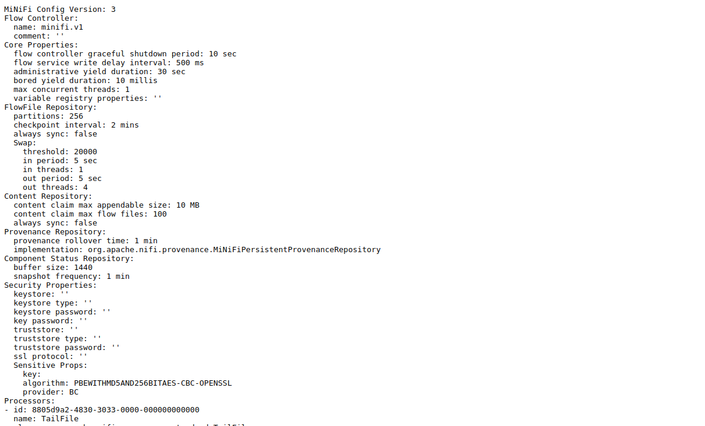

Интеграция сервисов MiNiFi и NiFi
=================================

**ADS** предоставляет, помимо *NiFi* и *MiNiFi*, поддержку централизованного управления *MiNiFi Agent* с помощью *MiNiFi C2 Server*.
Данный сервис обеспечивает автоматическое обновление конфигураций *MiNiFi Agent* без сторонних вспомогательных средств.
В данном разделе приведены основные шаги для настройки взаимодействи между *MiNiFi* и *NiFi* сервисами:

+ `Создание шаблона`_;
+ `Проверка конфигурации`_.

Создание шаблона
------------------

Для выполнения какой-либо задачи *MiNiFi Agent* необходимо создать шаблон в UI *NiFi*. В данном разделе представлен элементарный шаблон для сбора содержимого файла с машин *MiNiFi Agent*.

После установки *NiFi* и *MiNiFi* с помощью **ADCM**, в разделе *Template* появляется шаблон с название *simple-minifi-listener*, который состоит из следующих элементов (:numref:`Рис.%s. <minifi_simple-minifi-listener>`).

.. _minifi_simple-minifi-listener:

   Основные элементы шаблона

Чтобы создать шаблон для Агентов, необходимо перейти в *MiNiFi Process Group* и создать *Flow*, который будет выполнятся непосредственно *MiNiFi Agent*.

В нашем случае созданный *Flow* (:numref:`Рис.%s. <minifi_flow>`) содержит процессор *TailFile*, который считывает содержимое файла и передает экземпляру *NiFi*

.. _minifi_flow:

   Flow Агентов

Для успешной загрузки *Flow* на *MiNiFi Agent*, необходимо сохранить шаблон с названием указанным в `nifi.minifi.notifier.ingestors.pull.http.query <https://docs.arenadata.io/ads/v1.6-RUS/Config/ADCM.html#minifi>`_ с добавлением версии (например, *minifi.v1*).
Если вы изменили *Flow*, то для актуализации его на агентах необходимо увеличить версию шаблона (например, *minifi.v2*)

Автоматическое обновление конфигурации *MiNiFi Agent* происходить с периодичностью, заданной `nifi.minifi.notifier.ingestors.pull.http.period.ms <https://docs.arenadata.io/ads/v1.6-RUS/Config/ADCM.html#minifi>`_.
Если шаблон был неправильно собран, то Агенты продолжат работу на последней работоспособной конфигурации.

Проверка конфигурации
-----------------------

Текущую конфигурацию *Flow*, которую запрашивают *MiNiFi Agent* у *MiNiFi C2 Server*, можно проверить, обратившись к API *MiNiFi C2 Server* (:numref:`Рис.%s. <minifi_c2_api>`). Ссылка указана в описании сервиса *MiNiFi* в **ADCM**.

.. _minifi_c2_api:

   Результат обращения к MiNiFi C2 Server
