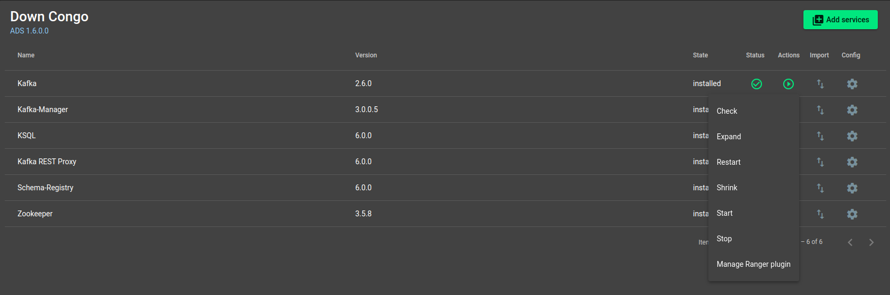
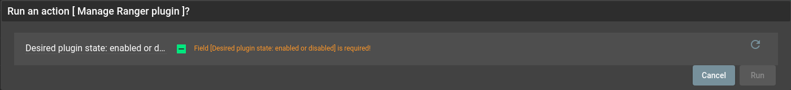

Интеграция ADS и ADPS
=================================

Enterprise-версия бандла **ADS** имеет в своем составе Ranger Kafka Plugin. Это позволяет произвести интеграцию **ADS** и **ADPS**.

.. note:: Подробнее об ADPS можно прочитать `по ссылке <https://docs.arenadata.io/adps/>`_

Включение плагина
------------------

На странице сервиса *Kafka* кластера **ADS** в разделе “Run action” выбрать **Manage Ranger Plugin** (:numref:`Рис.%s. <manage_ranger_plugin>`).

.. note:: Плагин не имеет смысла без какой-либо аутентификации, поэтому заранее следует включить `SASL/PLAIN <./Security.html>`_ на кластере.

.. _manage_ranger_plugin:

   Управление плагином

Выбрать необходимое состояние (Enabled/Disabled) (:numref:`Рис.%s. <manage_ranger_plugin_popup>`).

.. _manage_ranger_plugin_popup:

   Всплывающее окно при управлении плагином

После чего запускается процесс активации плагина и создание стандартных политик на стороне **Ranger**.

.. warning:: При выполнении произойдет перезапуск сервисов, поэтому существующие соединения будут разорваны!

Список создаваемых политик:

+ all -- topic,

+ all -- cluster,

+ all -- transactionalid,

+ all -- delegationtoken.

Данные политики сразу сконфигурированы для обеспечения работоспособности сервисов *Kafka-REST*, *Schema-Registry*, *KSQL*, *Kafka-Manager*.

После включения плагина определение прав к сервису *Kafka* для пользователя определяется в *Ranger*.
Так, например, пользователь может иметь права на просмотр списка топиков, но при этом не сможет никак с ними взаимодействовать.

Подробнее о пользователях для сервисов `Безопасность в кластере ADS <./Security.html>`_

Подробнее об использовании **Ranger** `документация ADPS <https://docs.arenadata.io/adps/>`_

