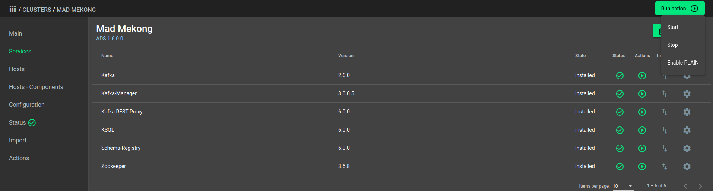
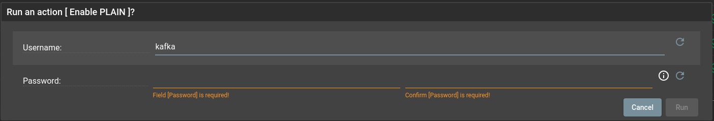
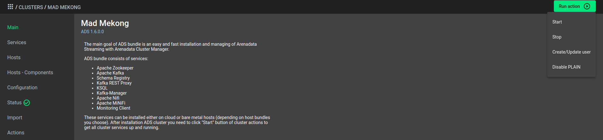
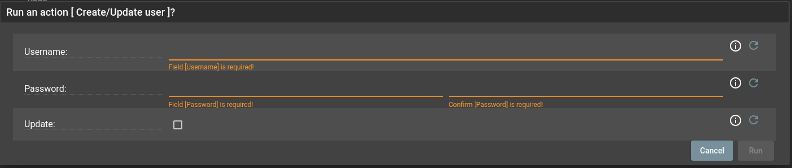

Безопасность в кластере ADS
===========================

Enterprise-версия бандла **ADS** предоставляет поддержку SASL/PLAIN аутентификации для сервисов *Kafka*, *KSQL*, *Kafka-Rest*, *Schema-Registry*, *Kafka-Manager*.
Данный функционал обеспечивает безопасность кластера **Kafka**.
В данном разделе приведены основные шаги для включения аутентификации и использования SASL/PLAIN:

+ `Включение SASL/PLAIN`_;
+ `Добавление/Обновление пользователя`_;
+ `Подключение к кластеру`_.

Включение SASL/PLAIN
--------------------

После установки *Kafka* и зависимых сервисов с помощью **ADCM** в кластере появляется возможность включить аутентификацию SASL/PLAIN с помощью кластерной кнопки *Enable PLAIN* (:numref:`Рис.%s. <enable_plain>`).

.. _enable_plain:

   Вызов включения SASL/PLAIN

В всплывающем окне необходимо установить пароль для пользователя *kafka* (:numref:`Рис.%s. <enable_plain_popup>`).

.. _enable_plain_popup:

   Всплывающее окно при включение SASL/PLAIN

После чего происходит конфигурация сервисов для SASL/PLAIN. *Enable PLAIN* включает в себя конфигурирование сервисов *Kafka*, *KSQL*, *Kafka-Rest*, *Schema-Registry*, *Kafka-Manager*.
Данные сервисы имеют специальных пользователей, с помощью которых происходит соединение с Kafka-кластером.

.. warning:: При выполнении произойдет перезапуск сервисов, поэтому существующие соединения будут разорваны!

Список создаваемых пользователей:

+ kafka

+ ksql-server

+ rest-server

+ schema-registry-server

+ kafka-manager-server

Добавление/Обновление пользователя
----------------------------------

Добавление/Обновление пользователя происходит с помощью вызова *Create/Update user* (:numref:`Рис.%s. <create_update_user>`).

.. _create_update_user:

   Вызов добавления/обновления пользователя

В всплывающем окне необходимо ввести данные пользователя, а именно *username* и *password* (:numref:`Рис.%s. <create_update_user_popup>`).
Для обновления данных пользователя необходимо установить флаг *Update*.

.. _create_update_user_popup:

   Вызов добавления/обновления пользователя

.. warning:: При выполнении произойдет перезапуск сервисов, поэтому существующие соединения будут разорваны!

.. note:: За раз можно создать/обновить только одного пользователя. Создание пользователя происходит только в конфигурации *Kafka*. Для других сервисов необходимо использовать собственные jaas-файлы.

Подключение к кластеру
----------------------

Для подключения к кластеру *Kafka* с аутентификацией SASL/PLAIN требуется настройка jaas-файлов, которые необходимы для соединения под конкретным пользователем.

Jaas-файл включает в себя следующее содержание для SASL/PLAIN аутентификации:

   .. code-block:: bash

      # Use for PLAIN
      sasl.mechanism=PLAIN
      security.protocol=SASL_PLAINTEXT
      sasl.jaas.config=org.apache.kafka.common.security.plain.PlainLoginModule required \
        username="${custom_user}" \
        password="${password_for_custom_user}";

*sasl.mechanism* -- механизм SASL, используемый для клиентских подключений.
Это может быть любой механизм, для которого доступен поставщик безопасности. GSSAPI -- это механизм по умолчанию.

Допустимые значения:

+ GSSAPI,
+ PLAIN.

*security.protocol* -- протокол, используемый для связи с брокерами.

Допустимые значения:

+ PLAINTEXT,
+ SSL,
+ SASL_PLAINTEXT,
+ SASL_SSL.

*sasl.jaas.config* -- параметры контекста входа в систему с помощью JAAS для соединений SASL.

*username* -- имя пользователя под которым необходимо произвести соединение.

*password* -- пароль указанного пользователя.

.. warning:: Указанные пользователи и пароли сначала должны быть добавлены в кластер *Kafka*. Подробнее `Добавление/Обновление пользователя`_

Рассмотрим использование jaas-файлов для подключения к *Kafka* на примере Schema-Registry.

Предположим есть потребность записи данных в топик с помощью *kafka-avro-console-producer*. Для этого необходимо произвести вызов с дополнительными параметрами:

   .. code-block:: bash

      [schema-registy-server@my-user ~]$ kafka-avro-console-producer --broker-list ${kafka_broker_fqdn}:${broker_port} --topic ${topic_name} --property value.schema='${some_schema}' --producer.config /some/path/to/jaas/my_jaas_file_to_produce_message.properties

После выполнения данного вызова можно производить запись в топик.

Для вызова *kafka-avro-console-consumer* необходимо произвести аналогичный вызов:

   .. code-block:: bash

      [schema-registy-server@my-user ~]$ kafka-avro-console-consumer --bootstrap-server ${kafka_broker_fqdn}:${broker_port} --topic ${topic_name} --consumer.config /some/path/to/jaas/my_jaas_file_to_consume_message.properties

.. warning:: Если включен *Ranger Kafka Plugin* или *ACL*, то важно обратить внимание на выданные права и политики для пользователя.

Аналогично производятся вызовы для создания различных Consumer и Producer в *Kafka*-кластер.

При вызове следует добавлять следующие параметры:

+ --consumer.config /some/path/to/jaas/my_jaas_file_to_consume_message.properties -- для вызова Consumer;
+ --producer.config /some/path/to/jaas/my_jaas_file_to_produce_message.properties -- для вызова Producer.
