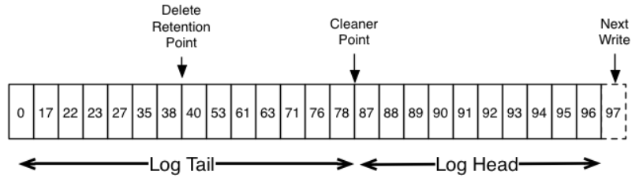

Log Compaction
=================

Log compaction ensures that **ADS** will always retain at least the last known value for each message key within the log of data for a single topic partition. It addresses use cases and scenarios such as restoring state after application crashes or system failure, or reloading caches after application restarts during operational maintenance.

So far we have described only the simpler approach to data retention where old log data is discarded after a fixed period of time or when the log reaches some predetermined size. This works well for temporal event data such as logging where each record stands alone. However an important class of data streams are the log of changes to keyed, mutable data (for example, the changes to a database table).

Let's discuss a concrete example of such a stream. There is a topic containing user email addresses; every time a user updates their email address we send a message to this topic using their user id as the primary key. Now say we send the following messages over some time period for a user with id *123*, each message corresponding to a change in email address (messages for other ids are omitted):

::
 
 1  123 => bill@microsoft.com
 2          .
 3          .
 4          .
 5  123 => bill@gatesfoundation.org
 6          .
 7          .
 8          .
 9  123 => bill@gmail.com

Log compaction gives us a more granular retention mechanism so that **ADS** is guaranteed to retain at least the last update for each primary key (e.g. *bill@gmail.com*). By doing this we guarantee that the log contains a full snapshot of the final value for every key not just keys that changed recently. This means downstream consumers can restore their own state off this topic without us having to retain a complete log of all changes.

Let's start by looking at a few use cases where this is useful:

1. *Database change subscription*. It is often necessary to have a data set in multiple data systems, and often one of these systems is a database of some kind (either a RDBMS or perhaps a new-fangled key-value store). For example you might have a database, a cache, a search cluster, and a **Hadoop** cluster. Each change to the database will need to be reflected in the cache, the search cluster, and eventually in **Hadoop**. In the case that one is only handling the real-time updates you only need recent log. But if you want to be able to reload the cache or restore a failed search node you may need a complete data set.

2. *Event sourcing*. This is a style of application design which co-locates query processing with application design and uses a log of changes as the primary store for the application.

3. *Journaling for high-availability*. A process that does local computation can be made fault-tolerant by logging out changes that it makes to its local state so another process can reload these changes and carry on if it should fail. A concrete example of this is handling counts, aggregations, and other "group by" -- like processing in a stream query system. **Samza**, a real-time stream-processing framework, uses `this feature <http://samza.apache.org/learn/documentation/0.7.0/container/state-management.html>`_ for exactly this purpose.

In each of these cases one needs primarily to handle the real-time feed of changes, but occasionally, when a machine crashes or data needs to be re-loaded or re-processed, one needs to do a full load. Log compaction allows feeding both of these use cases off the same backing topic. 

The general idea is quite simple. If we had infinite log retention, and we logged each change in the above cases, then we would have captured the state of the system at each time from when it first began. Using this complete log, we could restore to any point in time by replaying the first N records in the log. This hypothetical complete log is not very practical for systems that update a single record many times as the log will grow without bound even for a stable dataset. The simple log retention mechanism which throws away old updates will bound space but the log is no longer a way to restore the current state -- now restoring from the beginning of the log no longer recreates the current state as old updates may not be captured at all.

Log compaction is a mechanism to give finer-grained per-record retention, rather than the coarser-grained time-based retention. The idea is to selectively remove records where we have a more recent update with the same primary key. This way the log is guaranteed to have at least the last state for each key.

This retention policy can be set per-topic, so a single cluster can have some topics where retention is enforced by size or time and other topics where retention is enforced by compaction.

This functionality is inspired by one of LinkedIn's oldest and most successful pieces of infrastructure -- a database changelog caching service called `Databus <https://github.com/linkedin/databus>`_. Unlike most log-structured storage systems **ADS** is built for subscription and organizes data for fast linear reads and writes. Unlike Databus, **ADS** acts as a source-of-truth store so it is useful even in situations where the upstream data source would not otherwise be replayable.

Log Compaction Basics
------------------------

Here is a high-level picture that shows the logical structure of a **ADS** log with the offset for each message (:numref:`Pic.%s.<ADS_Architect_Log-structure>`).

.. _ADS_Architect_Log-structure:

   Logical structure of ADS log 

The head of the log is identical to a traditional **ADS** log. It has dense, sequential offsets and retains all messages. Log compaction adds an option for handling the tail of the log. The picture above shows a log with a compacted tail. Note that the messages in the tail of the log retain the original offset assigned when they were first written -- that never changes. Note also that all offsets remain valid positions in the log, even if the message with that offset has been compacted away; in this case this position is indistinguishable from the next highest offset that does appear in the log. For example, in the picture above the offsets *36*, *37*, and *38* are all equivalent positions and a read beginning at any of these offsets would return a message set beginning with *38*.

Compaction also allows for deletes. A message with a key and a null payload will be treated as a delete from the log. This delete marker will cause any prior message with that key to be removed (as would any new message with that key), but delete markers are special in that they will themselves be cleaned out of the log after a period of time to free up space. The point in time at which deletes are no longer retained is marked as the "Delete Retention Point" in the above diagram.

The compaction is done in the background by periodically recopying log segments. Cleaning does not block reads and can be throttled to use no more than a configurable amount of I/O throughput to avoid impacting producers and consumers. The actual process of compacting a log segment looks something like this (:numref:`Pic.%s.<ADS_Architect_Log-compaction>`):

.. _ADS_Architect_Log-compaction:

   Process of compacting a log segment 

What guarantees does log compaction provide?
----------------------------------------------

Log compaction guarantees the following:

1. Any consumer that stays caught-up to within the head of the log will see every message that is written; these messages will have sequential offsets. The topic's *min.compaction.lag.ms* can be used to guarantee the minimum length of time must pass after a message is written before it could be compacted. I.e. it provides a lower bound on how long each message will remain in the (uncompacted) head.

2. Ordering of messages is always maintained. Compaction will never re-order messages, just remove some.

3. The offset for a message never changes. It is the permanent identifier for a position in the log.

4. Any consumer progressing from the start of the log will see at least the final state of all records in the order they were written. Additionally, all delete markers for deleted records will be seen, provided the consumer reaches the head of the log in a time period less than the topic's *delete.retention.ms* setting (the default is *24 hours*). In other words: since the removal of delete markers happens concurrently with reads, it is possible for a consumer to miss delete markers if it lags by more than *delete.retention.ms*.

Log Compaction Details
-----------------------

Log compaction is handled by the log cleaner, a pool of background threads that recopy log segment files, removing records whose key appears in the head of the log. Each compactor thread works as follows:

1. It chooses the log that has the highest ratio of log head to log tail.

2. It creates a succinct summary of the last offset for each key in the head of the log.

3. It recopies the log from beginning to end removing keys which have a later occurrence in the log. New, clean segments are swapped into the log immediately so the additional disk space required is just one additional log segment (not a fully copy of the log).

4. The summary of the log head is essentially just a space-compact hash table. It uses exactly *24 bytes* per entry. As a result with *8GB* of cleaner buffer one cleaner iteration can clean around *366GB* of log head (assuming *1k* messages).

