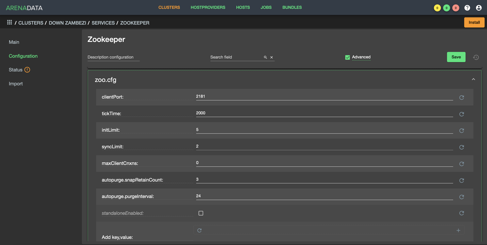
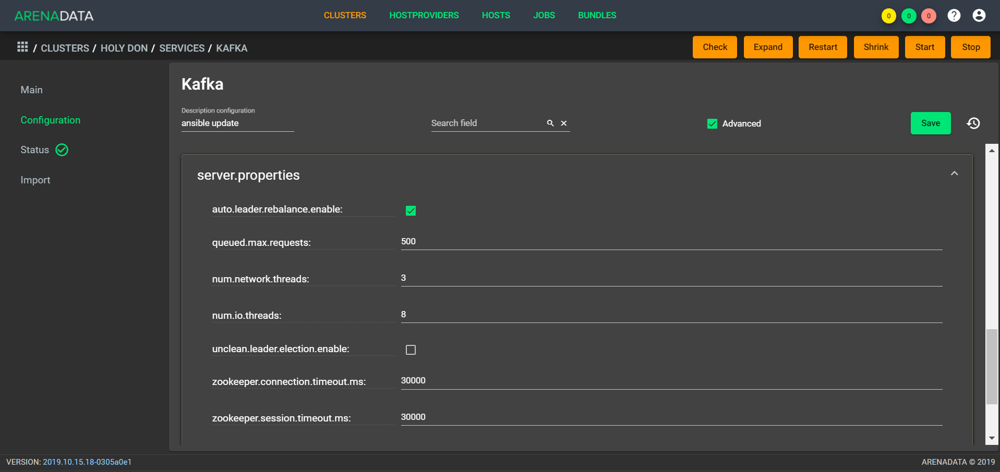
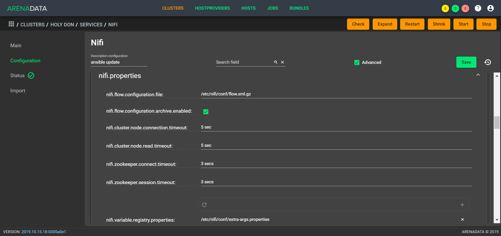

Настройки сервисов при помощи ADCM
===================================

В главе приведено описание сервисов **ADS** и их настройка при помощи **ADCM**:

+ `Zookeeper`_;
+ `Kafka`_;
+ `Nifi`_;
+ `Schema-registry`_;
+ `Kafka REST Proxy`_;
+ `KSQL`_;
+ `Kafka-Manager`_;
+ `Monitoring Clients`_.

Zookeeper
-------------

Для перехода к настройкам сервиса *Zookeeper* необходимо нажать кнопку с пиктограммой шестеренки в соответствующей строке вкладки "SERVICES" в интерфейсе **ADCM** и перейти в раздел меню "Configuration". При этом открывается окно настроек сервиса *Zookeeper* (:numref:`Рис.%s. <zk_config>`).

.. _zk_config:

.. figure:: ../Install/imgs/zk_config.png
   :align: center

   Настройки сервиса Zookeeper

В блоке настроек "Main" задаются основные параметры:

* ``connect`` -- строка подключения к Znode, в которой Zookeeper хранит конфигурацию текущего кластера, используется сервисом Kafka. В текущей реализации данный параметр недоступен для редактирования и автоматически генерируется на стороне ADCM;

* ``dataDir`` -- каталог для хранения снапшотов и транзакционных логов Zookeeper. Одноименный параметр в конфигурационном файле *zoo.cfg*.

При простановке галочки в поле "Advanced" открывается блок дополнительных настроек сервиса *Zookeeper* (:numref:`Рис.%s. <zk_config_adv>`).

.. _zk_config_adv:

   Дополнительные настройки сервиса Zookeeper

В группе настроек *zoo.cfg* находится ряд конфигураций, представляющих собой одноименные настройки в *zoo.cfg*-файле:

* ``clientРort`` -- порт, на котором Zookeeper слушает клиентские подключения;

* ``tickTime`` -- базовая единица времени в миллисекундах, используемая ZooKeeper. Используется при отправке heartbeats-сообщений, при этом минимальное время ожидания сессии в два раза больше установленного значения в параметре;

* ``initLimit`` -- это тайм-ауты, которые ZooKeeper использует для ограничения времени, в течение которого серверы ZooKeeper в кворуме должны соединиться с лидером;

* ``syncLimit`` -- параметр ограничивает, насколько устаревшим может быть сервер от лидера;

* ``maxClientCnxns`` -- ограничивает количество одновременных подключений (на уровне сокетов), которые может выполнить один идентифицируемый по IP-адресу клиент одному члену ансамбля ZooKeeper. Используется для предотвращения определенных классов DoS-атак, включая исчерпание файловых дескрипторов. Установка значения в *0* полностью снимает ограничение для одновременных подключений;

* ``autopurge_snapRetainCount`` -- при включенном параметре функция автоматической очистки ZooKeeper сохраняет самые последние снапшоты и соответствующие журналы транзакций в ``dataDir`` и ``dataLogDir`` соответственно и удаляет остальные;

* ``autopurge_purgeInterval`` -- интервал времени в часах, в течение которого должна быть запущена задача очистки. Для включения автоматической очистки значение параметра должно быть установлено на положительное целое число (*1* и выше).

Если необходимая настройка отсутствует в списке группы *zoo.cfg*, то для добавления таковой следует воспользоваться строкой ``Add key,value``, где требуется написать ключ и значение в соответствующих полях.

Далее в группе настроек файла *zookeeper-env.sh* задаются параметры, которые используются для внесения переменных окружения сервиса *Zookeeper* (:numref:`Рис.%s. <zk_config_env>`).

.. _zk_config_env:

   Настройки переменных окружения сервиса Zookeeper

Kafka
--------

Для перехода к настройкам сервиса *Kafka* необходимо нажать кнопку с пиктограммой шестеренки в соответствующей строке вкладки "SERVICES" в интерфейсе **ADCM** и перейти в раздел меню "Configuration". При этом открывается окно настроек сервиса *Kafka* (:numref:`Рис.%s. <kafka_config>`).

.. _kafka_config:

.. figure:: ../Install/imgs/kafka_config.png
   :align: center

   Настройки сервиса Kafka

В блоке настроек "Main" задаются основные параметры сервиса *Kafka*:

* ``log.dirs`` -- каталоги, в которых Kafka хранит данные журнала. Одноименное свойство в файле конфигурации `server.properties <../Config/broker>`_;

* ``listeners`` -- список URI (протокол, хост и порт, на котором поднят брокер), разделенный запятыми. Если используется не *PLAINTEXT*  протокол, то необходимо также указать ``listener.security.protocol.map``. Для привязки ко всем интерфейсам указать имя хоста как *0.0.0.0*. Оставить имя хоста пустым для привязки к интерфейсу по умолчанию. Указывается в качестве параметра ``listeners`` в конфигурационном файле `server.properties <../Config/broker>`_; 

* ``default.replication.factor`` -- коэффициенты репликации по умолчанию для автоматически создаваемых топиков. Одноименное свойство в файле конфигурации `server.properties <../Config/broker>`_;

* ``delete.topic.enable`` -- данный параметр позволяет удалять топики. Если параметр выключен, то удаление топика через инструменты администрирования не приводит к фактическому удалению. Одноименное свойство в файле конфигурации `server.properties <../Config/broker>`_; 

* ``log.retention.hours`` -- количество часов, в течение которых топики хранятся в Kafka. Одноименный параметр в конфигурационном файле `server.properties <../Config/broker>`_;

* ``log.roll.hours`` -- количество часов, по истечению которых пояляется новый журнал сегмента, даже если старый журнал не переполнен. Одноименный параметр в конфигурационном файле `server.properties <../Config/broker>`_.

При простановке галочки в поле "Advanced" открывается блок дополнительных настроек сервиса *Kafka* (:numref:`Рис.%s. <kafka_config_adv>`).

.. _kafka_config_adv:

   Дополнительные настройки сервиса Kafka

В группе настроек *server.properties* находится ряд конфигураций, представляющих собой одноименные настройки в *server.properties*-файле:

* ``auto.leader.rebalance.enable`` -- включение автоматической балансировки лидера. Балансировка лидера в фоновом режиме через регулярные промежутки времени;

* ``queued.max.requests`` -- количество запросов в очереди до блокировки сетевых потоков;

* ``num.network.threads`` -- количество потоков, используемых сервером для получения запросов от сети и отправки ответов в сеть;

* ``num.io.threads`` -- число потоков, используемых сервером для обработки запросов, которые могут включать дисковые операции ввода-вывода;

* ``unclean.leader.election.enable`` -- указывает, следует ли включить не входящие в набор ISR реплики и установка последнего средства в качестве лидера, даже если это может привести к потере данных;

* ``offsets.topic.replication.factor`` -- коэффициент репликации для топика смещения (устанавливается выше с целью обеспечения доступности). Создание внутреннего топика невозможно, пока размер кластера не соответствует данному требованию коэффициента репликации;

* ``transaction.state.log.min.isr`` -- переопределение конфигурации *min.insync.replicas* для топика транзакции;

* ``transaction.state.log.replication.factor`` -- коэффициент репликации для топика транзакции (задается выше для обеспечения доступности). Создание внутреннего топика завершается ошибкой, пока размер кластера не соответствует данному требованию к фактору репликации;

* ``zookeeper.connection.timeout.ms`` -- максимальное время ожидания клиентом установки соединения с Zookeeper. Если параметр не задан, используется значение для *zookeeper.session.timeout.ms*. Указывается в миллисекундах;

* ``zookeeper.session.timeout.ms`` -- тайм-аут сессии Zookeeper. Указывается в миллисекундах;

* ``zookeeper.sync.time.ms`` -- удаленность последователя Zookeeper от лидера Zookeeper. Указывается в миллисекундах.

Если необходимая настройка отсутствует в списке группы *server.properties*, то для добавления таковой следует воспользоваться строкой ``Add key,value``, где требуется написать ключ и значение в соответствующих полях.

Далее в группе настроек файла *kafka-env.sh* задаются параметры, которые используются для внесения переменных окружения сервиса *Kafka* (:numref:`Рис.%s. <kafka_config_env>`).

.. _kafka_config_env:

   Настройки переменных окружения сервиса Kafka

Nifi
--------

Для перехода к настройкам сервиса *Nifi* необходимо нажать кнопку с пиктограммой шестеренки в соответствующей строке вкладки "SERVICES" в интерфейсе **ADCM** и перейти в раздел меню "Configuration". При этом открывается окно настроек сервиса *Nifi* (:numref:`Рис.%s. <nifi_config>`).

.. _nifi_config:

.. figure:: ../Install/imgs/nifi_config.png
   :align: center

   Настройки сервиса Nifi

В блоке настроек "Main" задаются основные параметры:

* ``Nifi UI port`` -- http-порт, на котором поднимается веб-интерфейс сервиса Nifi. Указывается в качестве параметра ``nifi.web.http.port`` в конфигурационном файле *nifi.properties*;

* ``Nifi server Heap size`` -- размер кучи, выделяемой процессу сервиса Nifi. Указывается в конфигурационном файле *bootstrap.conf*;

* ``Nifi Registry UI port`` -- http-порт реестра Nifi. Указывается в качестве параметра ``nifi.registry.web.http.port`` в файле конфигурации *nifi.properties*;

* ``Nifi Registry Heap size`` -- размер кучи, выделяемой реестру Nifi. Указывается в конфигурационном файле *bootstrap.conf*.

* ``nifi.queue.backpressure.count`` -- при создании нового соединения между двумя компонентами это значение по умолчанию для порогового значения объекта обратного воздействия этого соединения. Значение должно быть целым числом (integer);

* ``nifi.queue.backpressure.size`` -- при создании нового соединения между двумя компонентами это значение по умолчанию для порогового значения размера данных обратного воздействия этого соединения. Значение должно быть размером данных, включая единицу измерения.

В блоке настроек "Directories" задаются параметры расположения репозиториев сервиса *Nifi* (:numref:`Рис.%s. <nifi_config_dirs>`):

* ``nifi.flowfile.repository.directory`` -- расположение репозитория FlowFile. Значением по умолчанию является *./flowfile_repository*;

* ``nifi.content.repository.directory`` -- расположение репозитория Content. Значением по умолчанию является *./content_repository*;

* ``nifi.provenance.repository.directory`` -- расположение репозитория Provenance. Значением по умолчанию является *./provenance_repository*;

* ``nifi.database.directory`` -- расположение директории H2 database. Значением по умолчанию является *./database_repository*;

* ``nifi.registry.db.directory`` -- расположение директории Registry database;

* ``nifi.nar.library.directory.lib`` -- параметр следует использовать в случае добавления custom nars (необязательный параметр).

.. _nifi_config_dirs:

   Настройки директорий репозиториев сервиса Nifi

В группе настроек *Analytics Framework* (:numref:`Рис.%s. <nifi_config_analyst>`) можно задать следующие параметры:

* ``nifi.`` -- 

* ``nifi.`` -- 

* ``nifi.`` -- 

* ``nifi.`` -- 

* ``nifi.`` -- 

.. _nifi_config_analyst:

   Настройки секции Analytics Framework

В группе настроек *Nifi-Registry Provider* находятся конфигурации потоков сервиса *Nifi* (:numref:`Рис.%s. <nifi_reg_config_adv>`):

* ``Flow Persistence Provider Type`` -- ;

* ``Flow Storage Directory`` -- директория хранения потока.

.. _nifi_reg_config_adv:

   Настройки Nifi-Registry Provider
   
При простановке галочки в поле "Advanced" открывается блок дополнительных настроек сервиса *Nifi* (:numref:`Рис.%s. <nifi_config_adv>`).

.. _nifi_config_adv:

   Дополнительные настройки сервиса Nifi

В группе настроек *nifi.properties* находится ряд конфигураций, представляющих собой одноименные настройки в *nifi.properties*-файле:

* ``nifi.flow.configuration.file`` -- расположение файла конфигурации потока (то есть файла, который содержит то, что в текущий момент отображается на графике NiFi). Значением по умолчанию является *./conf/flow.xml.gz*;

* ``nifi.flow.configuration.archive.enabled`` -- указывает, создает ли NiFi автоматически резервную копию потока при обновлении потока. Значение по умолчанию *true*;

* ``nifi.cluster.node.connection.timeout`` -- при подключении к другому узлу в кластере указывает, как долго этот узел должен ждать, прежде чем считать соединение неудачным;

* ``nifi.cluster.node.read.timeout`` -- при связи с другим узлом в кластере указывает, как долго этот узел должен ожидать получения информации от удаленного узла, прежде чем считать связь с узлом неудачной;

* ``nifi.zookeeper.connect.timeout`` -- время ожидания при подключении к ZooKeeper, прежде чем подключение считается неудачным;

* ``nifi.zookeeper.session.timeout`` -- время ожидания после потери соединения с ZooKeeper до истечения сессии;

* ``nifi.variable.registry.properties`` -- разделенный запятыми список путей расположения файлов для одного или нескольких файлов индивидуальных свойств.

Далее в группе настроек файла *nifi-env.sh* задаются параметры, которые используются для внесения переменных окружения сервиса *Nifi* (:numref:`Рис.%s. <nifi_config_env>`).

.. _nifi_config_env:

   Настройки переменных окружения сервиса Nifi

Далее в группе настроек файла *nifi-registry-env.sh* задаются параметры, которые используются для внесения переменных окружения сервиса *Nifi Regisrtry* (:numref:`Рис.%s. <nifi_reg_config_env>`).

.. _nifi_reg_config_env:

   Настройки переменных окружения сервиса Nifi Registry

Schema-registry
-----------------

Для перехода к настройкам сервиса *schema-registry* необходимо нажать кнопку с пиктограммой шестеренки в соответствующей строке вкладки "SERVICES" и перейти в раздел меню "Configuration". При этом открывается окно настроек сервиса *schema-registry* (:numref:`Рис.%s. <schemaR_config>`).

.. _schemaR_config:

.. figure:: ../Install/imgs/schemaR_config.png
   :align: center

   Настройки сервиса Schema-registry

В блоке настроек "Main" задаются следующие параметры:

* ``schema_registry_heap_opts`` -- размер кучи, выделяемoй процессу *schema-registry*. Указывается в качестве параметра ``SCHEMA_REGISTRY_HEAP_OPTS`` в файле *schema-registry-env.sh*;

* ``schema_registry_listener_port`` -- порт, который слушает *schema-registry*. Указывается в качестве параметра ``listeners`` в конфигурационном файле *schema-registry.properties*;
      
* ``schema_registry_jmx_port`` -- порт, по которому *schema-registry* отдает jmx-метрики. Указывается в качестве параметра ``JMX_PORT`` в файле *schema-registry-env.sh*.

Kafka REST Proxy
-----------------

Для перехода к настройкам сервиса *Kafka REST Proxy* необходимо нажать кнопку с пиктограммой шестеренки в соответствующей строке вкладки "SERVICES" и перейти в раздел меню "Configuration". При этом открывается окно настроек сервиса *Kafka REST Proxy* (:numref:`Рис.%s. <rest_config>`).

.. _rest_config:

.. figure:: ../Install/imgs/rest_config.png
   :align: center

   Настройки сервиса Kafka REST Proxy

В блоке настроек "Main" задаются следующие параметры:

* ``rest_heap_opts`` -- размер кучи, выделяемoй процессу Kafka REST Proxy. Указывается в качестве параметра ``KAFKAREST_HEAP_OPTS`` в файле *kafka-rest-env.sh*;

* ``rest_listener_port`` -- порт, который слушает REST Proxy. Указывается в качестве параметра ``listeners`` в конфигурационном файле *kafka-rest.properties*;

* ``rest_jmx_port`` -- порт, по которому Kafka REST Proxy отдает jmx-метрики. Указывается в качестве параметра ``JMX_PORT`` в файле *kafka-rest-env.sh*.

KSQL
------

Для перехода к настройкам сервиса *KSQL* необходимо нажать кнопку с пиктограммой шестеренки в соответствующей строке вкладки "SERVICES" и перейти в раздел меню "Configuration". При этом открывается окно настроек сервиса *KSQL* (:numref:`Рис.%s. <ksql_config>`).

.. _ksql_config:

   Настройки сервиса KSQL

В блоке настроек "Main" задаются следующие параметры:

* ``ksql_heap_opts`` -- размер кучи, выделяемoй процессу KSQL. Указывается в качестве параметра ``KSQL_HEAP_OPTS`` в файле *ksql-env.sh*;

* ``ksql_server_listener_port`` -- порт, который слушает сервер KSQL. Указывается в качестве параметра ``listeners`` в конфигурационном файле *ksql-server.properties*.

Kafka-Manager
---------------

Для перехода к настройкам сервиса *Kafka-Manager* необходимо нажать кнопку с пиктограммой шестеренки в соответствующей строке вкладки "SERVICES" и перейти в раздел меню "Configuration". При этом открывается окно настроек сервиса *Kafka-Manager* (:numref:`Рис.%s. <manager_config>`).

.. _manager_config:

.. figure:: ../Install/imgs/manager_config.png
   :align: center

   Настройки сервиса Kafka-Manager

В блоке настроек "Main" задается следующий параметр:

* ``manager_port`` -- порт, на котором поднимается Kafka-Manager. Указывается в файле *kafka-manager-env.sh*.

Monitoring Clients
---------------------

Для перехода к настройкам сервиса *monitoring clients* необходимо нажать кнопку с пиктограммой шестеренки в соответствующей строке вкладки "SERVICES" и перейти в раздел меню "Configuration". При этом открывается окно конфигурации сервиса *monitoring clients* (:numref:`Рис.%s. <mc_config>`).

.. _mc_config:

.. figure:: ../Install/imgs/mc_config.png
   :align: center

   Окно конфигурации сервиса Monitoring Clients

