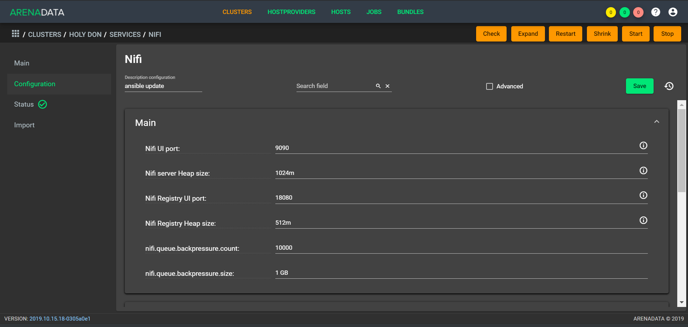
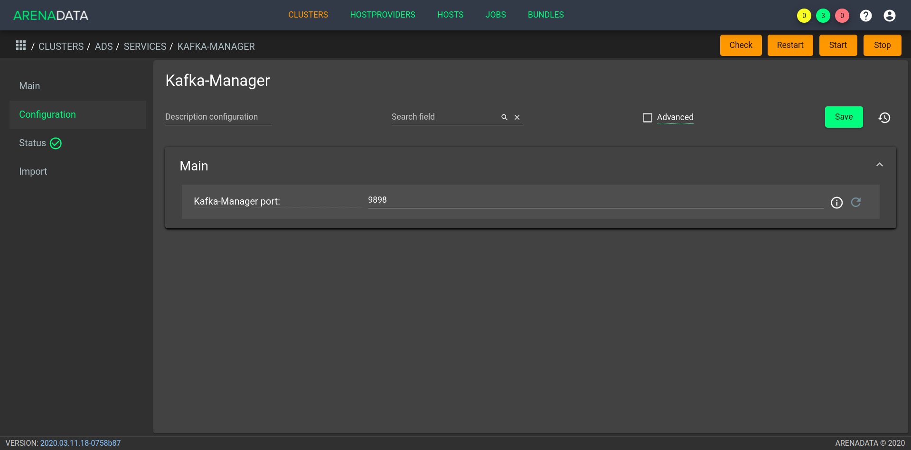
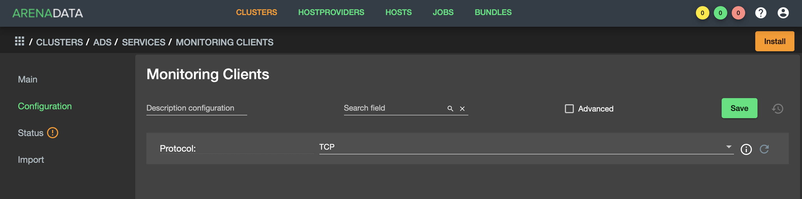

Настройки сервисов при помощи ADCM
===================================

В главе приведено описание сервисов **ADS** и их настройка при помощи **ADCM**:

+ `Zookeeper`_;
+ `Kafka`_;
+ `Nifi`_;
+ `Schema-registry`_;
+ `Kafka REST Proxy`_;
+ `KSQL`_;
+ `Kafka-Manager`_;
+ `Monitoring Clients`_.

Zookeeper
-------------

Для перехода к настройкам сервиса *Zookeeper* необходимо нажать кнопку с пиктограммой шестеренки в соответствующей строке вкладки "SERVICES" в интерфейсе **ADCM** и перейти в раздел меню "Configuration". При этом открывается окно настроек сервиса *Zookeeper* (:numref:`Рис.%s. <zk_config>`).

.. _zk_config:

.. figure:: ../Install/imgs/zk_config.png
   :align: center

   Настройки сервиса Zookeeper

В блоке настроек "Main" задаются основные параметры:

* *connect* -- строка подключения к Znode, в которой Zookeeper хранит конфигурацию текущего кластера, используется сервисом Kafka. В текущей реализации данный параметр недоступен для редактирования и генеруруется на стороне ADCM автоматически;

* *data_dirs* -- каталог для хранения снапшотов и транзакционных логов Zookeeper. Параметр указывается как ``dataDir`` в конфигурационном файле *zoo.cfg*; 

* *client_port* -- порт, на котором Zookeeper слушает клиентские подключения.  Параметр указывается как ``clientPort`` в конфигурационном файле *zoo.cfg*.

В блоке настроек "Advanced" задаются следующие расширенные параметры:

* *zoo_cfg_content* -- содержимое файла *zoo.cfg*, которое в дальнейшем шаблонизируется. Поле для внесения пользовательских параметров и  `дополнительных настроек <https://zookeeper.apache.org/doc/r3.4.12/zookeeperAdmin.html#sc_configuration>`_;

* *zookeeper_env_content* -- содержимое файла *zookeeper-env.sh*, которое в дальнейшем шаблонизируется. Поле для внесения переменных окружения.

Kafka
--------

Для перехода к настройкам сервиса *Kafka* необходимо нажать кнопку с пиктограммой шестеренки в соответствующей строке вкладки "SERVICES" и перейти в раздел меню "Configuration". При этом открывается окно настроек сервиса *Kafka* (:numref:`Рис.%s. <kafka_config>`).

.. _kafka_config:

.. figure:: ../Install/imgs/kafka_config.png
   :align: center

   Настройки сервиса Kafka

В блоке настроек "Main" задаются основные параметры:

* *data_dirs* -- каталог для хранения данных в *Kafka*. Указывается в качестве параметра ``log.dirs`` в конфигурационном файле `server.properties <../Config/broker>`_;

* *listeners* -- список URI (протокол, хост и порт, на котором поднят брокер), разделенный запятыми. Если используется не *PLAINTEXT*  протокол, то необходимо также указать *listener.security.protocol.map*. Для привязки ко всем интерфейсам указать имя хоста как *0.0.0.0*. Оставить имя хоста пустым для привязки к интерфейсу по умолчанию. Указывается в качестве параметра ``listeners`` в конфигурационном файле `server.properties <../Config/broker>`_; 

* *default_replication_factor* -- фактор репликации, с которым по умолчанию создаются и хранятся топики. Указывается в качестве параметра ``default.replication.factor`` в конфигурационном файле `server.properties <../Config/broker>`_;

* *delete_topic_enable* -- данный параметр позволяет удалять топики. Если параметр выключен, то удаление топика через инструменты администрирования не приводит к фактическому удалению. Указывается в качестве параметра ``default.replication.factor`` в конфигурационном файле `server.properties <../Config/broker>`_; 

* *log_retention_hours* -- количество часов, в течение которых топики хранятся в *Kafka*. Указывается в качестве параметра ``log.retention.hours`` в конфигурационном файле `server.properties <../Config/broker>`_;

* *log_roll_hours* -- количество часов, по истечению которых пояляется новый журнал сегмента, даже если старый журнал не переполнен. Указывается в качестве параметра ``log.roll.hours`` в конфигурационном файле `server.properties <../Config/broker>`_;

* *broker_jmx_port* -- порт, по которому *Kafka*-брокер отдает jmx-метрики. Указывается в качестве параметра ``JMX_PORT`` в файле *kafka-env.sh*.

В блоке настроек "Advanced" задаются следующие расширенные параметры:

* *server_properties_content* -- содержимое файла *server.properties*, которое в дальнейшем шаблонизируется. Данный параметр может использоваться для внесения `дополнительных настроек <../Config/broker>`_;

* *kafka_env_content* -- содержимое файла *kafka-env.sh*, которое в дальнейшем шаблонизируется. Данный параметр может использоваться для внесения переменных окружения.

Nifi
--------

Для перехода к настройкам сервиса *Nifi* необходимо нажать кнопку с пиктограммой шестеренки в соответствующей строке вкладки "SERVICES" и перейти в раздел меню "Configuration". При этом открывается окно настроек сервиса *Nifi* (:numref:`Рис.%s. <nifi_config>`).

.. _nifi_config:

   Настройки сервиса Nifi

В блоке настроек "Main" задаются основные параметры:

* *nifi_ui_port* -- http-порт, на котором поднимается веб-интерфейс сервиса *Nifi*. Указывается в качестве параметра ``nifi.web.http.port`` в конфигурационном файле *nifi.properties*;

* *nifi_node_jvm_memory* -- размер кучи, выделяемой процессу сервиса *Nifi*. Указывается в конфигурационном файле *bootstrap.conf*;

* *nifi_registry_ui_port* -- http-порт реестра *Nifi*. Указывается в качестве параметра ``nifi.registry.web.http.port`` в файле конфигурации *nifi.properties*;

* *nifi_registry_node_jvm_memory* -- размер кучи, выделяемой реестру *Nifi*. Указывается в конфигурационном файле *bootstrap.conf*.

В блоке настроек "Custom" задаются следующие необязательные параметры:

* *nifi_custom_nars* -- параметр следует использовать в случае добавления *custom nars*; перечисление через запятую. Указываются в качестве ``nifi.nar.library.directory.lib...`` в конфигурационном файле *nifi.properties*;

* *database_repository* -- ;

* *flowfile_repository* -- ;

* *content_repositories* -- ;

* *provenance_repositories* -- ;

* *nifi_registry_flow_storage* -- .

В блоке настроек "Advanced" задаются следующие расширенные параметры:

* *nifi_properties_content* -- содержимое файла *nifi.properties*, которое в дальнейшем шаблонизируется. Данный параметр может использоваться для внесения дополнительных настроек;

* *nifi_env_content* -- содержимое файла *nifi-env.sh*, которое в дальнейшем шаблонизируется. Данный параметр может использоваться для внесения переменных окружения;

* *bootstrap_content* -- содержимое файла *bootstrap.conf*, которое в дальнейшем шаблонизируется. Данное поле может использоваться для внесения настроек, связанных с запуском сервиса;

* *logback_content* -- содержимое файла *logback.xml*, которое в дальнейшем шаблонизируется. Данное поле может использоваться для внесения настроек, связанных с логированием;

* *state_management_content* -- содержимое файла *state_management.xml*, которое в дальнейшем шаблонизируется. Данное поле может использоваться для внесения настроек, связанных с хранением состояния сервиса *Nifi*;

* *authorizers_content* -- содержимое файла *authorizers.xml*, которое в дальнейшем шаблонизируется. Данное поле может использоваться для внесения настроек авторизации в сервис *Nifi* в том случае, если настроены политики безопасности;

* *login_identity_providers_content* -- содержимое файла *login_identity_providers.xml*, которое в дальнейшем шаблонизируется. Данное поле может использоваться для внесения настроек авторизации, используемые *state* провайдером, в том случае, если настроены политики безопасности.

В блоке настроек "Registry" задаются следующие дополнительные параметры:

* *nifi_registry_properties_content* -- содержимое файла *nifi-registry.properties*, которое в дальнейшем шаблонизируется. Данный параметр может использоваться для внесения дополнительных настроек;

* *nifi_registry_env_content* -- содержимое файла *nifi-registry-env.sh*, которое в дальнейшем шаблонизируется. Данный параметр может использоваться для внесения переменных окружения;

* *bootstrap_content* -- содержимое файла *bootstrap.conf*, которое в дальнейшем шаблонизируется. Данное поле может использоваться для внесения настроек, связанных с запуском сервиса;

* *logback_content* -- содержимое файла *logback.xml*, которое в дальнейшем шаблонизируется. Данное поле может использоваться для внесения настроек, связанных с логированием;

* *providers_content* -- содержимое файла *providers.xml*, которое в дальнейшем шаблонизируется. Данное поле может использоваться для внесения настроек пользовательских свойств авторизации;

* *identity_providers_content* -- содержимое файла *identity-providers.xml*, которое в дальнейшем шаблонизируется. Данное поле может использоваться для внесения настроек свойств входа в систему, в том случае, если настроены политики безопасности.

Schema-registry
-----------------

Для перехода к настройкам сервиса *schema-registry* необходимо нажать кнопку с пиктограммой шестеренки в соответствующей строке вкладки "SERVICES" и перейти в раздел меню "Configuration". При этом открывается окно настроек сервиса *schema-registry* (:numref:`Рис.%s. <schemaR_config>`).

.. _schemaR_config:

   Настройки сервиса Schema-registry

В блоке настроек "Main" задаются следующие параметры:

* *schema_registry_heap_opts* -- размер кучи, выделяемoй процессу *schema-registry*. Указывается в качестве параметра ``SCHEMA_REGISTRY_HEAP_OPTS`` в файле *schema-registry-env.sh*;

* *schema_registry_listener_port* -- порт, который слушает *schema-registry*. Указывается в качестве параметра ``listeners`` в конфигурационном файле *schema-registry.properties*;
      
* *schema_registry_jmx_port* -- порт, по которому *schema-registry* отдает jmx-метрики. Указывается в качестве параметра ``JMX_PORT`` в файле *schema-registry-env.sh*.

Kafka REST Proxy
-----------------

Для перехода к настройкам сервиса *Kafka REST Proxy* необходимо нажать кнопку с пиктограммой шестеренки в соответствующей строке вкладки "SERVICES" и перейти в раздел меню "Configuration". При этом открывается окно настроек сервиса *Kafka REST Proxy* (:numref:`Рис.%s. <rest_config>`).

.. _rest_config:

   Настройки сервиса Kafka REST Proxy

В блоке настроек "Main" задаются следующие параметры:

* *rest_heap_opts* -- размер кучи, выделяемoй процессу *Kafka REST Proxy*. Указывается в качестве параметра ``KAFKAREST_HEAP_OPTS`` в файле *kafka-rest-env.sh*;

* *rest_listener_port* -- порт, который слушает *REST Proxy*. Указывается в качестве параметра ``listeners`` в конфигурационном файле *kafka-rest.properties*;

* *rest_jmx_port* -- порт, по которому *Kafka REST Proxy* отдает jmx-метрики. Указывается в качестве параметра ``JMX_PORT`` в файле *kafka-rest-env.sh*.

KSQL
------

Для перехода к настройкам сервиса *KSQL* необходимо нажать кнопку с пиктограммой шестеренки в соответствующей строке вкладки "SERVICES" и перейти в раздел меню "Configuration". При этом открывается окно настроек сервиса *KSQL* (:numref:`Рис.%s. <ksql_config>`).

.. _ksql_config:

.. figure:: ../Install/imgs/ksql_config.png
   :align: center

   Настройки сервиса KSQL

В блоке настроек "Main" задаются следующие параметры:

* *ksql_heap_opts* -- размер кучи, выделяемoй процессу *KSQL*. Указывается в качестве параметра ``KSQL_HEAP_OPTS`` в файле *ksql-env.sh*;

* *ksql_server_listener_port* -- порт, который слушает сервер *KSQL*. Указывается в качестве параметра ``listeners`` в конфигурационном файле *ksql-server.properties*.

Kafka-Manager
---------------

Для перехода к настройкам сервиса *Kafka-Manager* необходимо нажать кнопку с пиктограммой шестеренки в соответствующей строке вкладки "SERVICES" и перейти в раздел меню "Configuration". При этом открывается окно настроек сервиса *Kafka-Manager* (:numref:`Рис.%s. <manager_config>`).

.. _manager_config:

   Настройки сервиса Kafka-Manager

В блоке настроек "Main" задается следующий параметр:

* *manager_port* -- порт, на котором поднимается *Kafka-Manager*. Указывается в файле *kafka-manager-env.sh*.

Monitoring Clients
---------------------

Для перехода к настройкам сервиса *monitoring clients* необходимо нажать кнопку с пиктограммой шестеренки в соответствующей строке вкладки "SERVICES" и перейти в раздел меню "Configuration". При этом открывается окно конфигурации сервиса *monitoring clients* (:numref:`Рис.%s. <mc_config>`).

.. _mc_config:

   Окно конфигурации сервиса Monitoring Clients

В блоке настроек "Advanced" задаются следующие расширенные параметры:

* *kafka_dashboard* -- файл в формате *json*, содержайщий дашборд с метриками сервиса *Kafka*. Шаблонизируется и отправляется в *Grafana*;

* *nifi_dashboard* -- файл в формате *json*, содержайщий дашборд с метриками сервиса *Nifi*. Шаблонизируется и отправляется в *Grafana*;

* *kafka_metrics* -- файл в формате *yaml*, который в дальнейшем шаблонизируется. Включает в себя *jmx*-метрики брокеров *Kafka*.

