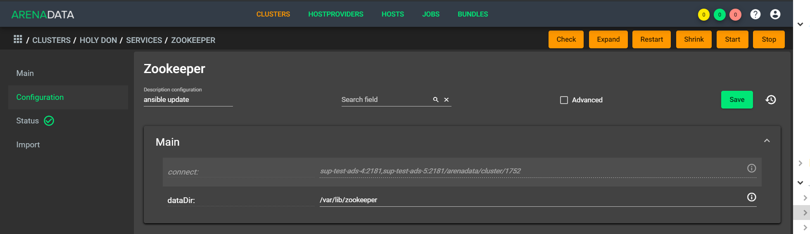

Настройки сервисов при помощи ADCM
===================================

В главе приведено описание сервисов **ADS** и их настройка при помощи **ADCM**:

+ `Zookeeper`_;
+ `Kafka`_;
+ `Nifi`_;
+ `Schema-registry`_;
+ `Kafka REST Proxy`_;
+ `KSQL`_;
+ `Kafka-Manager`_;
+ `Monitoring Clients`_.

Zookeeper
-------------

Для перехода к настройкам сервиса *Zookeeper* необходимо нажать кнопку с пиктограммой шестеренки в соответствующей строке вкладки "SERVICES" в интерфейсе **ADCM** и перейти в раздел меню "Configuration". При этом открывается окно конфигурации сервиса *Zookeeper* (:numref:`Рис.%s. <zk_config>`).

.. _zk_config:

   Окно конфигурации сервиса Zookeeper

В блоке настроек "Main" задаются основные параметры:

* *connect* -- строка подключения к Znode, в которой Zookeeper хранит конфигурацию текущего кластера, используется сервисом Kafka. В текущей реализации данный параметр недоступен для редактирования и генеруруется на стороне ADCM автоматически;

* *data_dirs* -- каталог для хранения транзакционных логов Zookeeper. Данный параметр указывается как *dataDir* в конфигурационном файле *zoo.cfg*; 

* *client_port* -- порт, на котором Zookeeper слушает клиентские подключения.

В блоке настроек "Advanced" задаются следующие расширенные параметры:

* *zoo_cfg_content* -- содержимое файла *zoo.cfg*, которое в дальнейшем шаблонизируется. Данный параметр может использоваться для внесения `дополнительных настроек <https://zookeeper.apache.org/doc/r3.4.12/zookeeperAdmin.html#sc_configuration>`_;

* *zookeeper_env_content* -- содержимое файла *zookeeper-env.sh*, которое в дальнейшем шаблонизируется. Данный параметр может использоваться для внесения переменных окружения.

Kafka
--------

Для перехода к настройкам сервиса *Kafka* необходимо нажать кнопку с пиктограммой шестеренки в соответствующей строке вкладки "SERVICES" и перейти в раздел меню "Configuration". При этом открывается окно конфигурации сервиса *Kafka* (:numref:`Рис.%s. <kafka_config>`).

.. _kafka_config:

.. figure:: ../imgs/kafka_config.png
   :align: center

   Окно конфигурации сервиса Kafka

В блоке настроек "Main" задаются основные параметры:

* *data_dirs* -- каталог для хранения данных в *Kafka*. Указывается к качестве параметра *log.dirs* в конфигурационном файле `server.properties <../../Config/broker>`_;

* *listeners* -- список URI (протокол, хост и порт, на котором поднят брокер), разделенный запятыми. Если используется не *PLAINTEXT*  протокол, то необходимо также указать *listener.security.protocol.map*. Для привязки ко всем интерфейсам указать имя хоста как *0.0.0.0*. Оставить имя хоста пустым для привязки к интерфейсу по умолчанию. Указывается в качестве параметра *listeners* в конфигурационном файле `server.properties <../../Config/broker>`_; 

* *default_replication_factor* -- фактор репликации, с которым по умолчанию создаются и хранятся топики. Указывается в качестве параметра *default.replication.factor* в конфигурационном файле `server.properties <../../Config/broker>`_;

* *delete_topic_enable* -- данный параметр позволяет удалять топики. Если параметр выключен, то удаление топика через инструменты администрирования не приводит к фактическому удалению. Указывается в качестве параметра *default.replication.factor* в конфигурационном файле `server.properties <../../Config/broker>`_; 

* *log_retention_hours* -- количество часов, в течение которых топики хранятся в *Kafka*. Указывается в качестве параметра *log.retention.hours* в конфигурационном файле `server.properties <../../Config/broker>`_;

* *log_roll_hours* -- максимальное время, после которого пояляется новый журнал сегмента, даже если старый журнал не переполнен. Указывается в качестве параметра *log.roll.hours* в конфигурационном файле `server.properties <../../Config/broker>`_;

* *broker_jmx_port* -- порт, по которому *Kafka* брокер отдает jmx-метрики. Указывается в качестве параметра *JMX_PORT* в файле *kafka-env.sh*;

* *manager_port* -- порт, на котором поднимается *Kafka-Manager*. Указывается в файле *kafka-manager-env.sh*;

* *schema_registry_heap_opts* -- размер кучи, выделяемoй процессу *schema-registry*. Указывается в качестве параметра *SCHEMA_REGISTRY_HEAP_OPTS* в *schema-registry-env.sh*;

* *schema_registry_listener_port* -- порт, который слушает *schema-registry*. Указывается в качестве параметра *listeners* в конфигурационном файле *schema-registry.properties*;

В блоке настроек "Advanced" задаются следующие расширенные параметры:

* *server_properties_content* -- содержимое файла *server.properties*, которое в дальнейшем шаблонизируется. Данный параметр может использоваться для внесения `дополнительных настроек <../../Config/index>`_;

* *kafka_env_content* -- содержимое файла *kafka-env.sh*, которое в дальнейшем шаблонизируется. Данный параметр может использоваться для внесения переменных окружения.

Nifi
--------

Для перехода к настройкам сервиса *Nifi* необходимо нажать кнопку с пиктограммой шестеренки в соответствующей строке вкладки "SERVICES" и перейти в раздел меню "Configuration". При этом открывается окно конфигурации сервиса *Nifi* (:numref:`Рис.%s. <nifi_config>`).

.. _nifi_config:

.. figure:: ../imgs/nifi_config.png
   :align: center

   Окно конфигурации сервиса Nifi

В блоке настроек "Main" задаются основные параметры:

* *nifi_ui_port* -- http-порт, на котором поднимается веб-интерфейс сервиса *Nifi*. Указывается в качестве параметра *nifi.web.http.port* в конфигурационном файле *nifi.properties*;

* *nifi_node_jvm_memory* -- размер кучи, выделяемой процессу сервиса *Nifi*. Указывается в конфигурационном файле *bootstrap.conf*.

В блоке настроек "Custom" задаются следующие необязательные параметры:

* *nifi_custom_nars* -- параметр следует использовать в случае добавления *custom nars*; перечисляются через запятую. Указываются в качестве *nifi.nar.library.directory.lib...* в конфигурационном файле *nifi.properties*;

В блоке настроек "Advanced" задаются следующие расширенные параметры:

* *nifi_properties_content* -- содержимое файла *nifi.properties*, которое в дальнейшем шаблонизируется. Данный параметр может использоваться для внесения дополнительных настроек;

* *nifi_env_content* -- содержимое файла *nifi-env.sh*, которое в дальнейшем шаблонизируется. Данный параметр может использоваться для внесения переменных окружения;

* *bootstrap_content* -- содержимое файла *bootstrap.conf*, которое в дальнейшем шаблонизируется. Данное поле может использоваться для внесения настроек, связанных с запуском сервиса;

* *logback_content* -- содержимое файла *logback.xml*, которое в дальнейшем шаблонизируется. Данное поле может использоваться для внесения настроек, связанных с логированием;

* *state_management_content* -- содержимое файла *state_management.xml*, которое в дальнейшем шаблонизируется. Данное поле может использоваться для внесения настроек, связанных с хранением состояния сервиса *Nifi*;

* *authorizers_content* -- содержимое файла *authorizers.xml*, которое в дальнейшем шаблонизируется. Данное поле может использоваться для внесения настроек авторизации в сервис *Nifi* в том случае, если настроены политики безопасности;

* *login_identity_providers_content* -- содержимое файла *login_identity_providers.xml*, которое в дальнейшем шаблонизируется. Данное поле может использоваться для внесения настроек авторизации, используемые *state* провайдером, в том случае, если настроены политики безопасности.

Schema-registry
-----------------

Kafka REST Proxy
-----------------

KSQL
------

Kafka-Manager
---------------

Monitoring Clients
---------------------

Для перехода к настройкам сервиса *monitoring clients* необходимо нажать кнопку с пиктограммой шестеренки в соответствующей строке вкладки "SERVICES" и перейти в раздел меню "Configuration". При этом открывается окно конфигурации сервиса *monitoring clients* (:numref:`Рис.%s. <mc_config>`).

.. _mc_config:

.. figure:: ../imgs/mc_config.png
   :align: center

   Окно конфигурации сервиса Monitoring Clients

В блоке настроек "Advanced" задаются следующие расширенные параметры:

* *kafka_dashboard* -- файл в формате *json*, который в дальнейшем шаблонизируется и отправляется в *Grafana*;

* *kafka_metrics* -- файл в формате *yaml*, который в дальнейшем шаблонизируется. Включает в себя *jmx* метрики брокеров *Kafka*.
