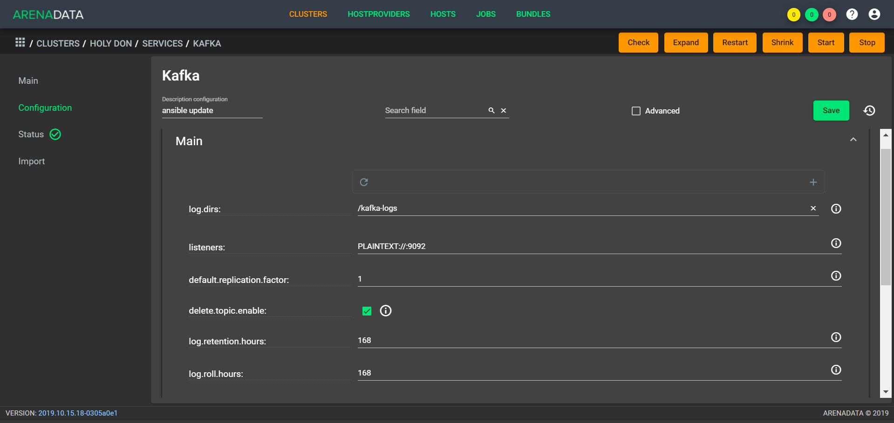
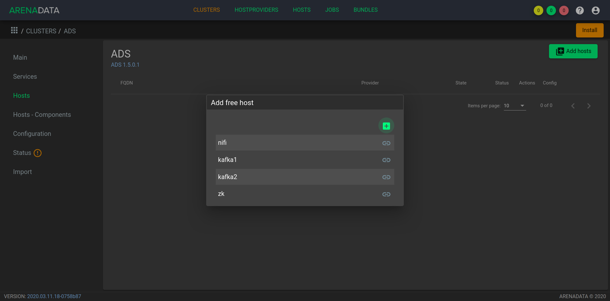
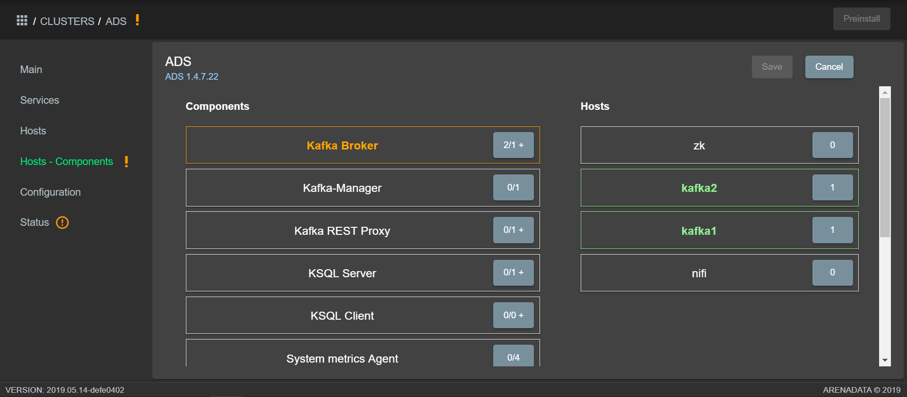

Create ADS cluster
=====================

After you complete :ref:`preliminary actions <preliminary_actions>` and :ref:`upload ADB bundle <installation_steps>`,
the **ADCM** cluster Manager contains the following list of objects (:numref:`Pic.%s. <hosts>`):

* A monitoring cluster prototype and instantiated cluster (a real monitoring program running on a host, ADCM records its results and settings);

* An *ads* cluster prototype for instantiation;

* Pre-prepared hosts, the ADCM database stores records of them and their credentials - ssh keys or passwords.

.. _hosts:

.. figure:: ../../imgs/hosts.png
   :align: center

   List of objects of ADCM

The following functionality is available:

+ `Instantiate cluster`_;
+ `Configure cluster`_;
+ `Add services`_;
+ `Add hosts`_;
+ `Map service components to hosts`_;
+ `Ways to install services`_;
+ `Install Zookeeper service`_;
+ `Install Kafka service`_;
+ `Install Nifi service`_;
+ `Install Monitoring Clients service`_.

Instantiate cluster
--------------------

When cluster instance *ads* is created in web interface of **ADCM** it means only adding data about it to the database **ADCM**, this step doesn't install *ads* on the hosts.

To instantiate cluster:

1. Open the "CLUSTERS" tab in ADCM (:numref:`Pic.%s. <cluster_mon>`).

.. _cluster_mon:

   "CLUSTERS" tab

2. Press the "Add cluster" button and in the opened form create an instance of the cluster from the prototype *ads* obtained from the bundle (:numref:`Pic.%s. <add_cluster>`).

.. _add_cluster:

.. figure:: ../../imgs/add_cluster.png
   :align: center

   Creating a cluster instance

3. As a result of the actions performed, the creation of the cluster instance is displayed in the ADCM database on the "CLUSTERS" tab (:numref:`Pic.%s. <clusters_list>`).

.. _clusters_list:

.. figure:: ../../imgs/clusters_list.png
   :align: center

   Cluster instance creation success

Configure cluster
---------------------

To go to the settings of the cluster instance *ads*, press the button with the gear icon in the necessary row of the "CLUSTERS" tab (:numref:`Pic.%s. <clusters_list>`) and go to the "Configuration" menu section. This opens the configuration window for the selected instance (:numref:`Pic.%s. <cluster_config>`).

.. _cluster_config:

.. figure:: ../../imgs/cluster_config.png
   :align: center

   Cluster configuration window

In the block "ADCM" it is possible to configure addresses:

* *Host* (or fqdn and IP address);
* *Port*.

In the "repos" settings block, you specify the packages required for *ads* installation from various yum repositories, and in each of the parameters you can change the default url to the required one:

* *ads*;
* *monitoring*;
* *epel*.

Any cluster's service component is able to send keep alive status information to the **ADCM** process in the docker container. Sometimes **ADCM** can be behind NAT and there is no evident way to automatically tell the address of **ADCM** to the service components located on cluster's hosts. That is why it should be configured manually. During the **ADB** installation the **ADCM** address would be used to fill component's keep alive status configuration.

Add services
--------------

Cluster **ADS** contains the following services:

* *Zookeeper* -- service for storing configurations, performing distributed process synchronization;
* *Kafka* -- distributed platform for streaming operations and data;
* *Nifi* -- distributed platform for building and automating data flows between different systems;
* *Monitoring Clients* -- agents that send host and ADS information to monitoring.

Not all services are required to be installed. For example if you do not plan to use **Nifi** then there is no need to add this service. If you have your own monitoring server (not **Graphite** based) there is no need for agents from the *monitoring clients* service. However, if you plan to use **Kafka**, the service of the same name and **Zookeeper** are required, the same can be said about the service **Nifi**. At the same time, the service may consist of mandatory and optional components. For example, the *Kafka* service consists of the mandatory component *broker* and the optional components: *manager* and *schema-registry*.

In this example, all services are added to the cluster:

+ `Setting up the Zookeeper service`_;
+ `Setting up the Kafka service`_;
+ `Setting up the Nifi service`_;
+ `Setting up the Monitoring Clients service`_.

.. important:: Currently it is not possible to remove already added service from the cluster

Setting up the Zookeeper service
^^^^^^^^^^^^^^^^^^^^^^^^^^^^^^^^^

To go to the settings of the service *Zookeeper*, press the button with the gear icon in the necessary row of the "SERVICES" tab in the **ADCM** and go to the "Configuration" menu section. This opens the configuration window for the selected service (:numref:`Pic.%s. <zk_config>`).

.. _zk_config:

.. figure:: ../../imgs/zk_config.png
   :align: center

   Configuration window of Zookeeper service

The settings block "Main" contains the following parameters:

* *connect* -- the Znode connection string, in which Zookeeper stores the configuration of the current cluster, is used by the *Kafka* service. In the current implementation, this parameter is not editable and is automatically generated on the ADCM side;

* *data_dirs* -- directory for storing transaction logs Zookeeper. This parameter is specified as *dataDir* in the configuration file *zoo.cfg*; 

* *client_port* -- the port on which Zookeeper listens to client connections.

The settings block "Advanced" contains the following parameters:

* *zoo_cfg_content* -- the contents of the file *zoo.cfg*, which is further templateable. This parameter can be used to make `additional settings <https://zookeeper.apache.org/doc/r3.4.12/zookeeperAdmin.html#sc_configuration>`_;

* *zookeeper_env_content* -- the contents of the file *zookeeper-env.sh*, which is further template. This parameter can be used to make environment variables.

Setting up the Kafka service
^^^^^^^^^^^^^^^^^^^^^^^^^^^^^^

To go to the settings of the service *Kafka*, press the button with the gear icon in the necessary row of the "SERVICES" tab in the **ADCM** and go to the "Configuration" menu section. This opens the configuration window for the selected service (:numref:`Pic.%s. <kafka_config>`).

.. _kafka_config:

   Configuration window of Kafka service

The settings block "Main" contains the following parameters:

* *data_dirs* -- directory for storing data in *Kafka*. Indicated to the quality of the parameter *log.dirs* in the configuration file `server.properties <../../../Config/broker>`_;

* *listeners* -- a list of URIs (protocol, host, and port on which the broker is run), separated by commas. If you are not using the *PLAINTEXT* protocol, then you must also specify *listener.security.protocol.map*. To bind to all interfaces, specify the host name as *0.0.0.0*. Leave the host name blank for binding to the default interface. It is specified as the *listeners* parameter in the configuration file `server.properties <../../../Config/broker>`_; 

* *default_replication_factor* -- replication factor, with which topics are created and stored by default. It is specified as the parameter *efault.replication.factor* in the configuration file `server.properties <../../../Config/broker>`_;

* *delete_topic_enable* -- this option allows you to delete topics. If the parameter is disabled, deleting the topic through the administration tools does not lead to the actual deletion. It is specified as the parameter *default.replication.factor* in the configuration file `server.properties <../../../Config/broker>`_; 

* *log_retention_hours* -- the number of hours that topics are stored in *Kafka*. It is specified as the *log.retention.hours* parameter in the configuration file `server.properties <../../../Config/broker>`_;

* *log_roll_hours* -- the maximum time after which a new segment log appears, even if the old log is not full. It is specified as the parameter *log.roll.hours* in the configuration file `server.properties <../../../Config/broker>`_;

* *broker_jmx_port* -- port on which *Kafka* broker gives jmx-metrics. It is specified as the parameter *JMX_PORT* in the file *kafka-env.sh*;

* *manager_port* -- port on which *Kafka-Manager* runs. Indicated in the file *kafka-manager-env.sh*;

* *schema_registry_heap_opts* -- heap size allocated to the *schema-registry* process. Specified as the *SCHEMA_REGISTRY_HEAP_OPTS* parameter in *schema-registry-env.sh*;

* *schema_registry_listener_port* -- port that is listening on *schema-registry*. Specified as the parameter *listeners* in the configuration file *schema-registry.properties*;

The settings block "Advanced" contains the following parameters:

* *server_properties_content* -- the contents of the *server.properties* file, which is further templateable. This parameter can be used to make `additional settings <../../../Config/index>`_;

* *kafka_env_content* -- the contents of the file *kafka-env.sh*, which is further template. This parameter can be used to make environment variables.

Setting up the Nifi service
^^^^^^^^^^^^^^^^^^^^^^^^^^^^^

To go to the settings of the service *Nifi*, press the button with the gear icon in the necessary row of the "SERVICES" tab in the **ADCM** and go to the "Configuration" menu section. This opens the configuration window for the selected service (:numref:`Pic.%s. <nifi_config>`).

.. _nifi_config:

.. figure:: ../../imgs/nifi_config.png
   :align: center

   Configuration window of Nifi service 

The settings block "Main" contains the following parameters:

* *nifi_ui_port* -- http-port on which the web interface of the service *Nifi* runs. It is specified as the parameter *nifi.web.http.port* in the configuration file *nifi.properties*;

* *nifi_node_jvm_memory* -- heap size allocated to the service process *Nifi*. It is specified in the configuration file *bootstrap.conf*.

The following optional parameters are set in the “Custom” settings block:

* *nifi_custom_nars* -- parameter should be used when adding *custom nars*; comma separated. Specified as *nifi.nar.library.directory.lib...* in the configuration file *nifi.properties*;

The settings block "Advanced" contains the following parameters:

* *nifi_properties_content* -- the contents of the file *nifi.properties*, which will be further templateable. This parameter can be used to make additional settings;

* *nifi_env_content* -- the contents of the file *nifi-env.sh*, which is further templateable. This parameter can be used to make environment variables;

* *bootstrap_content* -- the contents of the file *bootstrap.conf*, which is further templateable. This field can be used to make settings related to the start of the service;

* *logback_content* -- the contents of the file *logback.xml*, which is further templateable. This field can be used to make settings related to logging;

* *state_management_content* -- the contents of the file *state_management.xml*, which is further templateable. This field can be used to make settings related to storing the state of the service *Nifi*;

* *authorizers_content* -- the contents of the file *authorizers.xml*, which is further template. This field can be used to make authorization settings to the *Nifi* service if security policies are configured;

* *login_identity_providers_content* -- the contents of the file *login_identity_providers.xml*, which is further template. This field can be used to make authorization settings used by the *state* provider, if security policies are configured.

Setting up the Monitoring Clients service
^^^^^^^^^^^^^^^^^^^^^^^^^^^^^^^^^^^^^^^^^^^

To go to the settings of the service *monitoring clients*, press the button with the gear icon in the necessary row of the "SERVICES" tab in the **ADCM** and go to the "Configuration" menu section. This opens the configuration window for the selected service (:numref:`Pic.%s. <mc_config>`).

.. _mc_config:

.. figure:: ../../imgs/mc_config.png
   :align: center

   Configuration window of Monitoring Clients service 

The settings block "Advanced" contains the following parameters:

* *kafka_dashboard* -- a file in the format *json*, which is further template and sent to *Grafana*;

* *kafka_metrics* -- a file in the format *yaml*, which will be further template. Includes *jmx* broker metrics *Kafka*.

Add hosts
-----------

Для добавления хостов в кластер *ads* необходимо:

1. В меню кластера *ads* открыть вкладку "Hosts" (:numref:`Рис.%s. <hosts_list>`).

.. _hosts_list:

   Вкладка "Hosts" кластера ads

2. Нажать "Add hosts" и в открывшейся форме выбрать необходимые хосты (:numref:`Рис.%s. <add_hosts>`).

.. _add_hosts:

   Выбор хостов

3. В результате выполненных действий факт добавления хостов отображается в кластере *ads* в списке вкладки "Hosts" (:numref:`Рис.%s. <hosts_list2>`).

.. _hosts_list2:

.. figure:: ../../imgs/hosts_list2.png
   :align: center

   Результат успешного добавления хостов

Map service components to hosts
---------------------------------

Каждый сервис состоит из обязательных компонентов, которые должны быть размещены, и необязательных, которые могут быть не разщены на хостах кластера. Для этого необходимо на вкладке кластера "Hosts - Components" выбрать компонент посредством нажатия на него мышкой в колонке "Components" и определить для него необходимый хост в колонке "Hosts" (:numref:`Рис.%s. <components>`).

.. _components:

.. figure:: ../../imgs/components.png
   :align: center

   Размещение компонентов сервисов на хостах

Поскольку сервисы *Zookeeper*, *Kafka*, *Nifi* и *Monitoring Clients* добавлены в кластер **ADS**, но еще не размещены на хостах, то изначально ни на одном из хостов нет компонентов:

1. Компоненты сервиса *Zookeeper* (:numref:`Рис.%s. <zk_components>`):

* *Zookeeper.SERVER* -- необходимо добавить на один или нечетное количество хостов (*zk1*); для больших кластеров рекмоендуется не более *5*.

.. _zk_components:

.. figure:: ../../imgs/zk_components.png
   :align: center

   Компоненты сервиса *Zookeeper*

2. Компоненты сервиса *Kafka* (:numref:`Рис.%s. <kafka_components>`):

* *kafka.BROKER* -- необходимо добавить на один и более хостов брокеров (*kafka1*, *kafka2*);

* *kafka.MANAGER* -- опционально может быть добавлен на один любой хост (*kafka1*);

* *kafka.SCHEMA_REGISTRY* -- опционально может быть добавлен на один любой хост (*kafka2*).

.. _kafka_components:

   Компоненты сервиса *Kafka*

3. Компоненты сервиса *Nifi* (:numref:`Рис.%s. <nifi_components>`):

* *nifi.SERVER* -- необходимо добавить на один или более хостов (*df-mdw*);

.. _nifi_components:

.. figure:: ../../imgs/nifi_components.png
   :align: center

   Компоненты сервиса *Nifi*

4. Компоненты сервиса *monitoring clients* (:numref:`Рис.%s. <mc_components>`):

* *monitoring_clients.diamond* -- должен быть добавлен на все хосты (*zk1*, *kafka1*, *kafka2*, *nifi2*). Собирает системные метрики и отправляет их в **ADCM**;

* *monitoring_clients.jmxtrans* -- необходимо добавить на один хост (*zk1*). Собирает специфичные для cервисов метрики и отправляет их в **ADCM**;

.. _mc_components:

.. figure:: ../../imgs/mc_components.png
   :align: center

   Компоненты сервиса Monitoring Clients

Ways to install services
-----------------------------

Существует два способа установки сервисов:

* Установка всех сервисов кластера. Операция на уровне кластера, представляет собой последовательный вызов процессов установки и конфигурирования всех добавленных сервисов;

* Выборочная установка сервиса. Операция на уровне сервиса, представляет собой установку отдельно взятого сервиса.

.. important:: Независимо от выбранного типа установки изначально необходимо импортировать настройки из кластера *Monitoring*, в случае если добавлен сервис *Monitoring Clients*

Установка всех сервисов кластера
^^^^^^^^^^^^^^^^^^^^^^^^^^^^^^^^^^

Для установки всех добаленных сервисов в кластере *ads* необходимо выбрать соответствующий кластер в **ADCM** и нажать кнопку *Install* в правом вехнем углу экранной формы (:numref:`Рис.%s. <cluster_install>`).

.. _cluster_install:

.. figure:: ../../imgs/cluster_install.png
   :align: center

   Установка всех сервисов кластера

По результатам установки все добавленные сервисы меняют состояние с *created* -– создан, на *installed* -– установлен (:numref:`Рис.%s. <cluster_actions>`).

.. _cluster_actions:

.. figure:: ../../imgs/cluster_actions.png
   :align: center

   Установка всех сервисов кластера

Install Zookeeper service 
----------------------------

Для установки сервиса *Zookeeper* на вкладке кластера "Services" необходимо выполнить:

* В поле "Actions" нажать на пиктограмму в строке сервиса *Zookeeper* и выбрать действие *Install* (:numref:`Рис.%s. <zk_install>`). Производится настройка хостов, установка необходимых пакетов.

.. _zk_install:

.. figure:: ../../imgs/zk_install.png
   :align: center

   Install Zookeeper

* По результатам инсталляции сервис *Zookeeper* меняет состояние с *created* -- создан, на *installed* -- установлен.

Install Kafka service
-----------------------

Для установки сервиса *Kafka* на вкладке кластера "Services" необходимо выполнить:

* В строке сервиса *Kafka* в поле "Actions" нажать на пиктограмму и выбрать действие *Install* (:numref:`Рис.%s. <kafka_install>`).

.. _kafka_install:

.. figure:: ../../imgs/kafka_install.png
   :align: center

   Install Kafka

* По результатам инсталляции сервис *Kafka* меняет состояние с *created* -- создан, на *installed* -- установлен.

Install Nifi service
-----------------------

Для установки сервиса *Nifi* на вкладке кластера "Services" необходимо выполнить:

* В строке сервиса *Nifi* в поле "Actions" нажать на пиктограмму и выбрать действие *Install* (:numref:`Рис.%s. <nifi_install>`).

.. _nifi_install:

.. figure:: ../../imgs/nifi_install.png
   :align: center

   Install Nifi

* По результатам инсталляции сервис *Nifi* меняет состояние с *created* -- создан, на *installed* -- установлен.

Install Monitoring Clients service
------------------------------------

Сервис *Monitoring Clients* требует импорта конфигурационных параметров кластера мониторинга (адреса, логин/пароль) в кластер *ads*:

1. Для импорта конфигурации мониторинга в кластер *ads* необходимо открыть в ADCM вкладку "CLUSTERS", выбрать опцию *Import* и отметить импортируемые настройки сервисов с помощью простановки флажков в открывшейся форме (:numref:`Рис.%s. <import_configs>`).

.. _import_configs:

.. figure:: ../../imgs/import_configs.png
   :align: center

   Импорт конфигурации мониторинга

2. Установка клиентов мониторинга в кластер *ads*:

* В кластере *ads* на вкладке "Services" в поле "Actions" нажать на пиктограмму и выбрать действие *Install* для службы *monitoring clients* (:numref:`Рис.%s. <mc_install>`).

.. _mc_install:

.. figure:: ../../imgs/mc_install.png
   :align: center

   Установка клиентов мониторинга

* По результатам инсталляции служба *monitoring clients* меняет состояние с *created* -- создана, на *monitored* -- мониторится.

