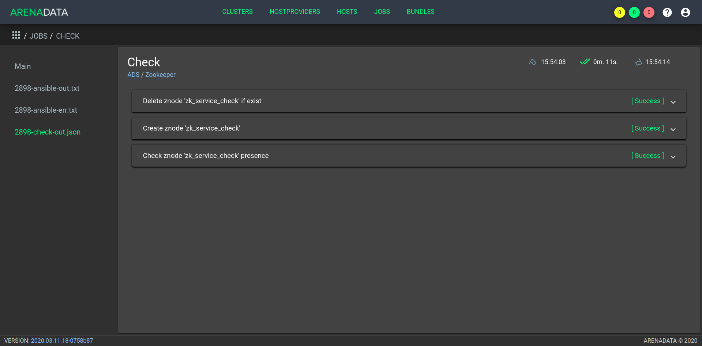

Инструменты управления
======================

В **ADS** предусмотрено 2 вида операций:

* `Операции на уровне кластера`_ -- предполагают выполнение операций последовательно над всеми сервисами;

* `Операции на уровне сервиса`_ -- предполагают выполнение операций над отдельным сервисом.
 

Операции на уровне кластера
---------------------------

**Запуск и остановка ADS** -- существует возможность последовательного запуска и остановки всех сервисов кластера *ads* через **ADCM**. Для этого необходимо открыть в **ADCM** кластер *ads* и нажать кнопку *Start*, *Stop* или *Restart* в зависимости от требуемой работы с кластером (:numref:`Рис.%s <cluster_run>`).

.. _cluster_run:

.. figure:: ../../imgs/cluster_run.png
   :align: center

   Операции на уровне кластера

В результате того или иного действия кластер меняет свое состояние на соответствующее -- *running* или *stopped*, в том случае если кластер уже проинсталлирован и не находится в состоянии *created*.

Операции на уровне сервиса
---------------------------

Для каждого из сервисов доступна возможность проверки его работоспособности, а также управления им независимо от остальных.

Проверка состояния сервиса Zookeeper
^^^^^^^^^^^^^^^^^^^^^^^^^^^^^^^^^^^^^^

Проверка работоспособности сервиса *Zookeeper* представляет собой подключение к кворуму *Zookeeper*, создание в нем тестовой *znode* и проверку доступности созданной *znode* каждому из хостов кворума.

Для проверки результатов действий над сервисом *Zookeeper* необходимо:

1. Перейти в кластер *ads* в ADCM, на вкладке "Services" для сервиса *Zookeeper* в поле "Actions" нажать на пиктограмму и выбрать действие *Check* (:numref:`Рис.%s <zk_actions>`).

.. _zk_actions:

.. figure:: ../../imgs/zk_actions.png
   :align: center

   Запуск проверки состояния сервиса *Zookeeper*

2. Открыть вкладку "JOBS" (:numref:`Рис.%s <ads_check1>`).

.. _ads_check1:

.. figure:: ../../imgs/ads_check1.png
   :align: center

   Вкладка "JOBS"

3. Выбрать последнее действие над кластером *ads* и в открывшемся окне проверить результаты (:numref:`Рис.%s <zk_status_check>`).

.. _zk_status_check:

   Проверка состояния сервиса *Zookeeper*

Проверка состояния сервиса Kafka
^^^^^^^^^^^^^^^^^^^^^^^^^^^^^^^^^^

Проверка работоспособности сервиса *Kafka* представляет собой создание тестовых топиков на каждом из хостов *BROKER* и проверку доступности созданных топиков.

Для проверки результатов действий над сервисом *Kafka* необходимо:

1. Перейти в кластер *ads* в ADCM, на вкладке "Services" для сервиса *Kafka* в поле "Actions" нажать на пиктограмму и выбрать действие *Check* (:numref:`Рис.%s <kafka_actions>`).

.. _kafka_actions:

   Запуск проверки состояния сервиса *Kafka*

2. Открыть вкладку "JOBS" (:numref:`Рис.%s <ads_check2>`).

.. _ads_check2:

.. figure:: ../../imgs/ads_check2.png
   :align: center

   Вкладка "JOBS"

3. Выбрать последнее действие над кластером *ads* и в открывшемся окне проверить результаты (:numref:`Рис.%s <kafka_status_check>`).

.. _kafka_status_check:

.. figure:: ../../imgs/kafka_status_check.png
   :align: center

   Проверка состояния сервиса *Kafka*

Запуск и остановка сервисов
^^^^^^^^^^^^^^^^^^^^^^^^^^^^

Для каждого из сервисов есть возможность управления им независимо от остальных, выполнять такие операции как *Stop*, *Start*, *Restart*.

Например, для того чтобы перезапустить все компоненты сервиса *Kafka* необходимо перейти в кластер *ads* в ADCM, на вкладке "Services" для сервиса *Kafka* в поле "Actions" нажать на пиктограмму и выбрать действие *Restart* (:numref:`Рис.%s <kafka_actions>`).

.. _kafka_actions:

   Допустимые операции над сервисом *Kafka*

В результате того или иного действия статус сервиса меняется на *running* или *stopped*, в том случае если сервис уже был проинсталлирован и не находится в состоянии *created*. 
