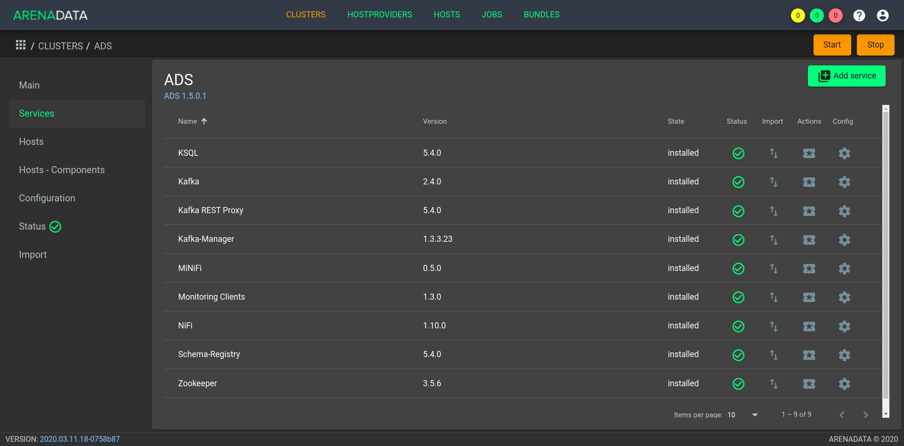

Manage tools
==============

**ADS** provides for 2 types of operations:

* `Cluster level operations`_ -- performing operations sequentially on all services;

* `Service level operations`_ -- performing operations on a particular service.
 

Cluster level operations
---------------------------

**Start and stop ADS** -- there is a possibility of sequential start and stop of all cluster services *ads* through **ADCM**. To do this, open in **ADCM** cluster *ads* and click the *Start*, *Stop* or *Restart* depending on the required work with the cluster (:numref:`Pic.%s <cluster_run>`).

.. _cluster_run:

   Cluster level operations

As a result of a particular action, the cluster changes its state to the corresponding -- *running* or *stopped*, in the event that the cluster is already installed and is not in the *created* state.

Service level operations
---------------------------

For each of the services there is an opportunity to check its working capacity, as well as to manage it independently of the others.

Health check Zookeeper service
^^^^^^^^^^^^^^^^^^^^^^^^^^^^^^^^

Health check of the *Zookeeper* service is a connection to the *Zookeeper* quorum, creating test *znode* in it and checking the availability of the created *znode* to each of the quorum hosts.

To check the results of actions on the service *Zookeeper* you need:

1. Go to the cluster *ads* in ADCM, on the "Services" tab for the *Zookeeper* service in the "Actions" field click on the icon and select the *Check* action (:numref:`Pic.%s <zk_actions>`).

.. _zk_actions:

.. figure:: ../../imgs/zk_actions.png
   :align: center

   Run the *Zookeeper* service health check

2. Open the "JOBS" tab (:numref:`Pic.%s <ads_check1>`).

.. _ads_check1:

.. figure:: ../../imgs/ads_check1.png
   :align: center

   "JOBS" tab

3. Select the last check action over *ads* cluster and get results (:numref:`Pic.%s <zk_status_check>`).

.. _zk_status_check:

.. figure:: ../../imgs/zk_status_check.png
   :align: center

   Health check *Zookeeper* service

Health check Kafka service
^^^^^^^^^^^^^^^^^^^^^^^^^^^^

Health check of the *Kafka* service is the creation of test topics on each of the *BROKER* hosts and checking the availability of the created topics.

To check the results of actions on the service *Kafka* you need:

1. Go to the cluster *ads* in ADCM, on the "Services" tab for the *Kafka* service in the "Actions" field click on the icon and select the *Check* action (:numref:`Pic.%s <kafka_actions>`).

.. _kafka_actions:

.. figure:: ../../imgs/kafka1.png
   :align: center

   Run the *Kafka* service health check

2. Open the "JOBS" tab (:numref:`Pic.%s <ads_check2>`).

.. _ads_check2:

.. figure:: ../../imgs/ads_check2.png
   :align: center

   "JOBS" tab

3. Select the last check action over *ads* cluster and get results (:numref:`Pic.%s <kafka_status_check>`).

.. _kafka_status_check:

.. figure:: ../../imgs/kafka_status_check.png
   :align: center

   Health check *Kafka* service

Start and stop services
^^^^^^^^^^^^^^^^^^^^^^^^^

For each of the services it is possible to control it independently of the others, to perform such operations as *Stop*, *Start*, *Restart*.

For example, in order to restart all the components of the service *Kafka* you need to go to the cluster *ads* in **ADCM**, on the "Services" tab for the *Kafka* service in the "Actions" field click on the icon and select the *Restart* action (:numref:`Pic.%s <kafka_actions>`).

.. _kafka_actions:

.. figure:: ../../imgs/kafka1.png
   :align: center

   Valid service operations

As a result, the service status changes to *running* or *stopped*, if the service has already been installed and is not in the *created* state. 
