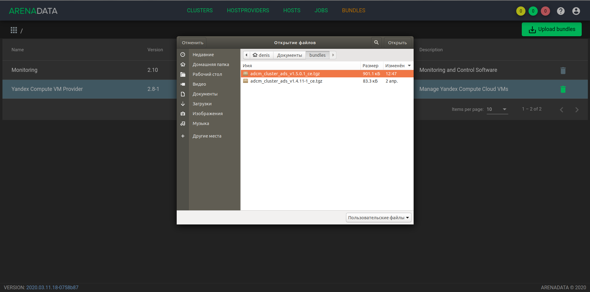

.. _upload_bundle:

Upload ADS bundle
===================

Loading the **ADS** bundle is necessary to create a cluster prototype in the **ADCM** from which it is possible to generate the cluster instances later.

To load the bundle:

1. Open "BUNDLES" tab in ADCM (:numref:`Pic.%s.<bundles>`).

.. _bundles:

.. figure:: ../../imgs/bundles.png
   :align: center

   "BUNDLES" tab

2. Press the "Upload bundle" button and select the ADS bundle file in the opened form (:numref:`Pic.%s.<choose_bundle>`).

.. _choose_bundle:

   Сhoose a bundle

3. As a result the fact of successful loading is displayed in the list of bundles on the "BUNDLES" tab (:numref:`Pic.%s.<load_bundle>`).

.. _load_bundle:

.. figure:: ../../imgs/load_bundle.png
   :align: center

   Bundle load success
