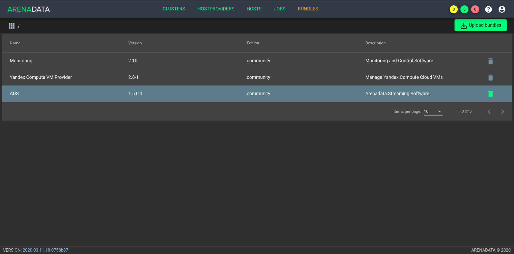

.. _upload_bundle:

Загрузка бандла ADS
===================

Загрузка бандла **ADS** необходима для создания в **ADCM** прототипа кластера, из которого в дальнейшем возможно создание его экземпляров. 

Для загрузки бандла следует выполнить следующие действия:

1. Открыть в ADCM вкладку "BUNDLES" (:numref:`Рис.%s.<bundles>`).

.. _bundles:

.. figure:: ../../imgs/bundles.png
   :align: center

   Вкладка "BUNDLES"

2. Нажать "Upload bundle" и в открывшейся форме выбрать файл бандла ADS (:numref:`Рис.%s.<choose_bundle>`).

.. _choose_bundle:

.. figure:: ../../imgs/choose_bundle.png
   :align: center

   Выбор бандла

3. В результате выполненных действий факт успешной загрузки отображается в общем списке бандлов на вкладке "BUNDLES" (:numref:`Рис.%s.<load_bundle>`).

.. _load_bundle:

   Результат успешной загрузки бандла
