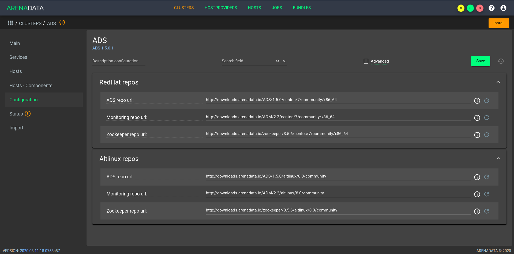

Создание кластера ADS
=====================

После выполнения :ref:`предварительных действий <preliminary_actions>` и :ref:`загрузки бандла <upload_bundle>` в кластер-менеджере **ADCM** содержится следующий список объектов (:numref:`Рис.%s. <hosts>`):

* Прототип кластера мониторинга и созданный на его основе экземпляр (программа мониторинга развернута на хосте, ADCM содержит записи о его результатах и настройках);

* Прототип кластера *ADS* для создания экземпляров;

* Предварительно подготовленные хосты, в базе данных ADCM хранятся записи о них и их учетных данных -- ssh-ключах или паролях.

.. _hosts:

.. figure:: ../imgs/hosts.png
   :align: center

   Список объектов в ADCM

Данным объектам доступен следующий функционал:

+ `Создание экземпляра кластера`_;
+ `Конфигурация кластера`_;
+ `Добавление хостов`_;
+ `Добавление сервисов`_;
+ `Размещение компонентов сервисов на хостах`_;
+ `Установка сервиса Zookeeper`_;
+ `Установка сервиса Kafka`_;
+ `Установка сервиса Nifi`_;
+ `Установка сервиса Monitoring Clients`_.

Создание экземпляра кластера
----------------------------

При создании кластера в веб-интерфейсе **ADCM** генерируется новый экземпляр кластера *ADS*, что означает только добавление данных о нем в базу данных **ADCM** -- на этом этапе не производится установка *ADS* на хосты.

1. Открыть в ADCM вкладку "CLUSTERS" (:numref:`Рис.%s. <cluster_mon>`).

.. _cluster_mon:

.. figure:: ../imgs/cluster_mon.png
   :align: center

   Вкладка "CLUSTERS"

2. Нажать "Add cluster" и в открывшейся форме создать экземпляр кластера из прототипа *ADS*, полученного из бандла (:numref:`Рис.%s. <add_cluster>`).

.. _add_cluster:

.. figure:: ../imgs/add_cluster.png
   :align: center

   Создание экземпляра кластера

3. В результате выполненных действий факт создания экземпляра кластера отображается в базе данных ADCM на вкладке "CLUSTERS" (:numref:`Рис.%s. <clusters_list>`).

.. _clusters_list:

.. figure:: ../imgs/clusters_list.png
   :align: center

   Результат успешного создания экземпляра кластера

Конфигурация кластера
---------------------

Для перехода к настройкам экземпляра кластера *ADS* необходимо нажать кнопку с пиктограммой шестеренки в соответствующей строке вкладки "CLUSTERS" (:numref:`Рис.%s. <clusters_list>`) и перейти в раздел меню "Configuration". При этом открывается окно конфигурации выбранного экземпляра (:numref:`Рис.%s. <cluster_config>`).

.. _cluster_config:

   Окно конфигурации кластера

В блоке настроек "Repositories" указываются требуемые для установки *ADS* пакеты из различных yum-репозиториев, при этом в каждом из параметров можно изменить заданный по умолчанию url на необходимый:

* *ADS*;
* *monitoring*;
* *epel*.

Каждый компонент сервиса кластера имеет возможность отсылать статусную информацию о своем состоянии (keep alive) процессу **ADCM** в докер-контейнере. В ряде случаев **ADCM** может оказаться за NAT, и тогда исключается очевидный вариант автоматического определения его адреса, видимого со стороны сервисного компонента на хосте кластера. Поэтому данный адрес указывается вручную. Во время установки **ADS** адрес **ADCM** используется для заполнения конфигурации компонентов, отвечающих за передачу статусной информации.

Добавление хостов
-----------------

Для добавления хостов в кластер *ADS* необходимо:

1. В меню кластера *ADS* открыть вкладку "Hosts" (:numref:`Рис.%s. <hosts_list>`).

.. _hosts_list:

.. figure:: ../imgs/hosts_list.png
   :align: center

   Вкладка "Hosts" кластера ads

2. Нажать "Add hosts" и в открывшейся форме выбрать необходимые хосты (:numref:`Рис.%s. <add_hosts>`).

.. _add_hosts:

.. figure:: ../imgs/add_hosts.png
   :align: center

   Выбор хостов

3. В результате выполненных действий факт добавления хостов отображается в кластере *ADS* в списке вкладки "Hosts" (:numref:`Рис.%s. <hosts_list2>`).

.. _hosts_list2:

.. figure:: ../imgs/hosts_list2.png
   :align: center

   Результат успешного добавления хостов

Добавление сервисов
-------------------

Кластер **ADS** содержит следующие сервисы (вот тут думаю, было бы логично сделать таблицу сервис/компоненты/описание):

* *Zookeeper* -- сервис, предназначенный для хранения конфигураций, выполнения распределенной синхронизации процессов;
* *Kafka* -- распределенная пплатформа для потоковых операций и данных;
* *Nifi* -- распрделенная платформа, предназначенная для построения и автоматизации потоков данных между различными системами;
* *Schema-registry* -- ;
* *Kafka REST Proxy* -- ;
* *KSQL* -- ;
* *Kafka-Manager* -- ; 
* *Monitoring Clients* -- агенты, отсылающие информацию о хосте и сервисах в мониторинг.

Не все сервисы являются обязательными для установки. Например, если вы не планируете использовать **Nifi**, то нет необходимости добавлять этот сервис. Или в случае, когда применяется сервис мониторинга (не на базе **Graphite**), незачем ставить агенты из *Monitoring Clients*. Однако, если планируется использование **Kafka**, одноименный сервис и **Zookeeper** обязательны, тоже самое можно сказать и про сервис **Nifi**. В тоже время сервис может состоять из обязательных и необязательных компонентов. Например, сервис *KSQL* состоит из обязательного компонента *Server* и необязательных: *Client*.

Для добавления сервисов в кластер *ADS* необходимо:

1. В меню кластера *ADS* открыть вкладку "Services".

2. Нажать "Add service" и в открывшейся форме выбрать необходимые сервисы (:numref:`Рис.%s. <add_services>`).

.. _add_services:

.. figure:: ../imgs/add_services.png
   :align: center

   Выбор сервисов

.. important:: На текущий момент невозможно удалить из кластера уже добавленный сервис

Особенности сервиса Monitoring Clients
^^^^^^^^^^^^^^^^^^^^^^^^^^^^^^^^^^^^^^

Сервис *Monitoring Clients* требует импорта конфигурационных параметров кластера мониторинга (адреса, логин/пароль) при добавлении в кластер *ADS*:

Для импорта конфигурации мониторинга в кластер *ADS* необходимо открыть в ADCM вкладку "CLUSTERS", выбрать опцию *Import* и отметить импортируемые настройки сервисов с помощью простановки флажков в открывшейся форме (:numref:`Рис.%s. <import_configs>`).

.. _import_configs:

.. figure:: ../imgs/import_configs.png
   :align: center

   Импорт конфигурации мониторинга

В настоящем примере в кластер добавлены все сервисы:

+ `Настройка сервиса Zookeeper`_;
+ `Настройка сервиса Kafka`_;
+ `Настройка сервиса Nifi`_;
+ `Настройка сервиса Schema-registry`_.
+ `Настройка сервиса Kafka REST Proxy`_;
+ `Настройка сервиса KSQL`_;
+ `Настройка сервиса Kafka-Manager`_;
+ `Настройка сервиса Monitoring Clients`_.

Размещение компонентов сервисов на хостах
-----------------------------------------

Каждый сервис состоит из обязательных компонентов, которые должны быть размещены, и необязательных, которые могут быть не разщены на хостах кластера. Для этого необходимо на вкладке кластера "Hosts - Components" выбрать компонент посредством нажатия на него мышкой в колонке "Components" и определить для него необходимый хост в колонке "Hosts" (:numref:`Рис.%s. <components>`).

.. _components:

.. figure:: ../imgs/components.png
   :align: center

   Размещение компонентов сервисов на хостах

Поскольку все сервисы добавлены в кластер **ADS**, но еще не размещены на хостах, то изначально ни на одном из хостов нет компонентов:

Например, компоненты cервиса *Nifi* (:numref:`Рис.%s. <nifi_components>`) размещены на хосте *nifi*:

* *Nifi Server* -- необходимо добавить на один или более хостов (возможна кластерная конфигурация);
* *Nifi Registry* -- необходимо добавить ровно на один  хост.

.. _nifi_components:

.. figure:: ../imgs/nifi_components.png
   :align: center

   Компоненты сервиса *Nifi*

Установки кластера
-------------------

.. important:: Необходимо импортировать настройки из кластера *Monitorig*, в случае если добавлен сервис *Monitoring Clients*

1. Прежде чем приступить непосредственно к установке кластера, необходимо в кластере *ADS* запустить действие "Preinstall" в правом верхенм углу экрана формы (:numref:`Рис.%s. <cluster_install>`).

.. _cluster_install:

.. figure:: ../imgs/cluster_install.png
   :align: center

   Список всех сервисов кластера

2. После запуска действия во всплывающем меню необходимо выбрать действия из приведенного списка и нажать *Run* (:numref:`Рис.%s. <preinstall_action>`).

.. _preinstall_action:

.. figure:: ../imgs/preinstall_action.png
   :align: center

   Список всех сервисов кластера

На данном этапе все хосты подготовлены и можно непосредственно приступать к установке всех сервисов кластера. 

Установка всех сервисов кластера
^^^^^^^^^^^^^^^^^^^^^^^^^^^^^^^^^^

Для установки всех добавленных сервисов в кластере *ADS* необходимо выбрать соответствующий кластер в **ADCM** и нажать кнопку *Install* в правом вехнем углу экранной формы (:numref:`Рис.%s. <cluster_preinstall>`).

.. _cluster_install:

.. figure:: ../imgs/cluster_preinstall.png
   :align: center

   Установка всех сервисов кластера

По результатам установки все добавленные сервисы меняют состояние с *preinstalled*, на *installed* -- установлен (:numref:`Рис.%s. <cluster_actions>`).

.. _cluster_actions:

.. figure:: ../imgs/cluster_actions.png
   :align: center

   Установка всех сервисов кластера

.. important:: в случае если возникла необходимость добавить новый сервис в инсталлированный кластер, то необходимо добавить его и произвести установку сервиса как описано ниже

Для того чтоб запустить кластер необходи нажать на кнопку *Start*

Установка сервиса в проинсталлированный кластер
^^^^^^^^^^^^^^^^^^^^^^^^^^^^^^^^^^^^^^^^^^^^^^^^^

В **ADCM** предусмотрена возможность добавить в работающий кластер новый сервис, в случае если возникла необходимость.

Например, для установки сервиса *Kafka* в проинсталлиованный кластер на вкладке кластера "Services" необходимо выполнить:

* 

* 

* В строке сервиса *Kafka* в поле "Actions" нажать на пиктограмму и выбрать действие *Install*.

* По результатам инсталляции сервис *Kafka* меняет состояние с *created* -- создан, на *installed* -- установлен.

Настройка сервиса Zookeeper
^^^^^^^^^^^^^^^^^^^^^^^^^^^^^

Для перехода к настройкам сервиса *Zookeeper* необходимо нажать кнопку с пиктограммой шестеренки в соответствующей строке вкладки "SERVICES" в интерфейсе **ADCM** и перейти в раздел меню "Configuration". При этом открывается окно конфигурации сервиса *Zookeeper* (:numref:`Рис.%s. <zk_config>`).

.. _zk_config:

.. figure:: ../imgs/zk_config.png
   :align: center

   Окно конфигурации сервиса Zookeeper

В блоке настроек "Main" задаются основные параметры:

* *connect* -- строка подключения к Znode, в которой Zookeeper хранит конфигурацию текущего кластера, используется сервисом Kafka. В текущей реализации данный параметр недоступен для редактирования и генеруруется на стороне ADCM автоматически;

* *data_dirs* -- каталог для хранения транзакционных логов Zookeeper. Данный параметр указывается как *dataDir* в конфигурационном файле *zoo.cfg*; 

* *client_port* -- порт, на котором Zookeeper слушает клиентские подключения.

В блоке настроек "Advanced" задаются следующие расширенные параметры:

* *zoo_cfg_content* -- содержимое файла *zoo.cfg*, которое в дальнейшем шаблонизируется. Данный параметр может использоваться для внесения `дополнительных настроек <https://zookeeper.apache.org/doc/r3.4.12/zookeeperAdmin.html#sc_configuration>`_;

* *zookeeper_env_content* -- содержимое файла *zookeeper-env.sh*, которое в дальнейшем шаблонизируется. Данный параметр может использоваться для внесения переменных окружения.

Настройка сервиса Kafka
^^^^^^^^^^^^^^^^^^^^^^^^^

Для перехода к настройкам сервиса *Kafka* необходимо нажать кнопку с пиктограммой шестеренки в соответствующей строке вкладки "SERVICES" и перейти в раздел меню "Configuration". При этом открывается окно конфигурации сервиса *Kafka* (:numref:`Рис.%s. <kafka_config>`).

.. _kafka_config:

.. figure:: ../imgs/kafka_config.png
   :align: center

   Окно конфигурации сервиса Kafka

В блоке настроек "Main" задаются основные параметры:

* *data_dirs* -- каталог для хранения данных в *Kafka*. Указывается к качестве параметра *log.dirs* в конфигурационном файле `server.properties <../../Config/broker>`_;

* *listeners* -- список URI (протокол, хост и порт, на котором поднят брокер), разделенный запятыми. Если используется не *PLAINTEXT*  протокол, то необходимо также указать *listener.security.protocol.map*. Для привязки ко всем интерфейсам указать имя хоста как *0.0.0.0*. Оставить имя хоста пустым для привязки к интерфейсу по умолчанию. Указывается в качестве параметра *listeners* в конфигурационном файле `server.properties <../../Config/broker>`_; 

* *default_replication_factor* -- фактор репликации, с которым по умолчанию создаются и хранятся топики. Указывается в качестве параметра *default.replication.factor* в конфигурационном файле `server.properties <../../Config/broker>`_;

* *delete_topic_enable* -- данный параметр позволяет удалять топики. Если параметр выключен, то удаление топика через инструменты администрирования не приводит к фактическому удалению. Указывается в качестве параметра *default.replication.factor* в конфигурационном файле `server.properties <../../Config/broker>`_; 

* *log_retention_hours* -- количество часов, в течение которых топики хранятся в *Kafka*. Указывается в качестве параметра *log.retention.hours* в конфигурационном файле `server.properties <../../Config/broker>`_;

* *log_roll_hours* -- максимальное время, после которого пояляется новый журнал сегмента, даже если старый журнал не переполнен. Указывается в качестве параметра *log.roll.hours* в конфигурационном файле `server.properties <../../Config/broker>`_;

* *broker_jmx_port* -- порт, по которому *Kafka* брокер отдает jmx-метрики. Указывается в качестве параметра *JMX_PORT* в файле *kafka-env.sh*;

* *manager_port* -- порт, на котором поднимается *Kafka-Manager*. Указывается в файле *kafka-manager-env.sh*;

* *schema_registry_heap_opts* -- размер кучи, выделяемoй процессу *schema-registry*. Указывается в качестве параметра *SCHEMA_REGISTRY_HEAP_OPTS* в *schema-registry-env.sh*;

* *schema_registry_listener_port* -- порт, который слушает *schema-registry*. Указывается в качестве параметра *listeners* в конфигурационном файле *schema-registry.properties*;

В блоке настроек "Advanced" задаются следующие расширенные параметры:

* *server_properties_content* -- содержимое файла *server.properties*, которое в дальнейшем шаблонизируется. Данный параметр может использоваться для внесения `дополнительных настроек <../../Config/index>`_;

* *kafka_env_content* -- содержимое файла *kafka-env.sh*, которое в дальнейшем шаблонизируется. Данный параметр может использоваться для внесения переменных окружения.

Настройка сервиса Nifi
^^^^^^^^^^^^^^^^^^^^^^^^

Для перехода к настройкам сервиса *Nifi* необходимо нажать кнопку с пиктограммой шестеренки в соответствующей строке вкладки "SERVICES" и перейти в раздел меню "Configuration". При этом открывается окно конфигурации сервиса *Nifi* (:numref:`Рис.%s. <nifi_config>`).

.. _nifi_config:

.. figure:: ../imgs/nifi_config.png
   :align: center

   Окно конфигурации сервиса Nifi

В блоке настроек "Main" задаются основные параметры:

* *nifi_ui_port* -- http-порт, на котором поднимается веб-интерфейс сервиса *Nifi*. Указывается в качестве параметра *nifi.web.http.port* в конфигурационном файле *nifi.properties*;

* *nifi_node_jvm_memory* -- размер кучи, выделяемой процессу сервиса *Nifi*. Указывается в конфигурационном файле *bootstrap.conf*.

В блоке настроек "Custom" задаются следующие необязательные параметры:

* *nifi_custom_nars* -- параметр следует использовать в случае добавления *custom nars*; перечисляются через запятую. Указываются в качестве *nifi.nar.library.directory.lib...* в конфигурационном файле *nifi.properties*;

В блоке настроек "Advanced" задаются следующие расширенные параметры:

* *nifi_properties_content* -- содержимое файла *nifi.properties*, которое в дальнейшем шаблонизируется. Данный параметр может использоваться для внесения дополнительных настроек;

* *nifi_env_content* -- содержимое файла *nifi-env.sh*, которое в дальнейшем шаблонизируется. Данный параметр может использоваться для внесения переменных окружения;

* *bootstrap_content* -- содержимое файла *bootstrap.conf*, которое в дальнейшем шаблонизируется. Данное поле может использоваться для внесения настроек, связанных с запуском сервиса;

* *logback_content* -- содержимое файла *logback.xml*, которое в дальнейшем шаблонизируется. Данное поле может использоваться для внесения настроек, связанных с логированием;

* *state_management_content* -- содержимое файла *state_management.xml*, которое в дальнейшем шаблонизируется. Данное поле может использоваться для внесения настроек, связанных с хранением состояния сервиса *Nifi*;

* *authorizers_content* -- содержимое файла *authorizers.xml*, которое в дальнейшем шаблонизируется. Данное поле может использоваться для внесения настроек авторизации в сервис *Nifi* в том случае, если настроены политики безопасности;

* *login_identity_providers_content* -- содержимое файла *login_identity_providers.xml*, которое в дальнейшем шаблонизируется. Данное поле может использоваться для внесения настроек авторизации, используемые *state* провайдером, в том случае, если настроены политики безопасности.

Настройка сервиса monitoring clients
^^^^^^^^^^^^^^^^^^^^^^^^^^^^^^^^^^^^^^

Для перехода к настройкам сервиса *monitoring clients* необходимо нажать кнопку с пиктограммой шестеренки в соответствующей строке вкладки "SERVICES" и перейти в раздел меню "Configuration". При этом открывается окно конфигурации сервиса *monitoring clients* (:numref:`Рис.%s. <mc_config>`).

.. _mc_config:

.. figure:: ../imgs/mc_config.png
   :align: center

   Окно конфигурации сервиса Monitoring Clients

В блоке настроек "Advanced" задаются следующие расширенные параметры:

* *kafka_dashboard* -- файл в формате *json*, который в дальнейшем шаблонизируется и отправляется в *Grafana*;

* *kafka_metrics* -- файл в формате *yaml*, который в дальнейшем шаблонизируется. Включает в себя *jmx* метрики брокеров *Kafka*.

