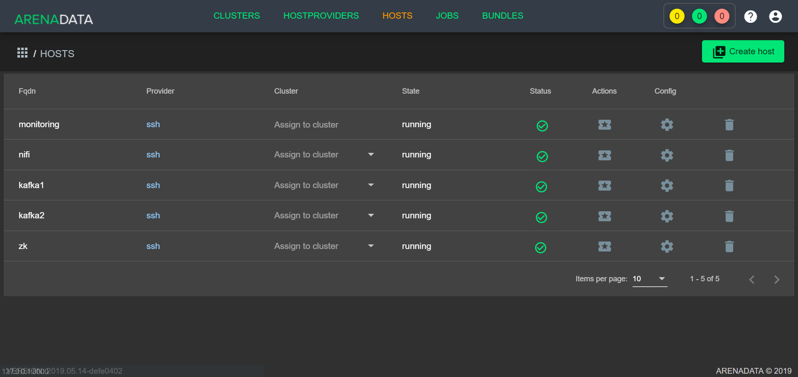
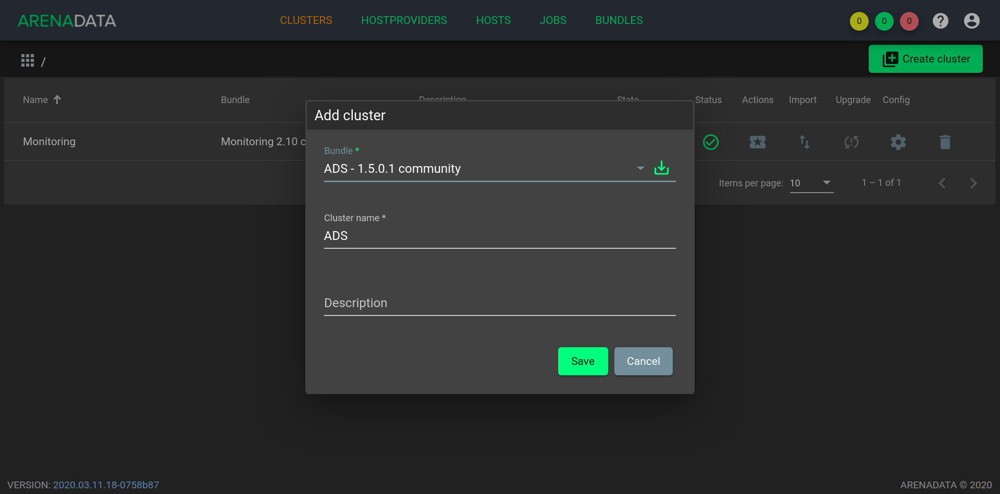
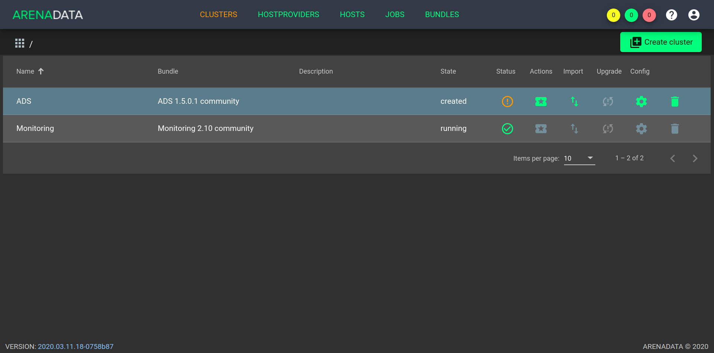
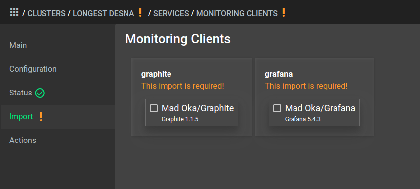
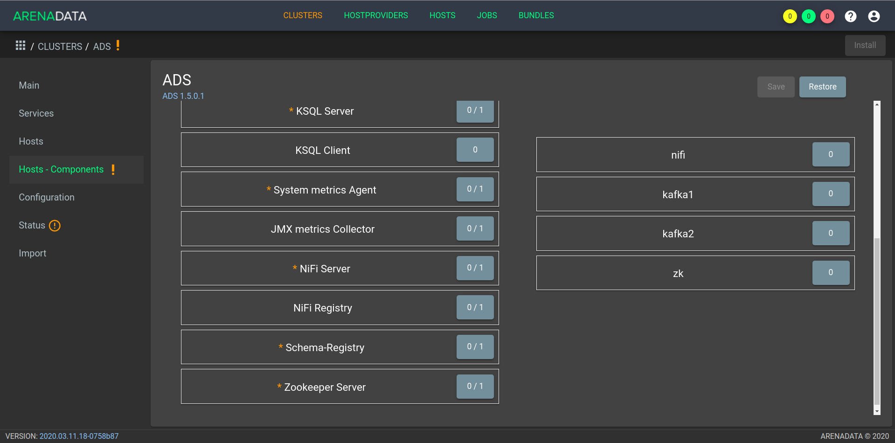
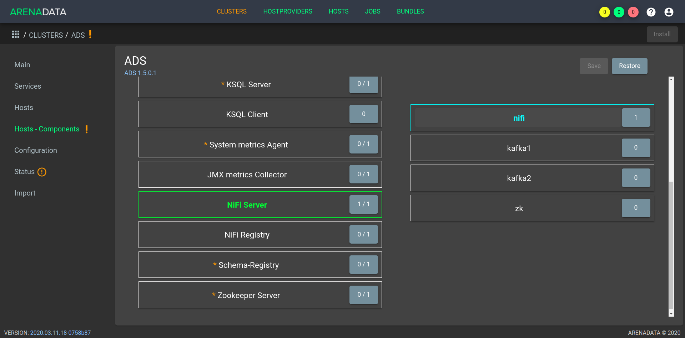

Создание кластера ADS
=====================

После выполнения :ref:`предварительных действий <preliminary_actions>` и :ref:`загрузки бандла <upload_bundle>` в кластер-менеджере **ADCM** содержится следующий список объектов (:numref:`Рис.%s. <hosts>`):

* Прототип кластера мониторинга и созданный на его основе экземпляр (программа мониторинга развернута на хосте, ADCM содержит записи о его результатах и настройках);

* Прототип кластера *ADS* для создания экземпляров;

* Предварительно подготовленные хосты, в базе данных ADCM хранятся записи о них и их учетных данных -- ssh-ключах или паролях.

.. _hosts:

   Список объектов в ADCM

Объектам доступен следующий функционал:

+ `Создание экземпляра кластера`_;
+ `Конфигурация кластера`_;
+ `Добавление хостов`_;
+ `Добавление сервисов`_;
+ `Размещение компонентов сервисов на хостах`_;
+ `Установка кластера`_.

Создание экземпляра кластера
----------------------------

При создании кластера в веб-интерфейсе **ADCM** генерируется новый экземпляр кластера *ADS*, что означает только добавление данных о нем в базу данных **ADCM** -- на этом этапе не производится установка *ADS* на хосты.

1. Открыть в ADCM вкладку "CLUSTERS" (:numref:`Рис.%s. <cluster_mon>`).

.. _cluster_mon:

.. figure:: ../imgs/cluster_mon.png
   :align: center

   Вкладка "CLUSTERS"

2. Нажать "Add cluster" и в открывшейся форме создать экземпляр кластера из прототипа *ADS*, полученного из бандла (:numref:`Рис.%s. <add_cluster>`).

.. _add_cluster:

   Создание экземпляра кластера

3. В результате выполненных действий факт создания экземпляра кластера отображается в базе данных ADCM на вкладке "CLUSTERS" (:numref:`Рис.%s. <clusters_list>`).

.. _clusters_list:

   Результат успешного создания экземпляра кластера

Конфигурация кластера
---------------------

Для перехода к настройкам экземпляра кластера *ADS* необходимо нажать кнопку с пиктограммой шестеренки в соответствующей строке вкладки "CLUSTERS" (:numref:`Рис.%s. <clusters_list>`) и перейти в раздел меню "Configuration". При этом открывается окно конфигурации выбранного экземпляра (:numref:`Рис.%s. <cluster_config>`).

.. _cluster_config:

.. figure:: ../imgs/cluster_config.png
   :align: center

   Окно конфигурации кластера

В блоке настроек "Repositories" указываются требуемые для установки *ADS* пакеты из различных yum-репозиториев, при этом в каждом из параметров можно изменить заданный по умолчанию url:

* *ADS*;
* *monitoring*;
* *epel*.

Если нет необходимости в добавлении того или иного yum-репозитория, то соответствующие галочки следует снять. 

Добавление хостов
-----------------

Для добавления хостов в кластер *ADS* необходимо:

1. В меню кластера *ADS* открыть вкладку "Hosts" (:numref:`Рис.%s. <hosts_list>`).

.. _hosts_list:

.. figure:: ../imgs/hosts_list.png
   :align: center

   Вкладка "Hosts" кластера ADS

2. Нажать "Add hosts" и в открывшейся форме выбрать необходимые хосты (:numref:`Рис.%s. <add_hosts>`).

.. _add_hosts:

.. figure:: ../imgs/add_hosts.png
   :align: center

   Выбор хостов

3. В результате выполненных действий факт добавления хостов отображается в кластере *ADS* в списке вкладки "Hosts" (:numref:`Рис.%s. <hosts_list2>`).

.. _hosts_list2:

.. figure:: ../imgs/hosts_list2.png
   :align: center

   Результат успешного добавления хостов

Добавление сервисов
-------------------

Кластер **ADS** содержит следующие сервисы:

.. csv-table:: Сервисы ADS
   :header: "Сервис", "Компоненты", "Описание"
   :widths: 20, 20, 60

   "Zookeeper", "Zookeeper Server", "Сервис, предназначенный для хранения конфигураций, выполнения распределенной синхронизации процессов"
   "Kafka", "Kafka Broker", "Распределенная платформа для потоковых операций и данных"
   "Nifi", "Nifi Server, Nifi Registry", "Распрделенная платформа, предназначенная для построения и автоматизации потоков данных между различными системами"
   "Schema-registry", "Schema-registry", "Сервис предоставляет обслуживающий слой для метаданных. Предоставляет интерфейс RESTful для хранения и извлечения схем Avro. Хранит версионную историю всех схем, предоставляет несколько параметров совместимости и позволяет изменять схемы в соответствии с настроенными параметрами совместимости и расширенной поддержкой Avro. Предоставляет сериализаторы, подключаемые к клиентам Kafka, которые обрабатывают хранение и извлечение схемы для сообщений Kafka, отправляемых в формате Avro"
   "Kafka REST Proxy", "Kafka REST Proxy", "Предоставляет RESTful-интерфейс для кластера Kafka, что упрощает создание и потребление сообщений, просмотр состояния кластера и выполнение административных действий без использования собственного протокола Kafka или клиентов"
   "KSQL", "KSQL Server, KSQL Client", "Сервис представляет собой потоковый SQL-движок с открытым исходным кодом, который обеспечивает обработку данных в реальном времени с использованием Apache Kafka. Состоит из компонентов: Server; Client"
   "Kafka-Manager", "Kafka-Manager", "Инструмент для управления Apache Kafka"
   "Monitoring Clients", "System metrics Agent, JMX metrics Collector", "Агенты, отсылающие информацию о хосте и сервисах в мониторинг"

Не все сервисы являются обязательными для установки. Например, если не планируется использование **Nifi**, то нет необходимости добавлять сервис. Или в случае, когда применяется сервис мониторинга (не на базе **Graphite**), незачем ставить агенты из *Monitoring Clients*. Однако, если планируется использование **Kafka**, одноименный сервис и *Zookeeper* обязательны, то же самое можно сказать и про сервис *Nifi*. При этом сервис может состоять из обязательных и необязательных компонентов. Например, сервис *KSQL* состоит из обязательного компонента *Server* и необязательного -- *Client*.

Для добавления сервисов в кластер *ADS* необходимо:

1. В меню кластера *ADS* открыть вкладку "Services".

2. Нажать "Add service" и в открывшейся форме выбрать необходимые сервисы (:numref:`Рис.%s. <add_services>`).

.. _add_services:

   Выбор сервисов

.. important:: На текущий момент невозможно удалить из кластера уже добавленный сервис

В настоящем примере в кластер добавлены все сервисы, подробное описание конфигурации которых приведено по следующим ссылкам:

+ `Настройка сервиса Zookeeper <https://docs.arenadata.io/ads/v1.4-RUS/Config/ADCM.html#zookeeper>`_;
+ `Настройка сервиса Kafka <https://docs.arenadata.io/ads/v1.4-RUS/Config/ADCM.html#kafka>`_;
+ `Настройка сервиса Nifi <https://docs.arenadata.io/ads/v1.4-RUS/Config/ADCM.html#nifi>`_;
+ `Настройка сервиса Schema-registry <https://docs.arenadata.io/ads/v1.4-RUS/Config/ADCM.html#schema-registry>`_.
+ `Настройка сервиса Kafka REST Proxy <https://docs.arenadata.io/ads/v1.4-RUS/Config/ADCM.html#kafka-rest-proxy>`_;
+ `Настройка сервиса KSQL <https://docs.arenadata.io/ads/v1.4-RUS/Config/ADCM.html#ksql>`_;
+ `Настройка сервиса Kafka-Manager <https://docs.arenadata.io/ads/v1.4-RUS/Config/ADCM.html#kafka-manager>`_;
+ `Настройка сервиса Monitoring Clients <https://docs.arenadata.io/ads/v1.4-RUS/Config/ADCM.html#monitoring-clients>`_.

Особенности сервиса Monitoring Clients
^^^^^^^^^^^^^^^^^^^^^^^^^^^^^^^^^^^^^^

Сервис *Monitoring Clients* требует импорта конфигурационных параметров кластера мониторинга (адреса, логин/пароль) при добавлении в кластер *ADS*.

Для импорта конфигурации мониторинга необходимо открыть в **ADCM** вкладку "CLUSTERS", выбрать опцию *Import* и отметить импортируемые настройки сервисов с помощью простановки флажков в открывшейся форме (:numref:`Рис.%s. <import_configs>`).

.. _import_configs:

   Импорт конфигурации мониторинга

Размещение компонентов сервисов на хостах
-----------------------------------------

Каждый сервис состоит из обязательных компонентов, которые должны быть размещены на хостах кластера, и необязательных, которые могут быть не размещены. Для размещения компонентов необходимо на вкладке "Hosts - Components" выбрать компонент в колонке "Components" и определить для него необходимый хост в колонке "Hosts" (:numref:`Рис.%s. <components>`).

.. _components:

   Размещение компонентов сервисов на хостах

Поскольку все сервисы добавлены в кластер **ADS**, но еще не размещены на хостах, то изначально ни на одном из хостов нет компонентов.

В качестве примера на :numref:`Рис.%s. <nifi_components>` показаны компоненты cервиса *Nifi*, размещенные на хосте *nifi*:

* *Nifi Server* -- необходимо добавить на один или более хостов (возможна кластерная конфигурация);
* *Nifi Registry* -- необходимо добавить ровно на один хост.

.. _nifi_components:

   Компоненты сервиса *Nifi*

Установка кластера
-------------------

.. important:: В случае если добавлен сервис *Monitoring Clients*, необходимо импортировать настройки из кластера *Monitoring* (см. `Особенности сервиса Monitoring Clients`_)

Прежде чем приступить к установке кластера, необходимо в *ADS* запустить действие *Preinstall* в правом верхнем углу экрана формы (:numref:`Рис.%s. <cluster_install>`).

.. _cluster_install:

.. figure:: ../imgs/cluster_install.png
   :align: center

   Preinstall

В результате чего во всплывающем меню следует выбрать необходимые действия из открывшегося списка и нажать *Run* (:numref:`Рис.%s. <preinstall_action>`).

.. _preinstall_action:

.. figure:: ../imgs/preinstall_action.png
   :align: center

   Action parameters

На данном этапе все хосты подготовлены и можно приступать непосредственно к установке сервисов кластера:

+ `Установка всех сервисов кластера`_;

+ `Установка сервиса в проинсталлированный кластер`_.

Установка всех сервисов кластера
^^^^^^^^^^^^^^^^^^^^^^^^^^^^^^^^^^

Для установки всех добавленных сервисов в кластере *ADS* необходимо выбрать соответствующий кластер в **ADCM** и выполнить действие *Install* (:numref:`Рис.%s. <cluster_preinstall>`).

.. _cluster_preinstall:

.. figure:: ../imgs/cluster_preinstall.png
   :align: center

   Установка всех сервисов кластера

По результатам установки все добавленные сервисы меняют состояние с *preinstalled*, на *installed* -- установлен (:numref:`Рис.%s. <cluster_actions>`).

.. _cluster_actions:

.. figure:: ../imgs/cluster_actions.png
   :align: center

   Состояние сервисов кластера

Для запуска кластера необходимо нажать на кнопку *Start*.

Установка сервиса в проинсталлированный кластер
^^^^^^^^^^^^^^^^^^^^^^^^^^^^^^^^^^^^^^^^^^^^^^^^^

В **ADCM** предусмотрена возможность добавления нового сервиса в уже работающий кластер. Для этого сервис необходимо добавить и произвести его установку. Например, для установки сервиса *Kafka* в проинсталлиованный кластер необходимо:

* В меню кластера *ADS* открыть вкладку "Services", нажать "Add service" и в открывшейся форме выбрать сервис *Kafka*.

* В строке сервиса *Kafka* в поле "Actions" нажать на пиктограмму и выбрать действие *Install*.

* По результатам инсталляции сервис *Kafka* меняет состояние с *created* -- создан, на *installed* -- установлен.

