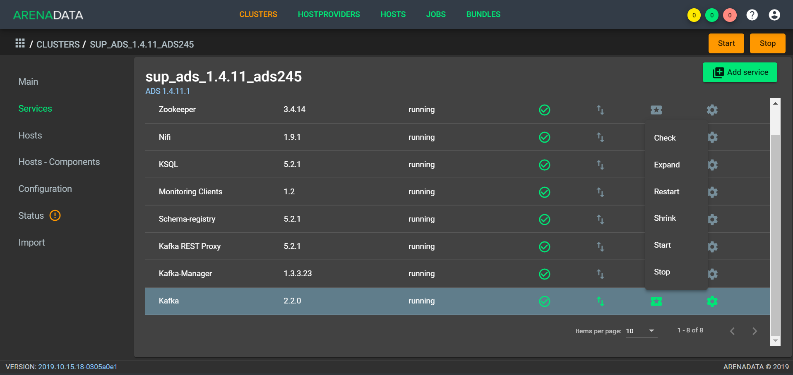
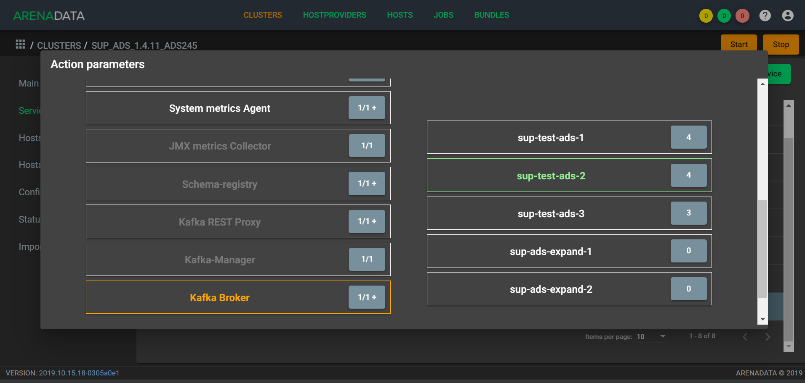

Удаление/Добавление компонентов сервиcа Kafka
==============================================

*Доступно с версии 1.4.11*

Если кластер ADS был развернут с помощью ADCM, операции по добавлению/удалению хоста в сервис *Kafka* могут быть выполнены автоматически. После выполнения планирования нового аппаратного обеспечения, необходимо добавить новые хосты в выбранный кластер в интерфейсе ADCM, используя кнопку **Add hosts** на вкладке **Hosts**. Кроме того, необходимо выполнить инициализацию каждого хоста, если того требует провайдер хостов.

.. important:: Описанные ниже операции не удаляют/добавляют хост из кластера – они лишь управляют компонентом *Kafka Broker* на хостах. Удаление хоста из кластера возможно в разделе “Hosts” кластера в случаях, когда к хосту не привязан ни один компонент.

Для добавления или удаления *Kafka Broker* с хостов необходимо воспользоваться соответствующими кнопками выпадающего меню, доступного по нажатию на иконку в поле “Actions” сервиса *Kafka* (:numref:`Рис.%s < kafka_action >`)

.. _kafka_action:

   Список допустимых операций над сервисом *Kafka*

Добавление компонентов Kafka Broker
------------------------------------

Когда хосты будут доступны для подключения по ssh для менеджера кластеров, необходимо выбрать действие **Expand** cервиса *Kafka* из списка возможных операций. В появившемся диалоге (:numref:`Рис.%s < expand_config_menu >`) необходимо указать следующие параметры:

* **Disable SELinux before cluster installation** -- Отключает SELinux на добавляемых хостах. Для того чтобы данная настройка применилась после завершения операции **Expand**, необходимо перезагрузить хосты вручную;

* **Disable Firewalld before cluster installation** -- Выключает firewalld на добавляемых хостах;

* **Install OpenJDK before cluster installation** -- Устанавливает пакет java-1.8.0-openjdk на добавляемых хостах;

* **Set vm.swappiness to 0 for all hosts** -- Отключает *swapping* на добавлемых хостах.

* **Append hosts into /etc/hosts file before cluster installation** -- Дописывет в */etc/hosts* на всех хостах кластера добавдяемые нодды. Данную настройку рекомендуется отключить, если настроен DNS.

.. _expand_config_menu:

.. figure:: ../imgs/expand_config_menu.png
   :align: center

   Настройки доступные при расширении

Затем нажмите кнопку **Next** для перехода к следующей странице конфигурации (:numref:`Рис.%s <expand_kafka_hc_menu>`). Далее необходимо распределить компонент *Kafka Broker* по добавляемым хостам. В случае если используется сервис *Monitoring Clinets*, их компоненты также необходимо разместить на добавляемых хостах для корретного функционирования этих сервисов. Затем необходимо запустить расширение сервиса кнопкой **Run**.

.. _expand_kafka_hc_menu:

На добавленные хосты будут установлены необходимые пакеты и произведена их настройка. Расширение сервиса *Kafka* не приводит к перемещению  существующих партиций топиков на новый хост. Если требуется перемещение партиций на только что добавленные в *Kafka* хосты, рекомендуем воспользоваться *Kafka-Manager*. В случае успешного завершения операций **Expand**, сервис будет переведен в состояние **running**.

Удаление Kafka Broker
----------------------

Для удаления одного или нескольких *Kafka Broker* с хостов кластера необходимо:

1. Нажать кнопку **Shrink**, что приведёт к появлению окна, описанного в предыдущем разделе (:numref:`Рис.%s <expand_kafka_hc_menu>`);

2. любым из двух способов удалить привязку компонента к хосту (компонент *Kafka Broker* будет выделен белым как возможный к удалению с хостов):

   - выбрать компонент в колонке "Components" и убрать выделение с хостов в колонке "Hosts", рамки которых выделены зелёным;
   - выбрать хост в колонке "Hosts" и убрать выделение с компонента *Kafka Broker* в колонке "Components" если рамка компонета *Kafka Broker* выделяется зелёным.

3. нажать кнопку *"Run"* в нижней части окна.

.. important:: Описанная выше операция не удаляет данные и пакет Kafka c хоста – онa лишь выводит ноду из кластера *Kafka*.

