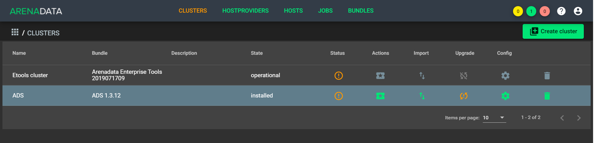
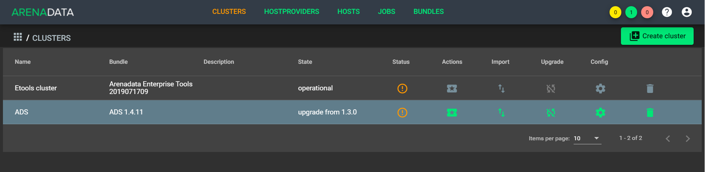
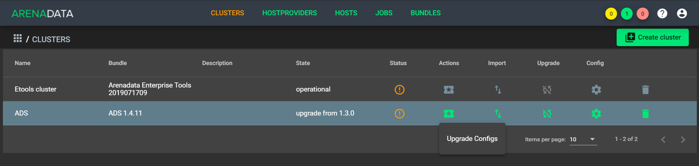
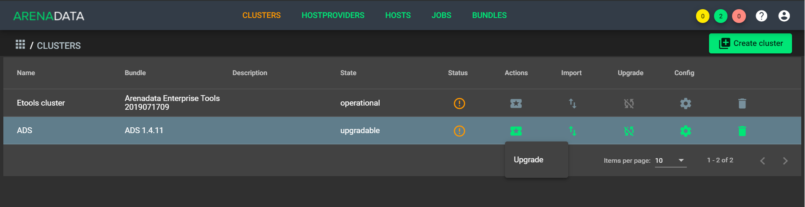

Обновление кластера ADS
=========================

*Доступно с версии 1.4.11*

**ADCM** предоставляет возможность обновления существующего кластера **ADS**.

Процесс обновления состоит из трех последовательных шагов:

* Обновление бандла;
* Обновления конфигов в ADCM;
* Обновление пакетов сервисов.

.. important:: В текущей версии доступно обновление кластеров как версий *1.3.X*, так и *1.4.X*

Обновление бандла
------------------

Для обновления бандла необходимо:

1. Загрузить бандл *ADS* новой версии. После его загрузки на вкладке "Clusters" в строке кластера с более старой версией бандла в колонке "Upgrade" появляется пиктограмма, указывающая на возможность обновления (:numref:`Рис.%s <bundle_upgrade>`).

.. _bundle_upgrade:

   Доступно обновление бандла

2. Нажать на пиктограмму в колонке "Upgrade" и выбрать доступную требуемую версию из списка (:numref:`Рис.%s <choose_bundle_upgrade>`).

.. _choose_bundle_upgrade:

.. figure:: ../imgs/choose_bundle_upgrade.png
   :align: center

   Доступные обновления

3. В открывшемся диалоговом окне подтвердить действие, после чего кластер меняет состояние на *upgrade from 1.3.X* или *upgrade from 1.4.X* в зависимости от установленной версии бандла (:numref:`Рис.%s <cluster_upgrade_state>`).

.. _cluster_upgrade_state:

   Изменение состояния кластера после обновления

Обновление конфигурации сервисов
---------------------------------

После обновления бандла в кластере становится доступным действие "Upgrade Configs".

.. important:: Прежде чем приступить к обновлению конфигураций, необходимо скопировать и сохранить конфигурации сервисов *Zookeeper*, *Kafka* и *Nifi* в случае, если были изменены настройки "по умолчанию". В частности, это касается файлов *nifi.properties* сервиcа *Nifi*, *zoo.cfg* сервиcа *Zookeeper* и *server.properties* сервиcа *Kafka*

.. important:: Если заданные по умолчанию настройки сервисов *Zookeeper*, *Kafka* и *Nifi* изменены, то их необходимо скопировать и сохранить прежде, чем приступить к обновлению конфигураций сервисов. В частности это касается файлов *nifi.properties*, *zoo.cfg* и *server.properties* сервиcов *Nifi*, *Zookeeper* и *Kafka* соответственно

Для обновления конфигурации сервисов необходимо:

1. В поле "Actions" обновляемого кластера нажать на пиктограмму и выбрать "Upgrade Configs" (:numref:`Рис.%s <cluster_upgrade_configs>`).

.. _cluster_upgrade_configs:

   Upgrade Configs

2. Подтвердить действие в открывшемся диалоговом окне нажатием кнопки "Run".

После успешного завершения операции обновления конфигурации кластеру присваивается состояние *upgradable*.

.. important:: Нижепреведенные шаги необходимо сделать в случае, если были изменены настройки "по умолчанию".

.. important:: Если заданные по умолчанию настройки сервисов были изменены перед обновлением, то после операции "Upgrade Configs" необходимо выполнить действия для соответствующих сервисов:

* Перейти к настройкам сервиса *Zookeeper*, проверить раздел *zoo.cfg* и при необходимости внести сохраненные ранее изменения;

* Перейти к настройкам сервиса *Kafka*, проверить разделы *Main* и *server.properties* и при необходимости внести сохраненные ранее изменения;

* Перейти к настройкам сервиса *Nifi*, проверить разделы *Main*, *Directories* и *nifi.properties* и при необходимости внести сохраненные ранее изменения.

Обновление пакетов сервисов
----------------------------

После завершения операции "Upgrade Configs" в кластере становится доступным действие "Upgrade". Данная операция применяет новые настройки, полученные на предыдущем шаге, и обновляет пакеты всех сервисов до указанных версий.

1. В поле "Actions" для обновляемого кластера нажать на пиктограмму и выбрать действие "Upgrade" (:numref:`Рис.%s <cluster_upgrade>`).

.. _cluster_upgrade:

   Обновление пакетов сервисов

2. Подтвердить действие в открывшемся диалоговом окне нажатием кнопки "Run".

После успешного завершения операции "Upgrade" кластеру присваивается состояние *installed*.
   
