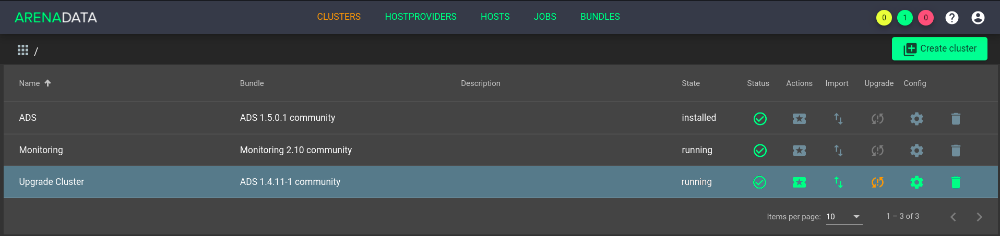
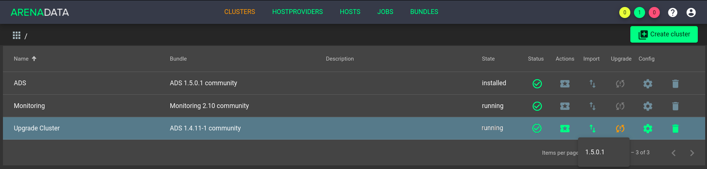
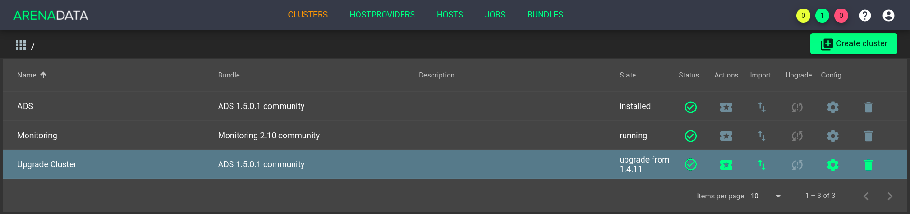

Обновление кластрера ADS
=========================

*Доступно с версии 1.4.11*

**ADCM** предоставляет возможность обновления существующего кластера **ADS**.

Процесс обновления состоит из трех последовательных шагов:

  - обновление бандла;
  - обновления конфигов в ADCM;
  - обновление пакетов сервисов.

.. important:: В текущем версии доступно обновление кластеров как версий *1.3.X* так и *1.4.X*.

Обновление бандла
------------------

Для обновления необходимо:

1. Загрузить бандл *ADS* новой версии. После загрузки на вкладке "Clusters" в строке кластера с более старой версией бандла появится пиктограмма, указывающая на возможность обновления. (:numref:`Рис.%s <bundle_upgrade>`).

.. _bundle_upgrade:

   Доступно обновление бандла

2. Нажать на появившуюся пиктограмму и выбрать действие *<версия бандла>* (:numref:`Рис.%s <choose_bundle_upgrade>`).

.. _choose_bundle_upgrade:

   Доступные обновления

3. Подтвердить действие в открывшемся диалоговом окне. После подтверждения кластер меняет состояние на *upgrade from 1.3.X* или *upgrade from 1.4.X* в зависимости от обновляемой версии бандла (:numref:`Рис.%s <cluster_upgrade_state>`).

.. _cluster_upgrade_state:

   Подтверждение действий

Обновление конфигурации сервисов
---------------------------------

После того как было произведенено обновление бандла, в кластере становится доступным действие "Upgrade Configs".

.. important:: Прежде чем приступить к обновлению конфигураций, необходимо скоприовать и сохранить конфигурации сервисов *Zookeeper*, *Kafka* и *Nifi* в случае, если были изменены настройки "по умолчанию". В частности, это касается файлов *nifi.properties* сервиcа *Nifi*, *zoo.cfg* сервиcа *Zookeeper* и *server.properties* сервиcа *Kafka.

Для обновления необходимо:

1. В поле "Actions" для обновляемого кластера нажать на пиктограмму и выбрать действие "Upgrade Configs" (:numref:`Рис.%s <cluster_upgrade_configs>`).

.. _cluster_upgrade_configs:

.. figure:: ../imgs/cluster_upgrade_configs.png
   :align: center

   Upgrade Configs

2. Подтвердить действие в открывшемся диалоговом окне нажатием кнопки "Run".

В случае успешного завершения операций "Upgrade Configs", кластер будет переведен в состояние **upgradable**.

.. important:: Нижепреведенные шаги необходимо сделать в случае, если были изменены настройки "по умолчанию".

3. Перейти к настройкам сервиса *Zookeeper*, проверить и внести, изменения для раздела *zoo.cfg* по требованию.

4. Перейти к настройкам сервиса *Kafka*, проверить и внести, изменения для разделов *Main* и *server.properties* по требованию.

5. Перейти к настройкам сервиса *Nifi*, проверить и внести, изменения для разделов *Main*, *Directories* и *nifi.properties* по требованию.

Обновление пакетов сервисов
----------------------------

После успешного завершения операции "Upgrade Configs", в кластере становится доступным действие "Upgrade". Данная операция применяет новые настройки, полученные на предыдущем шаге, и обновляет пакеты всех сервисов до указанных версий.

1. В поле "Actions" для обновляемого кластера нажать на пиктограмму и выбрать действие "Upgrade". (:numref:`Рис.%s <cluster_upgrade>`)

.. _cluster_upgrade:

.. figure:: ../imgs/cluster_upgrade.png
   :align: center

   Upgrade

2. Подтвердить действие в открывшемся диалоговом окне нажатием кнопки "Run".
   В случае успешного завершения операции "Upgrade" кластер меняет состояние на *installed*.

