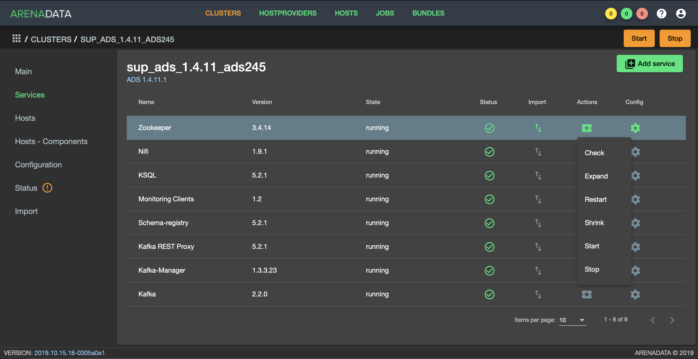
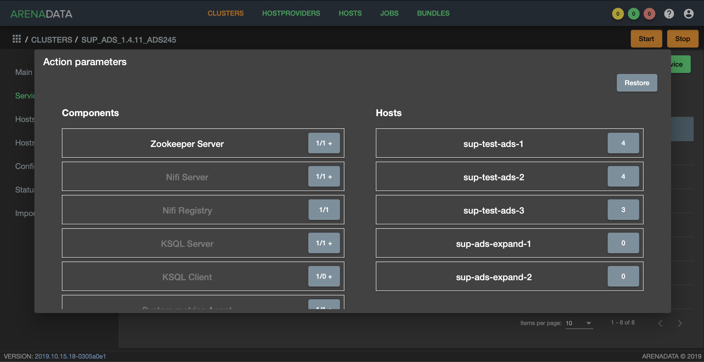

Удаление/Добавление компонентов сервиcа Zookeeper
==================================================

*Доступно с версии 1.4.11*

Если кластер ADS был развернут с помощью ADCM, операции по добавлению/удалению хоста в сервис *Zookeeper* могут быть выполнены автоматически. После выполнения планирования нового аппаратного обеспечения, необходимо добавить новые хосты в выбранный кластер в интерфейсе ADCM, используя кнопку **Add hosts** на вкладке **Hosts**. Кроме того, необходимо выполнить инициализацию каждого хоста, если того требует провайдер хостов.

.. important:: Описанные ниже операции не удаляют/добавляют хост из кластера – они лишь управляют компонентом *Zookeeper Server* на хостах. Удаление хоста из кластера возможно в разделе “Hosts” кластера в случаях, когда к хосту не привязан ни один компонент.

Для добавления или удаления *Zookeeper Server* с хостов необходимо воспользоваться соответствующими кнопками выпадающего меню, доступного по нажатию на иконку в поле “Actions” сервиса *Zookeeper* (:numref:`Рис.%s < zk_action >`)

.. _zk_action:

   Список допустимых операций над сервисом *Zookeeper*

.. important:: Рекомендуется использовать нечетное количество компонента *Zookeeper Server*

Добавление компонентов Zookeeper Server
----------------------------------------

Когда хосты будут доступны для подключения по ssh для менеджера кластеров, необходимо выбрать действие **Expand** cервиса *Zookeeper* из списка возможных операций. В появившемся диалоге (:numref:`Рис.%s < expand_config_menu >`) необходимо указать следующие параметры:

* **Disable SELinux before cluster installation** -- Отключает SELinux на добавляемых хостах. Для того чтобы данная настройка применилась после завершения операции **Expand**, необходимо перезагрузить хосты вручную;

* **Disable Firewalld before cluster installation** -- Выключает firewalld на добавляемых хостах;

* **Install OpenJDK before cluster installation** -- Устанавливает пакет java-1.8.0-openjdk на добавляемых хостах;

* **Set vm.swappiness to 0 for all hosts** -- Отключает *swapping* на добавлемых хостах.

* **Append hosts into /etc/hosts file before cluster installation** -- Дописывет в */etc/hosts* на всех хостах кластера добавдяемые нодды. Данную настройку рекомендуется отключить, если настроен DNS.

.. _expand_config_menu:

.. figure:: ../imgs/expand_config_menu.png
   :align: center

   Настройки доступные при расширении

Затем нажмите кнопку **Next** для перехода к следующей странице конфигурации (:numref:`Рис.%s <expand_zk_hc_menu>`). Далее необходимо распределить компонент *Zookeeper Server* по добавляемым хостам. Затем необходимо запустить расширение сервиса кнопкой **Run**.

.. _expand_zk_hc_menu:

На добавленные хосты будут установлены необходимые пакеты и произведена их настройка. В случае успешного завершения операций **Expand**, сервис будет переведен в состояние **running**.

Удаление Zookeeper Server
--------------------------

Для удаления одного или нескольких *Zookeeper Server* с хостов кластера необходимо:

1. Нажать кнопку **Shrink**, что приведёт к появлению окна, описанного в предыдущем разделе (:numref:`Рис.%s <expand_zk_hc_menu>`);

2. любым из двух способов удалить привязку компонента к хосту (компонент *Zookeeper Server* будет выделен белым как возможный к удалению с хостов):

- выбрать компонент в колонке "Components" и убрать выделение с хостов в колонке "Hosts", рамки которых выделены зелёным;
- выбрать хост в колонке "Hosts" и убрать выделение с компонента *Zookeeper Server* в колонке "Components" если рамка компонета *Zookeeper Server* выделяется зелёным.

3. нажать кнопку *"Run"* в нижней части окна.

.. important:: Описанная выше операция не удаляет данные и пакет Zookeeper c хоста – онa лишь выводит ноду из кластера *Zookeeper*.

