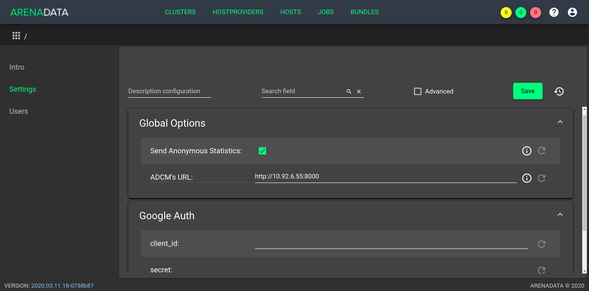

.. _preliminary_actions:

Предварительные действия
========================

Для установки кластера **ADS** посредством **ADCM** необходимо выполнить следующие предварительные шаги:

#. Установить ADCM;

#. Проверить настройки ADCM:

   * Перейти во вкладку "Settings"

   * Проверить на корректность определившийся автоматически URL и при необходимости заменить его на исправный.

.. _adcm_url:

   Вкладка "Settings"

#. Создать хосты для кластера ADS:

   * Загрузить выбранный бандл хоста. В текущем примере используется бандл *SSH*;

   * Инициализировать необходимое количество хостов (в текущем примере данный шаг пропускается, так как используются готовые хосты, а не облачный провайдер);

   * Добавить хосты в ADCM (в текущем примере используется 4 хоста): для Zookeeper (*zk*), для Kafka брокеров (*kafka1* и *kafka2*), для Nifi (*nifi*);

#. (Опционально) Создать кластер мониторинга:

   * Загрузить бандл мониторинга;

   * Создать экземпляр кластера мониторинга и установить его.

Установочные шаги
=================

.. toctree::
   :maxdepth: 2

   upload_ads_bundle/index
   create_cluster/index
   manage_tools/index

.. important:: Контактная информация службы поддержки -- e-mail: info@arenadata.io

