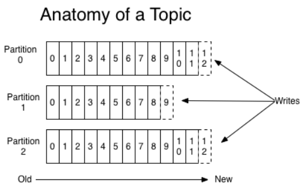
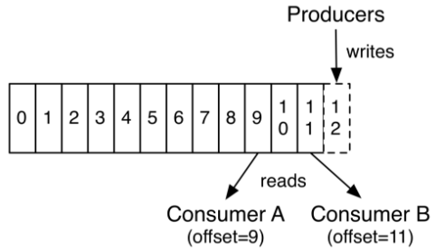

Storage concept
===================

Let's first dive into the core abstraction **ADS** provides for a stream of records -- the topic.

A topic is a category or feed name to which records are published. Topics in **ADS** are always multi-subscriber; that is, a topic can have zero, one, or many consumers that subscribe to the data written to it. For each topic, the platform maintains a partitioned log that looks like this :numref:`Pic.%s.<ADS_intro_Topic>`

.. _ADS_intro_Topic:

   Partitioned log 

Each partition is an ordered, immutable sequence of records that is continually appended to—a structured commit log. The records in the partitions are each assigned a sequential *id* number called the *offset* that uniquely identifies each record within the partition.

**ADS** persists all published records -- whether or not they have been consumed -- using a configurable retention period. For example, if the retention policy is set to two days, then for the two days after a record is published, it is available for consumption, after which it will be discarded to free up space. Platform's performance is effectively constant with respect to data size so storing data for a long time is not a problem (:numref:`Pic.%s.<ADS_intro_offset>`).

.. _ADS_intro_offset:

   Offset logic 

In fact, the only metadata retained on a per-consumer basis is the offset or position of that consumer in the log. This offset is controlled by the consumer: normally a consumer will advance its offset linearly as it reads records, but, in fact, since the position is controlled by the consumer it can consume records in any order it likes. For example a consumer can reset to an older offset to reprocess data from the past or skip ahead to the most recent record and start consuming from "now".

This combination of features means that **ADS** consumers are very cheap -- they can come and go without much impact on the cluster or on other consumers. For example, you can use our command line tools to "tail" the contents of any topic without changing what is consumed by any existing consumers.

The partitions in the log serve several purposes. First, they allow the log to scale beyond a size that will fit on a single server. Each individual partition must fit on the servers that host it, but a topic may have many partitions so it can handle an arbitrary amount of data. Second they act as the unit of parallelism—more on that in a bit.

Партиции журнала распределяются по серверам кластера **ADS**, при этом каждый сервер обрабатывает данные и запросы к определенным партициям. Каждая партиция реплицируется на настраиваемое число серверов для обеспечения отказоустойчивости.

У каждой партиции всегда имеется один сервер, выступающий в качетсве "лидера". Лидер обрабатывает все запросы на чтение и запись для партиции, а остальные сервера пассивно реплицируют изменения лидера. Если лидер выходит из строя, один из брокеров автоматически становится новым лидером. 

**ADS MirrorMaker** обеспечивает поддержку георепликации для кластеров. С помощью **MirrorMaker** сообщения реплицируются через несколько центров обработки данных или облачных сервисов, что можно использовать в активных/пассивных сценариях резервного копирования и восстановления или в активных/активных сценариях для размещения данных ближе к пользователям, а так же с целью поддержки требований к местоположению данных.

Поставщики публикуют данные по топикам по своему усмотрению и отвечают за выбор того, какую запись назначить для какой партиции. Это может быть сделано в циклическом режиме для балансировки нагрузки, или это может быть сделано в соответствии с какой-либо семантической функцией разбиения (например, на основе некоторого ключа в записи). 

Потребители относят себя к группе потребителей, и каждая запись, опубликованная в топике, доставляется каждому инстансу потребителя, группа которого подписана на данный топик. При этом инстансы потребителя могут находиться на отдельных процессах или машинах. Если все инстансы потребителя имеют одну и ту же группу, то записи эффективно балансируются. А в случае если инстансы потребителя имеют разные группы, то каждая запись передается во все потребительские процессы (:numref:`Рис.%s.<ADS_intro_group>`).

.. _ADS_intro_group:

.. figure:: ./imgs/ADS_intro_group.*
   :align: center

   Группы потребителей 

На рисунке приведен пример двухсерверного кластера **ADS** с четырьмя партициями (*P0-P3*) и с двумя группами потребителей. Группа потребителей *A* имеет два экземпляра потребителей, группа *B* -- четыре.

Чаще всего топики имеют небольшое количество групп потребителей -- по одной для каждого "логического подписчика" ("logical subscriber"). Каждая группа состоит из множества инстансов потребителей для обеспечения масштабируемости и отказоустойчивости. Это не что иное, как семантика "издатель-подписчик" ("publish-subscribe"), где подписчик представляет собой не один процесс, а группу потребителей.

Реализация способа считывания в **ADS** заключается в разделении записей журнала на партиции, исходя из экземпляров потребителя, чтобы каждый экземпляр был исключительным потребителем "изрядной доли" ("fair share") партиций в любой момент времени. Процесс поддержания членства в группе динамически обрабатывается протоколом **ADS**. Если к группе присоединяются новые экземпляры, они принимают некоторые партиции от других членов группы; если экземпляр удаляется, его партиции распределяются по остальным экземплярам.

**ADS** предоставляет только общий порядок записей внутри партиции, а не между партициями в топике. Упорядочивание по разделам в сочетании с возможностью разбиения данных по ключам для большинства приложений является достаточным. Однако если требуется полный порядок по записям, это может быть достигнуто с помощью топика, имеющего только одну партицию, хотя это будет означать только один потребительский процесс для каждой группы потребителей.

**ADS** можно развернуть как *multi-tenant* решение. Этот режим настраивает, в какой топик могут записываться данные, а из какого считываться. Существует также операционная поддержка квот. Администраторы могут определять и применять квоты на запросы для управления ресурсами брокера, которые используются клиентами.
