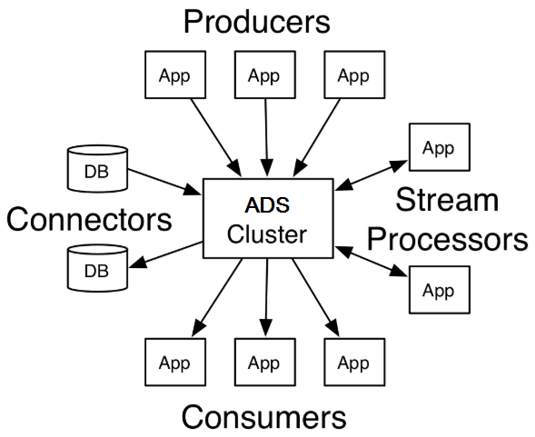

Arenadata Streaming Overview
================================

**Arenadata Streaming** (**ADS**) -- **distributed streaming platform**, which includes an integrated set of enterprise-level components based on open source solutions. The platform contains all the necessary components for streaming and processing real-time data, their transformation, interaction and storage, transmission in the semantics of "exactly-once delivery", security and administration. Also, the platform can act as a corporate data bus and ETL tool.

The idea of a distributed streaming platform is to provide:

+ Single access point -- use as a corporate data bus for all your applications;
+ Easy, safe and reliable way to control data flow -- the ability to safely collect large data streams and efficiently manage them in real time;
+ Security policies -- the ability to create data streams with support for differentiation of access rights to them;
+ Fast and continuous development -- Develop streaming analytic applications in minutes in real time without writing a line of code.

One of the features of the implementation of the platform is the use of technology, similar to the transaction logs used in database management systems. **ADS** has the following distinctive technical qualities:

+ Fault tolerance;
+ Scalability;
+ Distribution;
+ Available equipment;
+ Real time;
+ Security;
+ Integration;
+ Simplicity and flexibility/

A streaming platform has three key capabilities:

+ Publish and subscribe to streams of records, similar to a message queue or enterprise messaging system;
+ Store streams of records in a fault-tolerant durable way;
+ Process streams of records as they occur.

**ADS** is generally used for two broad classes of applications:

+ Building real-time streaming data pipelines that reliably get data between systems or applications;
+ Building real-time streaming applications that transform or react to the streams of dat.

A few concepts of  **Arenadata Streaming**:

+ Kafka is run as a cluster on one or more servers that can span multiple datacenters;
+ The Kafka cluster stores streams of records in categories called topics;
+ Each record consists of a key, a value, and a timestamp.

**ADS** has four core APIs (:numref:`Рис.%s.<ADS_intro_API-ADS>`):

+ The **Producer API** allows an application to publish a stream of records to one or more Kafka topics. Examples of use are given in `javadocs <https://kafka.apache.org/11/javadoc/index.html?org/apache/kafka/clients/producer/KafkaProducer.html>`_;
+ The **Consumer API** allows an application to subscribe to one or more topics and process the stream of records produced to them. Examples of use are given in `javadocs <https://kafka.apache.org/11/javadoc/index.html?org/apache/kafka/clients/consumer/KafkaConsumer.html>`_;
+ The **Streams API** allows an application to act as a stream processor, consuming an input stream from one or more topics and producing an output stream to one or more output topics, effectively transforming the input streams to output streams. Examples of use are given in `javadocs <https://kafka.apache.org/11/javadoc/index.html?org/apache/kafka/streams/KafkaStreams.html>`_;
+ The **Connector API** allows building and running reusable producers or consumers that connect Kafka topics to existing applications or data systems. For example, a connector to a relational database might capture every change to a table.. Examples of use are given in `javadocs <https://kafka.apache.org/11/javadoc/index.html?org/apache/kafka/connect>`_.

.. _ADS_intro_API-ADS:

   ADS Platform API

**Apache Kafka** clients are available in many programming languages. (`Clients <https://cwiki.apache.org/confluence/display/KAFKA/Clients>`_).

The **NiFi** service as part of the platform **ADS** is a powerful tool for building scalable oriented data routing graphs and their conversion. Some of the high-level features and goals **NiFi**:

+ Web user interface:
  + Development, management and monitoring in a single interface;

+ Flexible configuration depending on needs:
  + Loss resistance or guaranteed delivery;
  + Low latency or high bandwidth;
  + Dynamic prioritization;
  + The ability to change the flow at run time;

+ Origin of data:
  + Tracking data flow from start to finish;

+ Expansion of functionality:
  + The ability to create your own processors and much more;
  + Ensuring rapid development and effective testing;

+ Security:
  + SSL, SSH, HTTPS, encrypted content, etc.;
  + Multi-tenant authorization and internal authorization/policy management.

The documentation contains storage concepts for the **Arenadata Streaming** platform, warranties and recommendations for using **ADS**. The section is proposed for reading before proceeding to the direct installation of the system.

.. important:: Contact information support service -- e-mail: info@arenadata.io

.. toctree::
   :maxdepth: 2
   :caption: Table of contents:

   concept
   guarantees
   usecase
   core
