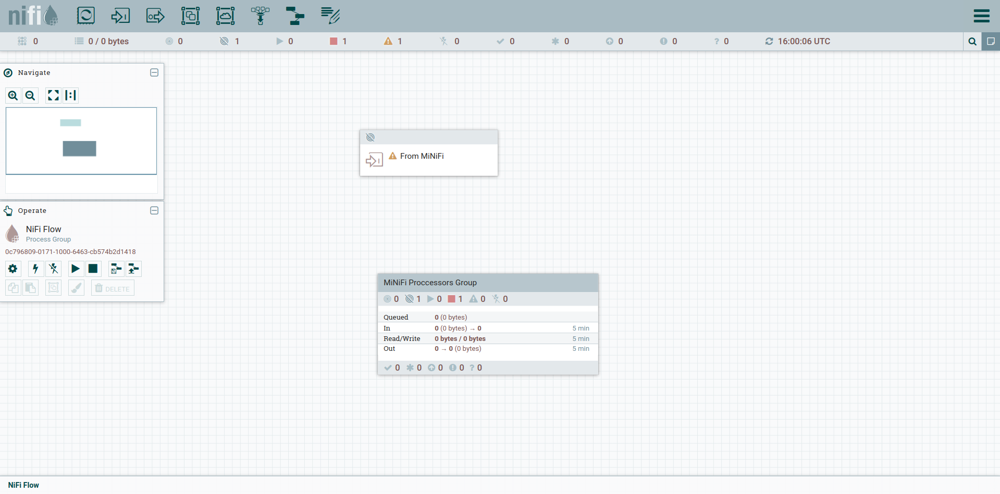
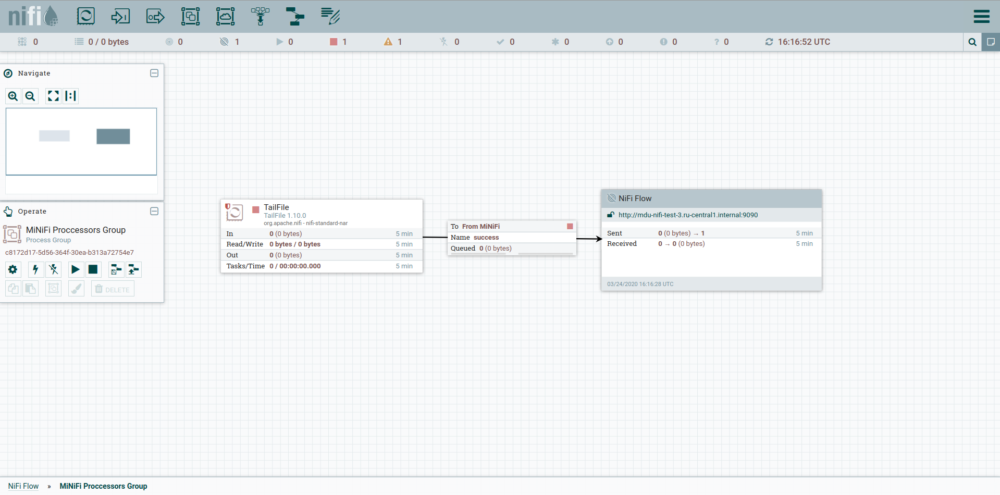
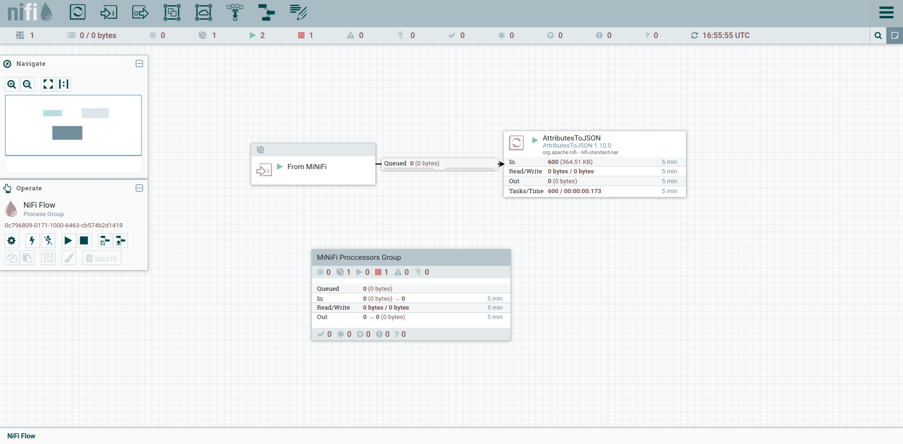
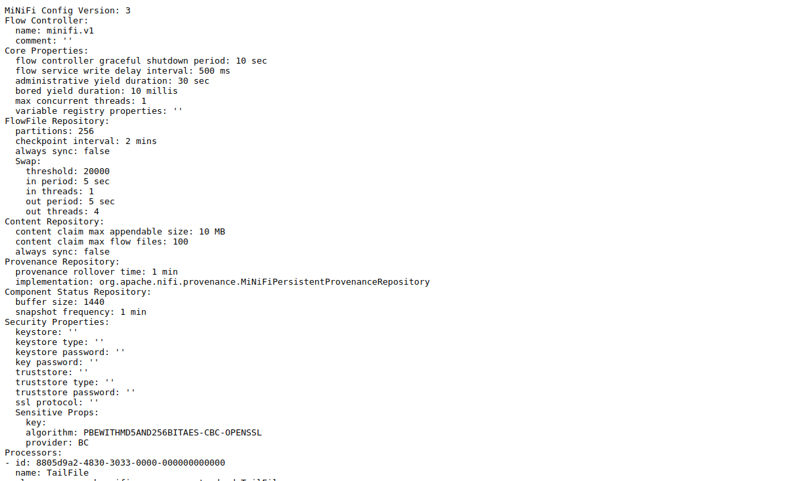

Интеграция сервисов MiNiFi и NiFi
=================================

**ADS** предоставляет, помимо NiFi и MiNiFi, поддержку центрального управления Агентами с помощью MiNiFi C2 Server.
Данный сервис обеспечивает автоматическое обновление конфигураций Агентов без дополнительных затрат.
В данном разделе приведены основные шаги для интеграции MiNiFi и NiFi:

+ `Создание шаблона`_;
+ `Проверка`_.

Создание шаблона
------------------

Для сбора информации Агентами необходимо создать шаблон в UI *NiFi*. Он может представлять различные вариации, в зависимости от поставленных задач. В данном разделе представлен элементарный шаблон для сбора содержимого файла.

После установки NiFi и MiNiFi, в разделе *Template* появляется шаблон с название *simple-minifi-listener*, который представляет из себя следующие элементы (:numref:`Рис.%s. <minifi_listener>`).

.. _minifi_listener:

   Основные элементы шаблона

Чтобы создать шаблон для Агентов, необходимо перейти в *MiNiFi Process Group*. Здесь создается *Flow*, который будет использоваться на Агентах.

В нашем случае созданный *Flow* (:numref:`Рис.%s. <minifi_flow>`)  содержит процессор *TailFile*, который передает данные экземпляру *NiFi*

.. _minifi_flow:

   Flow Агентов

Для успешной загрузки *Flow* на Агенты, необходимо создать шаблон с названием указанным в `nifi.minifi.notifier.ingestors.pull.http.query <https://docs.arenadata.io/ads/Config/ADCM.html#minifi>`_ с добавлением версии (например, *minifi.v1*).
Если вы изменили *Flow*, то для актуализации данных на агентах необходимо увеличить версию шаблона (например, minifi.v2)

По прохождении времени, заданного в `nifi.minifi.notifier.ingestors.pull.http.period.ms <https://docs.arenadata.io/ads/Config/ADCM.html#minifi>`_, Агенты автоматически обновят свои конфигурации.
Если шаблон был неправильно собран, то Агенты продолжат работу на последней работоспособной конфигурации.

Проверка
----------

* Самый простой способ - это подождать, пока в UI *NiFi* не появится информация об обмене данными (:numref:`Рис.%s. <nifi_flow>`).

.. _nifi_flow:

   Результат работы потока

* Все сервисы можно проверить с помощью утилиты *systemctl*.

* *MiNiFi_C2* можно проверить при обращении к его API (:numref:`Рис.%s. <minifi_с2_api>`). Ссылка указана в описании сервиса в **ADCM**.

.. _minifi_c2_api:

   Результат обращения к MiNiFi_C2
