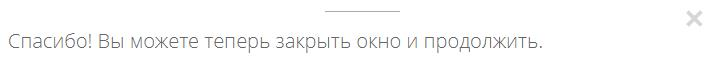
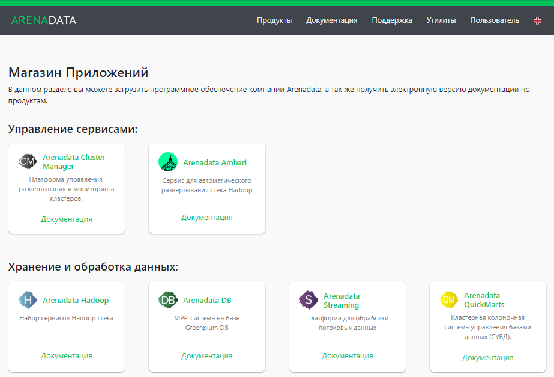
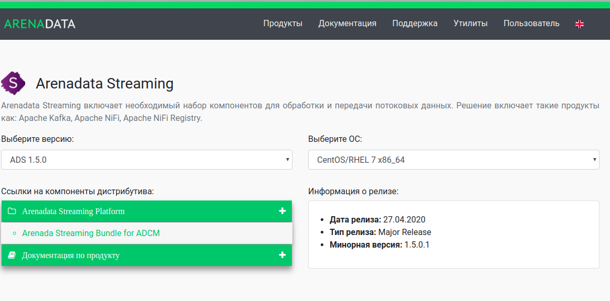

Загрузка дистрибутива платформы
===============================

Для загрузки дистрибутива **Arenadata Streaming** необходимо на сайте `arenadata.io <https://arenadata.tech/>`_ выбрать вкладку *"Скачать"*. При этом происходит переход на страницу *Магазин Программного Обеспечения Arenadata* (`store.arenadata.io <https://store.arenadata.io/>`_, :numref:`Рис.%s.<install_download_app-store>`), и открывается экранная форма заявки для загрузки продукта (:numref:`Рис.%s.<install_download_form-download>`).

.. _install_download_form-download:

.. figure:: ../imgs/install_download_form-download.png
   :scale: 60 %
   :align: center

   Заявка для загрузки продукта

В экранной форме заявки следует заполнить следующие поля:

+ *ФИО* -- ФИО пользователя;
+ *E-Mail* -- адрес электронной почты пользователя;
+ *Компания* -- наименование компании пользователя;
+ *Цель использования* -- описание цели использования платформы.

Все поля являются обязательными для заполнения. После ввода данных необходимо нажать кнопку *Отправить*, в результате чего выдается соответствующее сообщение (:numref:`Рис.%s.<install_download_accepted>`).

.. _install_download_accepted:

   Заявка принята

При закрытии окна происходит переход на страницу *Магазин Приложений* с перечнем продуктов **Arenadata** (:numref:`Рис.%s.<install_download_app-store>`).

.. _install_download_app-store:

   Магазин Приложений

Для загрузки дистрибутива платформы следует перейти на страницу продукта, кликнув на продукт **Arenadata Streaming**. При этом происходит переход на соответствующую страницу с кратким описанием продукта, ссылками на компоненты дистрибутива и информацией о релизе (:numref:`Рис.%s.<install_download_download-ADS_1.5>`).

.. _install_download_download-ADS_1.5:

   Страница загрузки Arenadata Streaming

В разделе *"Выберите версию продукта"* следует указать интересующую версию **ADS**, а в поле *"Выберите ОС"* -- используемую операционную систему. При этом в разделе *"Информация о релизе"* отображается дата выхода и тип релиза выбранной версии, ее номер, ссылки на лицензию использования и Release Notes.

В разделе *Ссылки на компоненты дистрибутива* находятся ссылки для загрузки компонентов выбранной версии платформы. После загрузки компонентов следует установить их, действуя в соответствии с последующими разделами настоящего документа.
