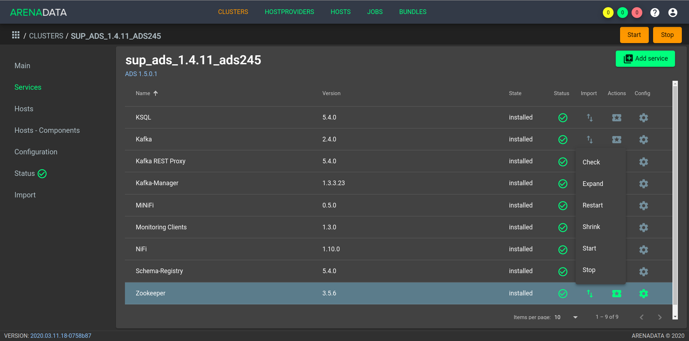
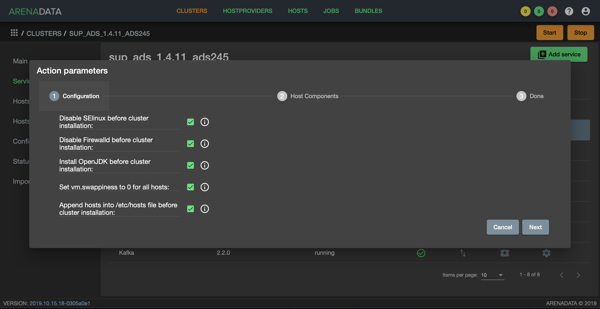
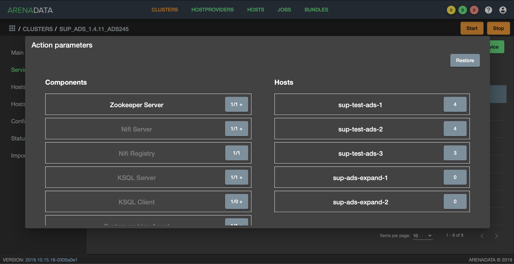

Удаление/Добавление компонентов сервиcа Zookeeper
==================================================

*Доступно с версии 1.4.11*

Если кластер **ADS** разворачивается с помощью **ADCM**, то операции по добавлению/удалению хоста в сервис *Zookeeper* могут быть выполнены автоматически. После выполнения планирования нового аппаратного обеспечения необходимо добавить новые хосты в выбранный кластер в интерфейсе **ADCM**, используя кнопку "Add hosts" на вкладке "Hosts". Кроме того, необходимо выполнить инициализацию каждого хоста, если того требует провайдер хостов.

.. important:: Описанные ниже операции не удаляют/добавляют хост из кластера -- они лишь управляют компонентом *Zookeeper Server* на хостах. Удаление хоста из кластера возможно в разделе “Hosts” кластера при условии, что к хосту не привязан ни один компонент

Для добавления или удаления *Zookeeper Server* с хостов необходимо воспользоваться соответствующими кнопками выпадающего меню, доступного по нажатию на иконку в поле “Actions” сервиса *Zookeeper* (:numref:`Рис.%s <zk_action>`).

.. _zk_action:

   Список допустимых операций над сервисом Zookeeper

.. important:: Рекомендуется использовать нечетное количество компонента *Zookeeper Server*

Добавление компонентов Zookeeper Server
----------------------------------------

Когда хосты становятся доступными для подключения по ssh для менеджера кластеров, необходимо выбрать действие *Expand* cервиса *Zookeeper* из списка возможных операций. В появившемся диалоговом окне предоставляется выбор опций (:numref:`Рис.%s <expand_config_menu>`):

* *Disable SELinux before cluster installation* -- отключение SELinux на добавляемых хостах. Для того, чтобы данная настройка применилась, после завершения операции *Expand* необходимо перезагрузить хосты вручную;

* *Disable Firewalld before cluster installation* -- выключение firewalld на добавляемых хостах;

* *Install OpenJDK before cluster installation* -- установка пакета *java-1.8.0-openjdk* на добавляемых хостах;

* *Set vm.swappiness to 0 for all hosts* -- отключение *swapping* на добавлемых хостах;

* *Append hosts into /etc/hosts file before cluster installation* -- запись добавляемых нод в */etc/hosts* на всех хостах кластера. Данную опцию рекомендуется отключить, если настроен DNS.

.. _expand_config_menu:

   Доступные при расширении настройки

После выбора опций для перехода к следующей странице конфигурации следует нажать кнопку "Next", и в открывшейся форме необходимо распределить компонент *Zookeeper Server* по добавляемым хостам (:numref:`Рис.%s <expand_zk_hc_menu>`).

.. _expand_zk_hc_menu:

   Распределение компонента по хостам

Расширение сервиса запускается кнопкой "Run". На добавленные хосты устанавливаются необходимые пакеты и производится их настройка.

Удаление Zookeeper Server
--------------------------

Для удаления одного или нескольких *Zookeeper Server* с хостов кластера необходимо:

1. Выбрать действие *Shrink* cервиса *Zookeeper* из списка возможных операций (см. :numref:`Рис.%s <zk_action>`), что приводит к появлению окна распределения компонента по хостам (см. :numref:`Рис.%s <expand_zk_hc_menu>`);

2. Любым из двух способов удалить привязку компонента к хосту (компонент *Zookeeper Server* выделяется белым цветом, как возможный к удалению с хостов):

- Выбрать компонент в колонке "Components" и убрать выделение с хостов в колонке "Hosts", рамки которых выделены зеленым цветом;

- Выбрать хост в колонке "Hosts" и убрать выделение с компонента *Zookeeper Server* в колонке "Components", если рамка компонета *Zookeeper Server* выделяется зеленым цветом.

3. Нажать кнопку "Run" в нижней части окна.

.. important:: Описанная процедура не удаляет данные и пакет *Zookeeper* c хоста -- онa лишь выводит ноду из кластера *Zookeeper*
