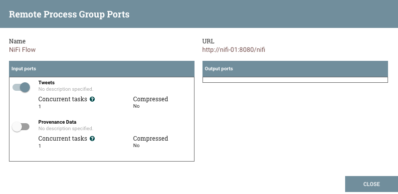

Управление потоком данных
===========================

При добавлении компонента в рабочую область **NiFi** он находится в статусе "Stopped". Для перевода компонента в рабочее состояние его необходимо запустить. После запуска он может быть остановлен в любой момент времени. В статусе "Stopped" компонент можно настроить, запустить или отключить.

Запуск компонента
------------------

Для запуска компонента должны быть выполнены следующие условия:

+ Конфигурация компонента действительна;
+ Все определенные связи компонента подключены к другим компонентам или настроены на автоматическое завершение;
+ Компонент остановлен;
+ Компонент доступен;
+ Компонент не имеет активных задач.

Для запуска отвечающего требованиям компонента необходимо выбрать его и нажать кнопку "Start" в палитре "Operate Palette" или щелкнув правой кнопкой мыши по компоненту и выбрать "Start" из открывшегося контекстного меню.

При запуске группы процессов запускаются все компоненты группы (включая дочерние), за исключением недействительных или отключенных.

После запуска индикатор состояния Процессора меняется на символ воспроизведения "Play".

Остановка компонента
---------------------

Компонент может быть остановлен в любой момент его выполнения. Для этого необходимо щелкнуть правой кнопкой мыши компонент и выбрать команду "Stop" из открывшегося контекстного меню или выбрать команду на панели "Operate Palette". При остановке группы процессов останавливаются все компоненты группы (включая дочерние).

После остановки индикатор состояния компонента меняется на символ "Stop".

Остановка компонента не прерывает его текущие задачи, а прекращает планирование выполнения новых задач. Количество активных задач отображается в правом верхнем углу Процессора.

Настройка компонента
----------------------

Когда компонент доступен, он может быть запущен. При этом пользователи могут отключить компоненты, являющиеся частью потока данных, который все еще собирается. Как правило, если компонент не предназначен для запуска, он отключается, а не остается в состоянии "Stopped". Это помогает различать компоненты, которые намеренно не запущены, и компоненты, которые могут быть временно остановлены (например, для изменения конфигурации компонента) и случайно не перезапущены.

При необходимости переподключения компонента это можно сделать, выбрав компонент и нажав кнопку "Enable" на панели "Operate Palette". Это доступно только в том случае, когда выбранный компонент или компоненты отключены. Кроме того, компонент можно включить, установив флажок рядом с параметром "Enabled" на вкладке "Settings" диалогового окна "Processor configuration" или диалогового окна настройки порта.

Индикатор состояния отключенного компонента меняется на "Invalid" или "Stopped" в зависимости от того, является ли компонент действительным.

Компонент отключается путем выбора компонента и нажатия кнопки "Disable" на панели "Operate Palette" или путем снятия флажка рядом с параметром "Enabled" на вкладке "Settings" диалогового окна "Processor configuration" или диалогового окна настройки порта. 

Включенными или отключенными компонентами могут быть только порты и процессоры.

Работа удаленных групп процессов
------------------------------------

Удаленные группы процессов (Remote Process Group, RPG) предоставляют механизм отправки или извлечения данных из удаленного инстанса **NiFi**. Когда удаленная группа процессов добавляется в рабочую область, она добавляется с отключенной передачей со значком "Transmission Disabled" в верхнем левом углу. Передачу данных можно включить, щелкнув правой кнопкой мыши по RPG и выбрав пункт меню "Enable Transmission". Это приводит к тому, что все порты, имеющие Соединение, начинают передачу данных, и индикатор состояния меняется на значок "Transmission Enabled".

При возникновении проблем установления связи с удаленной группой процессов в верхнем левом углу появляется предупреждение "Warning". Наведение курсора мыши на это предупреждение дает дополнительную информацию о проблеме.

Работа отдельного порта
^^^^^^^^^^^^^^^^^^^^^^^^^^^^^

В некоторых случаях DFM необходимо включить или отключить передачу данных только для определенного порта в группе удаленных процессов. Это можно сделать, щелкнув правой кнопкой мыши на RPG и выбрав пункт меню "Remote ports". При этом открывается диалоговое окно настроек, в котором доступны конфигурации каждого порта (:numref:`Рис.%s.<ADS_UserNIFI_Command_RPG>`).

.. _ADS_UserNIFI_Command_RPG:

   Настройка отдельных портов в RPG

С левой стороны в блоке "Input Ports" перечислены все входные порты, на которые удаленный инстанс **NiFi** позволяет отправлять данные. Справа в блоке "Output Ports" -- порты, из которых инстанс может извлекать данные. Если удаленный инстанс использует безопасную связь (его URL-адрес начинается с *https://*, а не *http://*), порты, которые он не сделал доступными, скрыты.

Если порт, который, как ожидается, должен быть показан, но при этом не отображается в диалоговом окне настроек портов, следует убедиться, что у инстанса есть надлежащие разрешения, и что поток в группе удаленных процессов является текущим. Проверить это можно, закрыв диалоговое окно "Port Configuration" и посмотрев в нижний правый угол группы удаленных процессов -- отображается дата последнего обновления потока. Если поток является устаревшим, его можно обновить, щелкнув правой кнопкой мыши на RPG и выбрав "Refresh flow".

Каждый порт отображается с указанием его имени, сопровождающееся описанием, настроенным на данный момент количеством параллельных задач и необходимостью сжатия данных, отправляемых на порт. Слева от информации находится переключатель для включения или выключения порта. Порты, к которым не подключены соединения, выделены серым цветом (:numref:`Рис.%s.<ADS_UserNIFI_Command_RPG-Ports>`).

.. _ADS_UserNIFI_Command_RPG-Ports:

   Настройка отдельных портов в RPG

Переключатель предоставляет механизм для включения и отключения передачи данных для каждого порта в удаленной группе процессов независимо друг от друга. Неактивные в данный момент подключенные порты можно настроить, щелкнув значок карандаша "Edit" под переключателем состояния. Это позволяет DFM редактировать количество параллельных задач и определить, следует ли использовать сжатие при передаче данных посредством выбранного порта.

