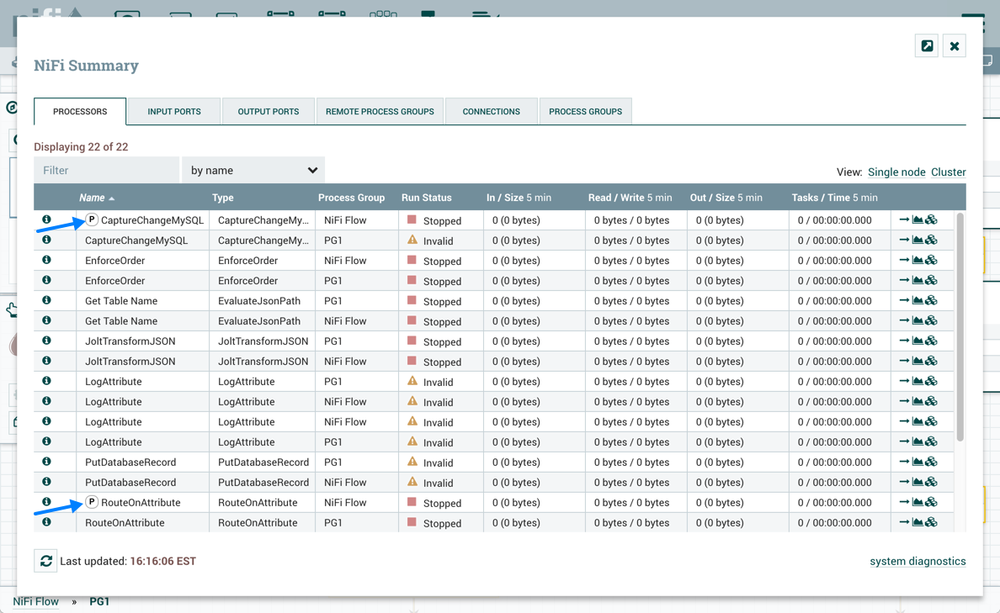

Настройка Процессора
=====================

Окно настройки Процессора открывается по двойному щелчку по Процессору в рабочей области либо при выборе опции "Configure" из контекстного меню Процессора. Диалоговое окно конфигурации имеет четыре вкладки, каждая из которых описана далее. После завершения настройки Процессора для применения изменений следует нажать кнопку "Apply"; для выхода из окна без сохранения -- кнопку "Cancel".

При запущенном Процессоре в его контекстном меню опция "Configure" меняется на "View Configuration", так как нельзя менять конфигурацию Процессора во время его работы. Для этого необходимо сначала остановить Процессор и дождаться завершения всех его активных задач.

.. important:: Ввод определенных символов не поддерживается и автоматически отфильтровывается при вводе. Следующие символы и любые непарные суррогатные коды Unicode не сохраняются ни в одной конфигурации:

  :: 
  
   [#x0], [#x1], [#x2], [#x3], [#x4], [#x5], [#x6], [#x7], [#x8], [#xB], [#xC], [#xE], [#xF], [#x10], [#x11], [#x12], [#x13], [#x14], [#x15], [#x16], [#x17], [#x18], [#x19], [#x1A], [#x1B], [#x1C], [#x1D], [#x1E], [#x1F], [#xFFFE], [#xFFFF]

Вкладка SETTINGS
-----------------

При обращении к диалоговому окну настроек Процессора, оно открывается на первой вкладке "SETTINGS" (:numref:`Рис.%s.<ADS_UserNIFI_Config_SETTINGS>`).

.. _ADS_UserNIFI_Config_SETTINGS:

.. figure:: ../../imgs/ADS_UserNIFI_Config_SETTINGS.png
   :align: center

   Вкладка SETTINGS

Вкладка содержит несколько элементов конфигурации. В поле "Name" у DFM есть возможность изменить имя Процессора. По умолчанию оно совпадает с типом. Рядом с полем имени располагается флажок "Enabled", указывающий статус Процессора. При добавлении Процессора на рабочую область он активируется, и если его отключить, дальнейший запуск уже невозможен. Отключенное состояние используется для указания того, что, например, при запуске группы Процессоров данный (отключенный) Процессор следует исключить.

Ниже отображается уникальный идентификатор Процессора в поле "Id", его тип в поле "Type" и NAR в поле "Bundle". Данные значения не могут быть изменены.

Далее находятся поля "Penalty Duration" и "Yield Duration". Во время обычного процесса обработки потока данных (FlowFile) может произойти событие, указывающее, что данные могут быть обработаны не в данный момент, а позднее. Например, если Процессор должен передать данные удаленному сервису, но у сервиса уже есть одноименный файл. В таком случае Процессор может "оштрафовать" FlowFile сроком ожидания, что останавливает обработку данных потока на период времени, заданный в поле "Penalty Duration" (по умолчанию *30 секунд*).

Аналогичным образом Процессор может определить, что существует ситуация, при которой он больше не может выполнять действия независимо от обрабатываемых данных. Например, если Процессор должен отправить данные в удаленный сервис, но сервис не отвечает, Процессор при этом не может добиться какого-либо прогресса. В результате Процессор должен "уступить", а это отодвигает запланированный запуск Процессора на некоторый период времени, который задается в поле "Yield Duration" (значение по умолчанию *1 секунда*).

Последний настраиваемый параметр в левой части вкладки -- "Bulletin Level". Всякий раз, когда Процессор записывает данные в свой журнал, он также создает бюллетень. В параметре указывается самый низкий уровень бюллетеня. По умолчанию установлено значение *WARN*, означающее, что в пользовательском интерфейсе отображаются все бюллетени с предупреждениями и ошибками.

В правой части вкладки "SETTINGS" находится "Automatically Terminate Relationships" c перечислением всех определенных Процессором связей и их описанием. Для того чтобы Процессор считался действительным и способным к запуску, каждая определенная им связь должна быть подключена к нисходящему компоненту, в противном случае она автоматически прерывается. При автоматическом прерывании связи любой направляемый в нее FlowFile удаляется из потока, и его обработка считается завершенной. Любая связь, которая уже подключена к нисходящему компоненту, не может быть автоматически завершена, для этого связь должна быть сначала удалена из использующих ее Соединений. Кроме того, у предназначенной к автоматическому прерыванию связи при ее добавлении к Соединению статус "auto-termination" отключается.

Вкладка SCHEDULING
--------------------

"SCHEDULING" -- вторая вкладка диалогового окна настроек Процессора (:numref:`Рис.%s.<ADS_UserNIFI_Config_SCHEDULING>`).

.. _ADS_UserNIFI_Config_SCHEDULING:

   Вкладка SCHEDULING

Вкладка содержит несколько элементов конфигурации:

+ `Scheduling Strategy`_
+ `Concurrent Tasks`_
+ `Run Schedule`_
+ `Execution`_
+ `Run Duration`_

Scheduling Strategy
^^^^^^^^^^^^^^^^^^^^

В поле стратегии планирования "Scheduling Strategy" есть три возможных варианта планирования компонентов:

+ *Timer driven* -- режим по умолчанию -- запуск Процессора осуществляется с регулярным интервалом, определенным опцией "Run Schedule";

+ *Event driven* -- в данном режиме Процессор инициируется с выполнением события, когда FlowFiles входят в Соединения, относящиеся к Процессору. Режим в настоящее время считается экспериментальным и не поддерживается всеми Процессорами. В данном режиме опция "Run Schedule" недоступна для конфигурации, так как Процессор запускается не по периодам, а в результате выполнения события. Кроме того, это единственный режим, для которого параметр "Concurrent Tasks" может быть установлен равным *0*, так как количество потоков ограничено только размером Event-Driven Thread Pool, настроенным администратором;

+ *CRON driven* -- запуск Процессора осуществляется периодически, подобно режиму *Timer driven*. Однако *CRON driven* обеспечивает значительно большую гибкость за счет увеличения сложности конфигурации, представляющую собой строку из шести обязательных полей и одного опционального, разделенных пробелом. 

.. csv-table:: Конфигурация стратегии планирования CRON driven
   :header: "Поле", "Допустимые значения"
   :widths: 50, 50

   "Seconds", "0-59"
   "Minutes", "0-59"
   "Hours", "0-23"
   "Day of Month", "1-31"
   "Month", "1-12 или JAN-DEC"
   "Day of Week", "1-7 или SUN-SAT"
   "Year (опционально)", "Пусто или 1970-2099"

Значения задаются одним из следующих способов:

+ *Number* -- одно или несколько допустимых значений, разделенных запятыми;
+ *Range* -- диапазон значений в виде <number>-<number>;
+ *Increment* -- инкремент с использованием синтаксиса <start value>/<increment>. Например, в поле "Minutes" значение *0/15* обозначает последовательность минут *0*, *15*, *30* и *45*.

Кроме того, могут быть использованы специальные символы:

+ Символ * -- означает, что все допустимые значения действительны;
+ Символ ? -- означает, что может быть задано не характерное значение (допустипо в полях "Day of Month" и "Day of Week");
+ Символ L -- можно добавить *L* к одному из значений дня недели, чтобы указать последнее вхождение этого дня в месяце. Например, *1L* обозначает последнее воскресенье месяца.

Примеры:

+ Строка ``0 0 13 * * ?`` указывает, что необходимо запланировать запуск Процессора в 13:00 каждый день;

+ Строка ``0 20 14 ? * MON-FRI`` указывает, что необходимо запланировать запуск Процессора в 14:20 с понедельника по пятницу;

+ Строка ``0 15 10 ? * 6L 2011-2017`` указывает, что необходимо запланировать запуск Процессора в 10:15 в последнюю пятницу каждого месяца в период с 2011 по 2017 год.

Дополнительную информацию с примерами можно найти в документации Quartz по ссылке `Chron Trigger Tutorial <http://www.quartz-scheduler.org/documentation/quartz-2.x/tutorials/crontrigger.html>`_.

Concurrent Tasks
^^^^^^^^^^^^^^^^^^^

Параметр конфигурации "Concurrent Tasks" -- параллельные задачи -- определяет количество потоков, используемых Процессором, то есть количество одновременно обрабатываемых FlowFiles. Увеличение значения, как правило, позволяет Процессору обрабатывать больше данных за тот же промежуток времени. Однако это достигается засчет использования системных ресурсов, которые в таком случае не могут использоваться другими Процессорами. Параметр по существу контролирует, сколько ресурсов системы должно быть выделено для конкретного Процессора. 

Поле "Concurrent Tasks" доступно для большинства Процессоров. Однако существуют некоторые типы Процессоров, которые можно запланировать только с одной параллельной задачей.

Run Schedule
^^^^^^^^^^^^^

Параметр "Run Schedule" определяет расписание запуска Процессора. Допустимые значения для поля зависят от выбранной стратегии планирования "Scheduling Strategy". При стратегии *Event driven* поле "Run Schedule" недоступно. При стратегии *Timer driven* значение представляет собой единицу времени. Например, *1 second* или *5 mins*. Значение по умолчанию *0 sec* означает, что Процессор должен работать как можно чаще при наличии данных для обработки. Условие верно для любой продолжительности времени со значением *0* (независимо от единицы времени, то есть *0 sec*, *0 mins*, *0 days*). Объяснение значений, применимых к стратегии *CRON driven*, приведено в описании самой стратегии.

Execution
^^^^^^^^^^^^

Параметр "Execution" используется для определения узла, на котором запланирован запуск Процессора. Выбор значения *All Nodes* приводит к планированию запуска Процессора на каждом узле кластера. Значение *Primary Node* приводит к тому, что запуск Процессора планируется только на первичном узле. Настроенные на *Primary Node* Процессоры помечаются значком с буквой "P" рядом с пиктограммой самого Процессора (:numref:`Рис.%s.<ADS_UserNIFI_Config_Execution>`).

.. _ADS_UserNIFI_Config_Execution:

   Процессоры, настроенные на Primary Node

Для быстрого определения настроенных на первичный узел Процессоров значок "P" также отображается на вкладке "Processors" на странице "Summary" (:numref:`Рис.%s.<ADS_UserNIFI_Config_Execution-Summary>`).

.. _ADS_UserNIFI_Config_Execution-Summary:

   Процессоры, настроенные на Primary Node

Run Duration
^^^^^^^^^^^^^

Правая часть вкладки "SCHEDULING" содержит ползунок для управления параметром "Run Duration", определяющий длительность повторных запусков Процессора. Левая часть ползунка помечена как нижняя грань латентности "Lower latency", правая -- как наиболее высокая пропускная способность "Higher throughput". 

При завершении работы Процессор обновляет репозиторий, чтобы передать FlowFiles следующему Соединению. Обновление хранилища является ресурсоемким процессом, поэтому, чем больше работы может быть выполнено перед обновлением репозитория, тем больше работы Процессор может обработать (более высокая пропускная способность). Однако, это означает, что следующий Процессор не может начать обработку задействованных потоков, пока предыдущий процесс не обновит репозиторий, что приводит к увеличению латентности (время, необходимое для обработки FlowFile от начала до конца, увеличивается). В результате, ползунок параметра "Run Duration" предоставляет спектр, из которого DFM выбирает более низкую задержку или более высокую пропускную способность.

Вкладка PROPERTIES
--------------------

Вкладка свойств "PROPERTIES" предоставляет механизм для настройки поведения Процессора. Свойства не задаются по умолчанию и каждому типу Процессора определяются характерные ему оцпии, имеющие смысл для конкретного использования. Далее приведены свойства для Процессора *RouteOnAttribute* (:numref:`Рис.%s.<ADS_UserNIFI_Config_PROPERTIES>`).

.. _ADS_UserNIFI_Config_PROPERTIES:

   Вкладка PROPERTIES

Данный Процессор имеет одно свойство по умолчанию -- "Routing Strategy", заданное на "Route to Property name". Рядом с наименованием свойства находится символ знака вопроса, и как и в других местах интерфейса символ обозначает информационную справку для пользователя, при наведении курсора на которую в данном случае выдается дополнительная информация о свойстве и установленном значении по умолчанию, а также его исторические значения.

Клик по значению свойства позволяет DFM изменить его. В зависимости от допустимых значений для конкретного свойства предоставляется либо раскрывающийся список, либо открывается текстовое поле для ввода (:numref:`Рис.%s.<ADS_UserNIFI_Config_PROPERTIES-Property>`).

.. _ADS_UserNIFI_Config_PROPERTIES-Property:

   Выбор значения свойства

В правом верхнем углу вкладки расположена кнопка добавления свойства "New Property", при нажатии на которую открывается диалоговое окно для ввода имени и значения нового свойства. Не всеми Процессорами допускаются пользовательские свойства User-Defined, и в случае их назначения Процессор становится недействителен (:numref:`Рис.%s.<ADS_UserNIFI_Config_PROPERTIES-User-Defined>`).

.. _ADS_UserNIFI_Config_PROPERTIES-User-Defined:

   Добавление свойства

После добавления свойства User-Defined в правой части его строки появляется значок удаления, при нажатии на который свойство удаляется из Процессора.

Некоторые Процессоры, например, *UpdateAttribute*, имеют встроенный пользовательский интерфейс. Для перехода к нему необходимо нажать кнопку "Advanced", которая появляется в нижней части окна настройки у подобных Процессоров. 

Так же некоторые Процессоры имеют свойства, ссылающиеся на другие компоненты, например, на Controller Services, которые также требуют настройки. Например, Процессор *GetHTTP* имеет свойство *SSLContextService*, которое ссылается на контроллер *StandardSSLContextService*. В случае, когда DFM необходимо настроить свойство, но при этом еще не создан и не настроен контроллер, у DFM есть возможность сделать это сразу на месте, как показано далее на рисунке (:numref:`Рис.%s.<ADS_UserNIFI_Config_PROPERTIES-Controller>`).

.. _ADS_UserNIFI_Config_PROPERTIES-Controller:

.. figure:: ../../imgs/ADS_UserNIFI_Config_PROPERTIES-Controller.png
   :align: center

   Настройка контроллера через свойство Процессора

Вкладка COMMENTS
--------------------

Последней вкладкой диалогового окна конфигурации Процессора является вкладка "COMMENTS", предоставляющая пользователям область для добавления комментариев к компоненту. Использование вкладки необязательно (:numref:`Рис.%s.<ADS_UserNIFI_Config_COMMENTS>`).

.. _ADS_UserNIFI_Config_COMMENTS:

   Вкладка COMMENTS

