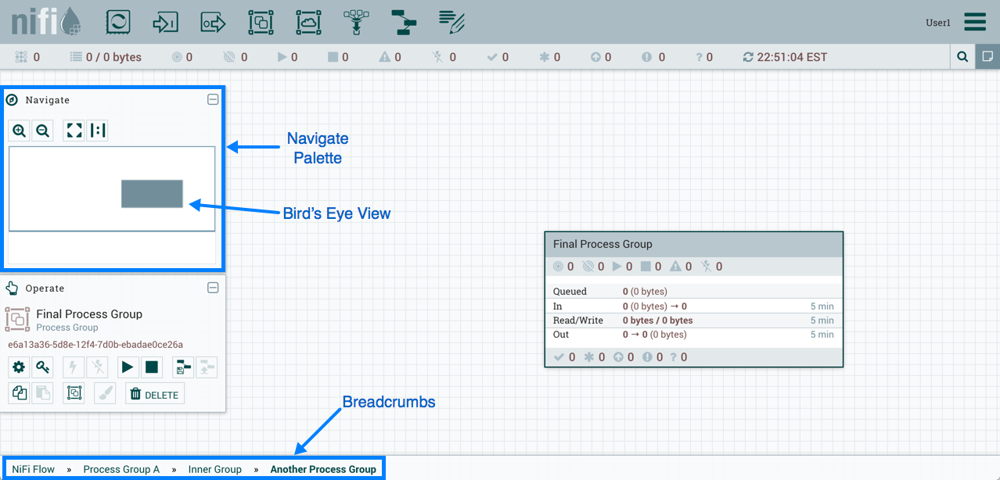

Пользовательский интерфейс NiFi
=================================

Пользовательский интерфейс (UI) **NiFi** предоставляет механизмы для создания автоматизированных потоков данных, а также их визуализации, редактирования, мониторинга и администрирования. Пользовательский интерфейс может быть разбит на несколько сегментов,  отвечающих за различные функции приложения. Далее представлены некоторые скриншоты с выделенными сегментами UI приложения с подробным описанием основных моментов. 

При запуске приложения пользователь может перейти к пользовательскому интерфейсу, выбрав в веб-браузере адрес по умолчанию *http://<hostname>:8080/nifi*. Так как изначально разрешения не настроены, любой пользователь может просматривать и изменять поток данных. Конфигурация настроек приведена в `Руководстве администратора по работе с сервисом Nifi <https://docs.arenadata.io/ads/AdminNIFI/index.html>`_.

При первом переходе DFM к пользовательскому интерфейсу отображается пустая рабочая область (:numref:`Рис.%s.<ADS_UserNIFI_UI_blank-canvas>`).

.. _ADS_UserNIFI_UI_blank-canvas:

.. figure:: ../../imgs/ADS_UserNIFI_UI_blank-canvas.png
   :align: center

   Рабочая область NiFi

Панель инструментов "Components Toolbar" располагается в левой верхней части экрана. Она состоит из компонентов, которые можно переносить в рабочую область для построения потока данных. Каждый компонент панели описан в главе `Построение потока данных <https://docs.arenadata.io/ads/UserNIFI/DataFlow.html>`_.

Строка состояния "Status Bar" находится под панелью "Components Toolbar". Она предоставляет информацию о количестве активных потоков на текущий момент времени, об объеме данных в настоящее время в потоке, количестве групп удаленных процессов в рабочей области в каждом состоянии (*Transmitting*, *Not Transmitting*), сколько процессоров существует в рабочей области в каждом состоянии (*Stopped*, *Running*, *Invalid*, *Disabled*), сколько версий групп процессов существует в рабочей области в каждом состоянии (*Up to date*, *Locally modified*, *Stale*, *Locally modified and stale*, *Sync failure*) и временная метка, в которой вся приведенная информация обновлена в последний раз. Кроме того, если инстанс **NiFi** кластеризован, в строке состояния отображается количество узлов в кластере и сколько из них в настоящее время подключено.

Палитра "Operate" находится в левой части экрана. Она состоит из кнопок управления потоком для DFM, а также для администраторов, управляющих доступом пользователей и настраивающих системные свойства, например, количество предоставленных приложению системных ресурсов.

В правой части рабочей области находится поиск и общее меню. С помощью поиска можно легко находить компоненты в рабочей области по их имени, типу, идентификатору, свойствам конфигурации и их значениям. Общее меню содержит параметры, позволяющие управлять существующими компонентами (:numref:`Рис.%s.<ADS_UserNIFI_UI_Global-Menu>`).

.. _ADS_UserNIFI_UI_Global-Menu:

.. figure:: ../../imgs/ADS_UserNIFI_UI_Global-Menu.png
   :align: center

   Пармаметры общего меню NiFi

Кроме того, пользовательский интерфейс имеет панель навигации "Navigate", позволяющую легко перемещаться по рабочей области с возможностью увеличения и уменьшения масштаба. Отдаленный вид потока данных обеспечивает высокоуровневое представление потока и позволяет перемещаться между его крупными частями. Вдоль нижней части экрана располагается навигационная цепочка ("Breadcrumbs"). При переходе в группу процессов цепочка отображают глубину потока и его группы, каждая из которой в свою очередь представляет собой ссылку, по которой можно перейти на тот или иной уровень в потоке (:numref:`Рис.%s.<ADS_UserNIFI_UI_breadcrumbs>`).

.. _ADS_UserNIFI_UI_breadcrumbs:

   Навигация в NiFi

