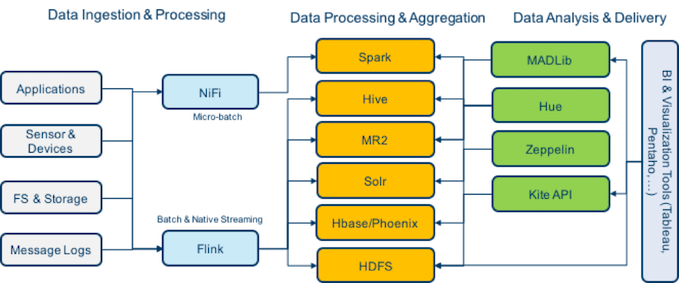
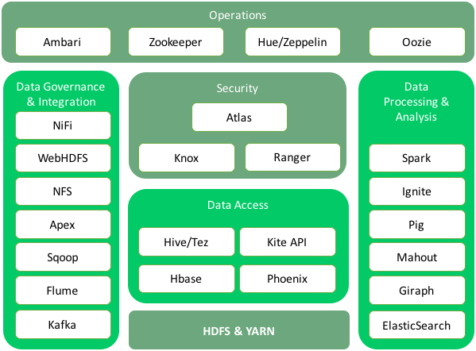

Общий обзор
===========

**Arenadata Unified Data Platform** (**Универсальная платформа данных**) – это
интегрированный набор компонентов корпоративного уровня на базе
решений с открытым исходным кодом. Платформа включает в себя все
необходимые компоненты для управления данными, доступа к данным,
анализа данных, интеграции, безопасности и администрирования.

Основная идея универсальной платформы заключается в обеспечении
возможности работы с любыми типами и форматами данных путем
комбинированного использования различных технологических решений и
архитектур обработки данных.

В настоящий момент полностью реализован уровень хранения и обработки
слабоструктурированных и неструктурированных данных – **Arenadata Hadoop**
(**ADH**). Это полноценный дистрибутив распределенной платформы хранения
на базе **Apache Hadoop**, адаптированный для корпоративного
использования.

.. image:: imgs/arenadata-ru-products-obshii-obzor-2.png

В 2016 году дистрибутив **Arenadata Hadoop 1.3.2** прошел сертификацию и
получил подтверждение о полном соответствии стандартам **Open Data Platform Initiative** (**ODPi**). **ODPi** – крупнейшее мировое сообщество разработчиков проектов хранения больших данных с открытым кодом под эгидой **Linux Foundation**: `подробнее <https://www.odpi.org/blog/2016/07/13/hadoop-summit-san-jose-2016-wrap-up>`_.

Текущий релиз версии **1.4.1** вышел во втором квартале 2017 года. В состав версии входят следующие компоненты: **Ambari**, **HDFS**,	**YARN**,	**Zookeeper**, **Tez**, **Hive**,	**HBase**, **Phoenix**, **Pig**, **Sqoop**, **Flume**, **Oozie**, **Atlas**, **NiFi**, **Apex**, **Flink**, **Kafka**, **Knox**,	**Mahout**,	**Ranger**,	**Ranger KMS**,	**Solr**,	**Spark**, **Zeppelin**, **Giraph**,	**Kite**.

В отличие от других корпоративных дистрибутивов, представленных на
рынке, **Arenadata Hadoop** обладает рядом особенностей:

+ Вся поддержка и непосредственно экспертиза доступна в России и на русском языке;
+ Есть пакет утилит для полной off-line установки (без доступа к сети Интернет);
+ Вся сборка выполнена на базе открытых проектов Apache, нет проприетарных компонентов;
+ Российское программное обеспечение;
+ Поддержка доступна как удаленно, так и on-site;
+ Есть набор доступных типовых пакетных сервисов по планированию, установке и аудиту системы.

**Arenadata Hadoop** обеспечивает полный набор возможностей и инструментов
для автоматического развертывания компонентов как на «голом железе»,
так и на виртуальных машинах (в "облаке"). Средства мониторинга и
управления конфигурацией кластера позволяют оптимизировать
производительность для всех компонентов системы. **Apache Ambari**
обеспечивает интерфейсы для интеграции с существующими системами
управления, например, **Microsoft System Center** и **Teradata ViewPoint**.

Оригинальная документация на русском языке позволяет облегчить процесс
планирования и разворачивания кластера **Hadoop**.

.. toctree::
   :maxdepth: 2
   :caption: Оглавление:

   Streaming/index

.. toctree::
   :hidden:
   :maxdepth: 1
   :caption: Скачать

   download
