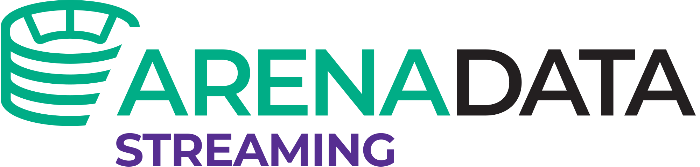

.. _ADS_index_logo:

Эффективное решение для потоковой обработки данных в режиме реального времени 
==============================================================================

**Arenadata Streaming** (**ADS**) -- платформа потоковых операций, построенная на базе **Apache Kafka** и **Apache Nifi**, проектов с открытым исходным кодом, адаптированное для корпоративного использования. **ADS** содержит в себе все необходимые компоненты для сбора, анализа и обработки данных в режиме реального времени, обеспечивает хранение и передачу в семантике "exactly-once delivery" безопасным и отказоустойчивым способом, предоставляя удобный интерфейс для администрирования и разработки. Также платформа может выступать в качестве корпоративной шины данных и ETL-инструмента (:numref:`Рис.%s.<ADS_index_scheme>`).

.. _ADS_index_scheme:

.. figure:: imgs/ADS_index_scheme.png
   :align: center

   Принципиальная схема платформы ADS

Идея платформы распределенных потоковых операций заключается в обеспечении:

+ Единой точки доступа;
+ Легкого, безопасного и надежного способа управления потоком данных;
+ Политики безопасности;
+ Быстрой и непрерывной разработки.

Одной из особенностей реализации платформы является применение техники, сходной с журналами транзакций, используемыми в системах управления базами данных. 

**ADS** обладает следующими отличительными техническими качествами:

+ *Отказоустойчивость* -- обеспечение консистентности при потоковой передаче данных в режиме реального времени;
+ *Масштабируемость* -- добавление новых серверов в кластер по мере необходимости;
+ *Распределенность* -- возможность построения гео-распределенной инфраструктуры;
+ *Доступное оборудование* -- работу на любом x86-совместимом оборудовании;
+ *Реальное время* -- управление потоками, добавление и настройка источников данных в режиме реального времени;
+ *Безопасность* -- гибкие механизмы контроля доступа к данным;
+ *Интеграция* -- коннекторы к различным системам: Elasticsearch, SAP HANA, Vertica, Couchbase, Cassandra, CouchDB, IBM MQ и т.д. Широкий набор API для интеграции с другими внешними системами;
+ *Простота и гибкость* -- возможность создания workflow с помощью графического интерфейса или разрабатывать свои собственные приложения с помощью SDK для повышения эффективности работы.

**Apache Kafka** -- распределенный программный брокер сообщений, проект с открытым исходным кодом, разработанный в рамках **Apache Software Foundation**. 

Текущий релиз версии **ADS 1.5** вышел в первом квартале 2020 года. Состав и версии компонентов представлены по ссылке `Release Notes <Release/index>`_. 

С **Arenadata Streaming** Вы получаете эффективное решение для потоковой обработки данных:

+ Используйте в качестве корпоративной шины обмена данными для всех своих приложений;
+ Собирайте большие потоки данных, безопасно и эффективно управляйте ими в режиме реального времени;
+ Создавайте потоки данных с поддержкой разграничения прав доступа к ним;
+ Разрабатывайте потоковые аналитические приложения за считанные минуты в режиме реального времени без единой строчки кода.

Оригинальная документация на русском языке позволяет облегчить процесс планирования и разворачивания платформы. Инструкция может быть полезна администраторам, программистам, разработчикам и сотрудникам подразделений информационных технологий, осуществляющих внедрение и сопровождение кластеров **Arenadata**. 

Далее в документации: установка, архитектурные особенности, настройки платформы и руководства администратора, пользователя и разработчика с сервисами **Nifi** и **Kafka**.

.. important:: Контактная информация службы поддержки -- e-mail: info@arenadata.io

.. toctree::
   :maxdepth: 2
   :caption: Оглавление:

   Intro/index
   Requirements/index
   Install/index
   OperationGuide/index
   UserGuide/index
   Architecture/index
   Release/index
   glossary

.. toctree::
   :hidden:
   :maxdepth: 1
   :caption: Скачать

   download
